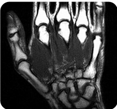

# Pre-study Notes

## Basic Informa

- **Program Name**: BEHI 5011 - AI & Medical Imaging
- **Class Schedule**: Mo 06:00PM - 08:50PM
- **Place**: Rm 1527, Lift 22 (74)
- **Professor**: CHEN, Hao
  - **Ust rank of professor**:  F  [CHEN, Hao](https://www.google.com/search?q=site%3Afacultyprofiles.hkust.edu.hk+CHEN%2C+Hao)

---

## Pre-requisites of class

- Basic Math including calculus(微积分), lineear algebra(线性代数), geometry(几何), probaility(概率学), statistics(统计学).
- Image processing of Machine Learning
- Programming Skills: Python, Pytorch, Tensorflow.

---

## Grading scheme

- Assignments (40%)

  2 assignments (each 20%), including journal club sharing and article report, etc.
  
  > Two presentation ?
  
- Final Project (60%)
  Final Presentation and Project report.

  Details will be released later.

- Don’t be late

  Only one day tolerate, and each day(whether tolerated) will cause 20% grade punish.

---

## Timeline and sub-group, etc rules

| Week | Title            | Context                                       |
| ---- | ---------------- | --------------------------------------------- |
| 1    | 医学影像分析导论 | 医学影像特点、应用场景、成像模态              |
| 2    | 深度学习基础     | 机器学习基础、CNN、RNN、自编码器等            |
| 3    | 医学影像分类     | 分类器构建、迁移学习、3D深度学习、多任务学习  |
| 4    | 医学影像分割     | 语义/实例分割、体积分割、传统与深度学习方法   |
| 5    | 医学影像配准     | 配准与评估、深度相似性度量、有监督/无监督配准 |
| 6    | 标签高效学习     | 半监督、多实例、自监督、主动学习等            |
| 7    | 异常检测         | 重建法、自监督法、挑战与展望                  |
| 8    | 注意力机制       | 空间/通道注意力、Transformer                  |
| 9    | 可解释性AI       | Ante-hoc vs Post-hoc方法、可解释模型          |
|10|领域自适应|浅层与深层领域自适应|
|11|联邦学习|临床应用、领域泛化、半监督学习|
|12|多模态学习|多模态信息融合、精准肿瘤学|
|13|基础模型|预训练与适配、法规与伦理|
|14|前沿与应用|计算病理学、乳腺癌等临床应用|

---

# Class 1 study

## Topic 1: Medical Image Analysis

Medical Image Analysis  = **MIA (医学图像分析)**：

1. MR = Magnetic Resonance Imaging, aka **MRI**

​	MR是磁共振成像，成像原理是通过发射特定的无线电波（射频脉冲），让物体中的质子吸收能量、偏离原来的方向。当射频脉冲停止，质子会释放能量并回到初始状态，这个过程中产生的信号会被机械捕捉。

​	计算机根据信号的强度和时间差异，重构出人体组织的端的断层图像，对**软组织(如软骨、韧带、脊髓、肌肉)**的分辨率非常高。

2. X Ray

​	X射线是通过X射线的穿透性，利用不同组织对X射线的吸收能力不同呈现不同的“二维投影”，清晰显示骨骼等吸收X射线较多的致密组织。

- 骨骼等致密组织吸收的X射线较多，因此呈白色；
- 肌肉、皮肤等软组织吸收较少，显灰色/黑色。

## Topic 2: Fundamentals of Deep Learning

Machine Learning VS Deep Learning:

- Machine Learning basics: input $\rightarrow$ **man-made Feature Extraction** $\rightarrow$ computer-made Classification $\rightarrow$ Output.

- Deep Learning: input $\rightarrow$ computer-made **Feature extraction + Classification** $\rightarrow$ Output.

---

## Medical Image Classification

如何用深度学习构建并评估医学图像分类器，流程：

-  Input $\rightarrow$ CNN：核心特征提取器 $\rightarrow$ Softmax 分类器：概率输出 $\rightarrow$ 结果可视化：条形图输出；
  - CNN：通过多层卷积和池化，自动从图像中学习底层（边缘、纹理）到高层（病变形态、病灶分布）的特征，无需人工设计，完美设配医学图像的复杂纹理特征。
  - Softmax 分类器：将CNN提取的高维特征映射为各类别的概率分布。
  - 条形图输出：让模型决策过程透明化，展示不同病变类型的预测概率。

DL为了解决3大医学图像数据的痛点（样本量少、多模态3D数据、多任务需求）：

1. Transfer learning with limited medical dataset：小样本下的迁移学习，由于医学图像的标注成本较高，样本量通常远小于自然图像。
   - 迁移学习的思路是：先用大规模自然图像（如ImageNet）预训练CNN模型，再用少量医学数据微调模型参数，让模型快速适应医学图像特征。
2. 3D deep learning for volumetric image modality：体积图像的3D深度学习，DL能捕捉病灶在三维空间中的形态、位置关系。
3. Multi-task learning（多任务学习）：多任务学习可以让模型同时学习多个相关任务，**共享特征提取层**，既提升了模型效率，又能通过任务间的关联提升预测精度。

---

## Medical Image Segmentation

医学图像分割：从医学影像中，精准提取临床关注的目标区域，并标注病灶的轮廓，给图像中的每个像素分配标签的过程。

场景：

- Volumetric medical image segmentation（体积医学图像分割）：采用3D U-Net等模型捕捉病灶的三维形态。
- Interactive segmentation（交互式分割）：结合手动标注与算法自动优化，解决模糊边界、复杂病灶的分割难题。

### Method(方法)：

1. 阈值分割。

   - 原理：通过设定一个或多个阈值，将图像像素划分为不同的领域。这种方法适用于**对比度明显**的图像。

   - 应用：常用于简单的图像分割任务，如分离骨骼与软组织。

2. 区域生长。

   - 原理：从一个种子点开始，根据**相似性（灰度值或颜色）**逐步扩展，直到满足特定条件。
   - 应用：用于分割具有相似特征的结构，如肿瘤或器官。

3. 边缘检测。

  - 原理：利用图像中**像素强度变化的变化**来找到边缘，常用的算法包括**Canny边缘检测**和**Sobel算子**。
   - 应用：用于精准地定位结构边界，如血管或器官边缘。

4. 水平集方法。

   - 原理：通过**演化曲线**来捕捉图像中的边界，适用于复杂形状地分割。
   - 应用：常用于分割不规则形状的器官或病变。

5. 图割方法。

   - 原理：将图像视为**图结构，通过最小化能量函数**来实现分割，常用于Graph Cut算法。
   - 应用：适用于需要高精度分割地任务，如肿瘤检测。

6. 深度学习方法。

   - 原理：使用CNN等deep learning模型进行**像素级分类**，广泛应用于医学图像分割。
   - 应用：U-Net、SegNet和Mask R-CNN等架构在医学图像分割中表现出色，适用于多种医学图像任务。

7. 多模态分割。

   - 原理：结合来自不同成像模型（如CT和MRI）地信息，通过**融合特征**进行分割。
   - 应用：用于提高分割精度，特别是在不同模态提供互补信息的情况下。

8. 主动轮廓模型（Snake）。

   - 原理：通过能量最小化地方法，调整轮廓以适应图像中的特征，如边缘或纹理。
   - 应用：用于分割复杂形状的物体，如心脏或脑部结构。

---

## Medical Image Registration

医学图像配对：通过空间交换算法，将“待配准图像（Moving Image）”与”参考图像（Fixed Image）”对齐到同一坐标系的过程，简单说就是**用于多个图像的融合与时间空间维度的对比**，_解决如何让不同时间、不同模态、不同视角的医学图像精准对齐，从而辅助医生发现病灶变化、融合多模态信息。_

核心内容：

- Medical image registration and evaluation（配准与评估）:

​	定义空间变换 $\rightarrow$ 计算图像相似度 $\rightarrow$ 优化变换参数 $\rightarrow$ 验证对齐精度；

​	评估指标：Dice系数、均方误差（MSE）、互信息（MI）等量化配准后图像的重叠度与相似度，以确保临床有效性。

- Deep similarity metric（深度相似度度量）

  传统配准依赖手动设置相似度指标，但对医学图像的复杂形变、低对比度鲁棒性不足，因此选择深度学习方法通过神经网络自动学习图像的高维特征，计算更鲁棒的相似度。

- Supervised vs Unsupervised image registration（监督式与无监督式配准）

​	监督式：需要大量的标注数据，但医学图像标注成本极高，实际应用受限。

​	无监督式：无需标签。

---

## Label-efficient learning in MIA

Label-efficient learning标签高效学习，是指在标注数据稀缺、未标注数据充足的场景下，通过优化算法设计，用尽可能少的人工标注数据训练出高性能模型的学习范式。

核心方法：

- Semi-supervised learning（半监督学习）：用“少量标注数据 + 大量未标注数据”共同训练模型，通过数据分布的先验假设，让未标注数据辅助替身模型性能。

  - 两种假设：**平滑性与低密度假设**和**流形假设**

  1. **平滑性与低密度假设**：相似的样本应具有**相似的标签**，且模型的决策边界应穿过数据密度低的区域
  2. **流形假设**：高维医学图像的有效信息分布在低维流形上，可通过流形上的邻域关系，用标注数据推断未标注数据的标签

- Multi-instance learning（多实例学习）

  1. 解决**弱标注**问题：标注是给一组样本而非单个样本。

- Self-supervised learning（自监督学习）

  1. 不需要人工标注，而从数据本身生成 “伪标签” 来预训练模型

- Active learning（主动学习）

  1. 模型主动选择 “最有价值” 的未标注数据（如预测最不确定的样本）请求医生标注，通过 “标注 - 训练 - 迭代” 的闭环，用最少的人工标注获得最优性能。

- Annotation-efficient learning（标注高效学习）

  1. 更广义的标签高效学习，包含以上所有方法，核心是 “用更高效的标注方式（如弱标注、交互式标注）或算法，降低标注成本”

---

