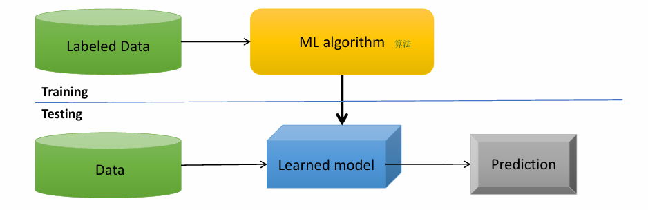
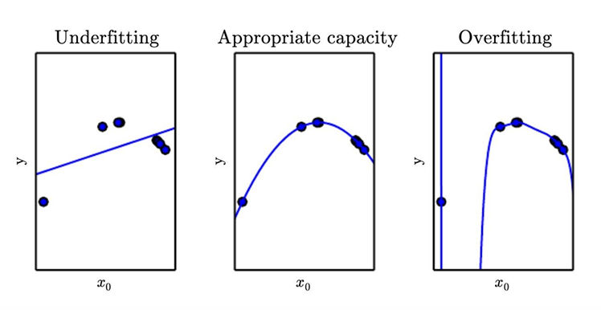
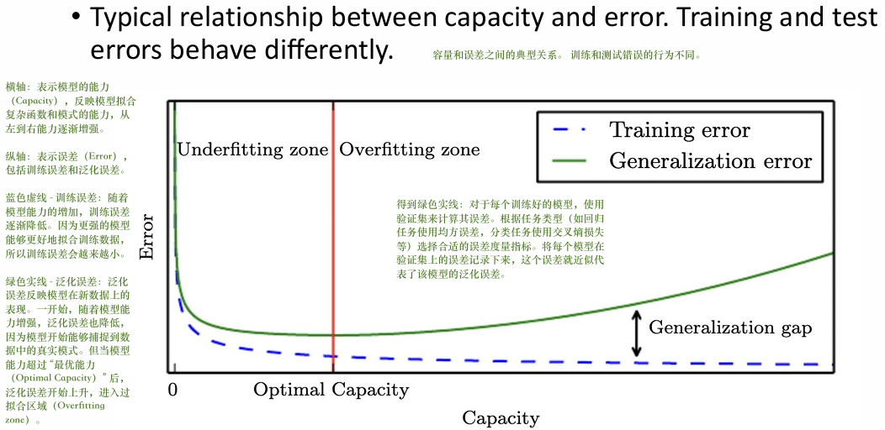

# Class 3 study: Foundation of ML

**Topic: Introduction to Machine Learning**

**Summary: **

- Machine learning basics
- Deep learning
- Regularization for deep learning
- Optimization for deep learning
- Advanced deep learning models

围绕深度学习基础展开，涵盖机器学习基础、深度学习概念、正则化、优化算法以及高级深度学习模型等方面内容。

1. 机器学习基础：机器学习让计算机无需显式编程就能学习，通过对数据的学习进行预测，常涉及数据预处理和特征设计。监督学习依据已知联合概率分布的训练数据来评估条件概率，目标任务有分类、回归等；无监督学习旨在挖掘数据的潜在结构，如聚类、降维等。
2. 深度学习概述：深度学习试图模拟人脑行为，从大量数据中学习，以解决传机器学习手动设计特征的难题，神经网络是其重要基础，历经多个发展阶段，多层感知机由多个神经元连接构成，通过激活函数和多层结构进行复杂函数的拟合。
3. 深度学习的正则化：正则化用于降低深度学习模型的泛化误差，防止过拟合。常见方法包括扩大数据集、参数范数惩罚，还有数据增强、噪音鲁棒性处理、模型集成、早停法、随机失活（Dropout）、对抗训练等。
4. 深度学习的优化：随机梯度下降（SGD）是训练深度模型常用算法，反向传播算法用于计算梯度。此外，还有动量法、自适应学习率、批归一化等优化技巧辅助训练。
5. 高级深度学习模型：卷积神经网络利用卷积滤波器和池化操作提取图像特征；循环神经网络适用于处理序列数据；自动编码器用于数据压缩和特征学习；生成对抗网络、变分自编码器、去噪扩散概率模型等生成模型能生成新的数据。

---

## Machine Learning Basics

> Machine learning (ML) is a field of computer science that gives  computers the ability to learn without being explicitly programmed

### ML

机器学习（ML）是一个计算机科学领域，它使计算机能够在不明确编程的情况下进行学习。

- 经典流程：输入Labeled Data（带标签数据）→ 处理ML algorithm（机器学习算法 ）→ 输出Prediction（预测）

- Pre-work: 需要
  - **数据预处理（Data pre-processing）**：清洗原始数据（比如去除噪声、填补缺失值），让数据适合模型输入。
  - **特征设计（Feature design）**：从原始数据中提取有意义的特征（比如从医学影像中提取纹理、边缘等特征），帮助模型更好地学习规律。

---

### Supervised Learning

Supervised Learning监督学习是机器学习中最成熟、应用最广的分支。

#### 监督学习的数学本质：

1. 核心假设：假设数据来自一个未知的**联合概率分布**$p$$X,Y$，训练数据$(x$$i$$, y$$i$$)$是从这个分布中独立同分布（i.i.d., 即每个样本**互相独立**、来自同一分布）抽取的。

> 考虑位置的联合概率分布$P$$X,Y$，并假设训练数据 $(x$$i$$, y$$i$$)$ ~$P$$X,Y$$, x$$i$$∈X$$,  y$$i$$∈Y, i = 1,..... , N.$

- xi是**特征向量**（比如患者的年龄、血压、影像特征），yi是**标签**（比如 “是否患糖尿病” 是离散类别，“血糖值” 是连续数值）。

  > 在大多数情况下，$x$$i$ 是特征的向量，而 $y$$i$ 是标量（例如，类别或实值）.
  >
  > 
  >
  > 训练数据生成i.i.d.（是 “独立同分布 independent and identically distributed” 的缩写，指训练集中每个样本互相独立，且都来自同一个概率分布，这是模型能有效泛化到新数据的基础假设.）
  >
  > 
  >
  > 对于任何新的 $(x,y)$，推理是估计条件：$p (Y=y|X=x)$

2. 目标与任务：

- 监督学习的目标是：对新输入的X，估计**条件概率**$P(Y = y|X = x)$，也就是给定特征x的情况下，预测标签y的概率。
  - 常见任务类型：
    - **Classification**分类：标签 $y$ 是离散的类别（比如 “良性 / 恶性”“猫 / 狗”），目标是预测输入属于哪一类。
    - **Regression**回归：标签 $y$ 是连续的数值（比如 “房价”“血糖值”），目标是预测输入对应的具体数值。

#### Supervised vs Unsupervised

| Dimension | Supervised                                                   | Unsupervised                                                 |
| --------- | ------------------------------------------------------------ | ------------------------------------------------------------ |
| Data      | $X$ (data), $Y$ (label)                                      | Just data $X$                                                |
| Goal      | Learn a function to map $X$ → $Y$                            | Learn some underlying hidden structure of the data           |
| Example   | Classification, regression,  object detection, semantic  segmentation, image captioning(分类、回归、对象检测、语义分割、图像字幕) | Clustering,  dimensionality reduction, density  estimation(聚类、尺寸缩小、密度估计) |

---

### Empirical Risk Minimization

经验风险最小化（**ERM**），是监督学习的**核心数学优化原则**，决定了模型如何从数据中学习到最优的预测规则：

**定义 “预测好坏” 的衡量标准**（损失函数概念） → **针对不同任务选择具体工具**（常见损失函数） → **明确优化的直接目的**（最小化 “整体预测误差”） → **理论层面**（1-3，真正想优化的目标） → **实践层面**（4-5，可实际执行的） → **Q&A**

#### **核心概念拆解**

- 模型函数 $f$：$X$ → $Y$：机器学习算法生成的预测函数，输入特征输出预测值。
- **损失函数**$\mathcal{L}(y, f(x))$：衡量预测值$f(x)$与真实标签 $y$ 之间的差距，满足$\mathcal{L}(y, f(x)) \geq 0$。
  - 损失值越小，说明预测越精准。
- **ERM**：模型的优化目标是**最小化训练集上的平均损失**（即“经验风险”），通过调整模型参数，让预测值和真实值的整体差距最小。

#### 常见损失函数

- **分类**任务选择**交叉熵损失 Cross-Entropy Loss**：

  $\mathcal{L}(y, f(x)) = -\sum y·logf(x)$

​	用来衡量预测的类别概率分布和真实标签分布的差异，值越小说明概率预测越准。

- **回归**任务选择**均方误差 MSE，Mean Squared Error**:

  $\mathcal{L}(y, f(x)) = \sum ||y-logf(x)||^2$

	用来衡量预测值和真实值的平方差之和，值越小说明数值预测越准。

#### 理论优化目标

从数学上通过定义获取机器学习算法的**理论优化目标**。

##### **Hypothesis Space 假设空间**

> Let $\mathcal{F}$ denote the set of all functions $f$ (hypothesis space) that can be produced by the chosen learning algorithm.

- **符号  $\mathcal{F}$ **：表示 “假设空间”，即选择的学习算法（如线性回归、神经网络）能生成的**所有可能函数 $f$ 的集合**。

  > > 譬如：若使用线性回归，则 $\mathcal{F}$ 就是形如：
  > > $f(x) = w_1x_1 + w_2x_2 +... + w_nx_n + b$的线性函数的集合。
  > >
  > > aka, 假设空间是算法 “能想到的所有可能模型” 的范围。 

##### **Expected Risk 期望风险**

> We are looking for a function $f∈F$ with a small expected risk:
>
> $R(f)= \mathbb{E}_{(x,y)\sim p_{X,Y}}[\mathcal{L}(y,f(x))]$

- **符号**$R(f)$：代表“期望风险”，是模型在整个**真实数据分布**$p_{X, Y}$上的平均损失。
- $\mathbb{E}_{(x,y)\sim p_{X,Y}}$：期望符号，代表对所有来自真实分布$p_{X, Y}$的样本$(x, y)$**求平均**。
- $\mathcal{L}(y,f(x))$：损失函数，衡量单个样本的预测值$ f(x)$ 与真实标签 $y $的**差距**。

**核心逻辑**：期望风险是**真正想最小化的目标**，反映了模型在 “所有可能数据” 上的泛化能力。但因为真实分布$p_{X, Y}$是未知的，无法直接计算$R(f)$，所以在实际中用**训练集上的经验风险（训练集损失的平均）**来近似它。

##### **理论最优函数 $f_*$** 

> $f_* = \arg \min_{f∈F}R(f)$

- 符号$\arg \min$：表示“找到使后面的函数取得最小值的**自变量**”。此处是寻找在假设空间  $\mathcal{F}$ 中，让期望风险$R(f)$最小的函数$f_*$ 。
- **含义**：$f_*$是理论上的“最优模型”，它在真实数据分布上的泛化能力最强。但由于真实分布位置，我们无法直接找到$f_*$​​，**<u>只能通过训练集上的经验风险最小化来逼近它</u>**。

##### **Empirical Risk 经验风险**

> If we have i.i.d. training data $d={(x_i,y_i)∣i=1,...,N}$, we can compute an estimate, the empirical risk (or training error).
>
> $\hat{R}(f, d) = \frac{1}{N} \sum_{(x_i, y_i)∈d}\mathcal{L}(y_i,f(x_i))$​

- **训练数据d**：包含$ N $个独立同分布（i.i.d.）的样本$ (x_i,y_i)$，是我们从真实分布中抽取的 “可见样本”。
- **经验风险$\hat{R}(f, d)$**：aka“训练误差”，是模型$f$在**训练集**上的**平均损失**。
  - $\frac{1}{N} \sum$：对训练集中所有样本的损失求平均。
  - $\mathcal{L}(y_i,f(x_i))$：单个样本的损失（比如分类任务的交叉熵、回归任务的均方误差）。

核心逻辑：用经验风险$\hat{R}(f, d)$替代期望风险$R(f)$​，从**<u>不可计算</u>**的理论目标到**<u>可计算</u>**的优化目标。

##### 经验风险最小化原则

> This results into the empirical risk minimization principle:
> $f^d_* = \arg \min _{f∈\mathcal{F}}\hat{R}(f, d)$

- $f^d_*$：在训练集 $d$ 上，$\hat{R}_{min}(f, d)$找到的“最优模型”。
- $\arg \min _{f∈\mathcal{F}}$：$\mathcal{F}$ 中，能使$\hat{R}_{min}(f, d)$的函数 $f$。

本质是所有监督学习算法的**实际优化目标**，譬如：

> > 线性回归中，最小化 “均方误差的平均值”（经验风险）来找到最优权重；
> >
> > 神经网络中，反向传播最小化 “训练集的交叉熵损失平均值”（经验风险）来更新参数。
>
> Most machine learning algorithms, including neural networks, implement empirical risk minimization.

​	ERM代表着无论是何种模型本质都在执行“ERM最小化”，**唯一区别**在于不同算法的 $\mathcal{F}$ 不同，以及使用的$\mathcal{L}(y,f(x))$不同。

#### Q&A

- Q：**啥是“真实分布”**？

  A：真实分布是生成所有数据的**潜在概率规律**。

  > 譬如所有可能的患者（收集和未收集的）的“年龄、血压、是否患糖尿病”数据，均来自一个真实分布。
  >
  >
  > 这个分布包含了所有可能的样本组合及其出现的概率，譬如50岁血压140患者糖尿病概率为30%。
  >
  > 训练集只能从真实分布中抽取一部分样本，而真实分布本身是**永远无法观测**，只能通过样本去估计它的规律。

- Q：**泛化能力是啥**？

  A：泛化能力的确是模型对不同输入数据的通用性，更准确些：

  > 泛化能力是指模型对**从未见过的新数据**的预测能力，而不是对 “不同输入” 的通用性。

  其本质，就是模型在**真实分布**$p_{X,Y}$上的表现，即期望风险$R(f)$​的大小。

---

## Capacity & Generalization & Regularization

从模型容量（Capacity）和泛化能力（Generalization）出发，解释机器学习中欠拟合（Underfitting）与过拟合（Overfitting）：

### Capacity of a Hypothesis Space

假设空间 $\mathcal{F}$ 的容量：

> The capacity of a hypothesis space induced by a learning algorithm intuitively represents the ability to find a good model $f∈ \mathcal{F}$​ for any functions.

​	**Capacity** 容量是 $\mathcal{F}$ 的“表达能力”，直观来说就是模型拟合**多复杂的函数**的能力

> > 容量低，如“线性回归”：只能拟合线性关系，无法处理复杂的非线性模式。
> >
> > 容量高，如“深度神经网络”：能拟合高度非线性的函数，甚至能记住噪点细节。

### Generalization

> ML algorithm must perform well on new, previously unseen inputs. The ability to perform well on previously unobserved inputs is called generalization.

- Generalization 泛化能力，上述**[Q&A](#q-a)**已解答

### Problem

决定算法性能的两个核心能力：

> The factors determining how well a ML algorithm will perform are its ability to:
>
> 1. Make the training error small and
> 2. Make the gap between training and test error small.

1. 让训练误差小 → 若过大 → Capacity 不足  → 没学到**基础规律**  → **Underfitting 欠拟合**。
2. 训练误差和测试误差的差距小 → 若差距大 → Generalization差  → **过度拟合**训练集的**细节** → 没学到真实分布规律 → **Overfitting 过拟合**。

常见的调节方法：

1. 选择$\mathcal{F}$ （用线性模型降低容量，用深度神经网络提升容量）；
2. 调整模型参数数量（更多参数通常代表更高容量）；
3. 使用正则化（如 L1/L2 正则化，降低模型容量以防止过拟合）。

> Capacity, Underfitting and Overfitting 可视化

### Core Visualization

**分阶段解析**：

- Underfitting zone：欠拟合区

  位于横轴最左侧（容量极低），训练误差、泛化误差极高，随着容量增加，两误差同步快速下降——模型开始能捕捉数据真实规律。

- Optimal Capacity：最佳容量

  红色竖线标注处，**泛化误差（绿线）最低点**

- Overfitting zone：过拟合区

  竖线右侧，容量过高，训练误差持续下降，模型过于复杂，泛化误差上升。

---

### Regularization

1. 机器学习的**正则化**：

> Regularization is any modification we make to a learning algorithm that is intended to reduce its generalization error but not its training error.

- 核心目标：正则化的唯一目的是**降低泛化误差（测试集误差）**，而不是降低训练误差。
- 关键逻辑：允许模型在训练集上**保持一定的误差**，但能让模型在**从未见过的新数据**上表现更好。
- 与过拟合的关联：过拟合的本质是模型容量过高，正则化通过**约束模型复杂度**，从根源上减少拟合的风险。

2. 作用原理：

> It discourages learning a more complex model, so as to avoid the risk of overfitting.

- **核心手段**：通过 “惩罚复杂模型” 来限制模型的容量（复杂度）。
  - 例如：用 L2 正则化（权重衰减）时，会给损失函数增加一个 “权重平方和” 的惩罚项，让模型的权重尽可能小，从而避免模型学习到过于复杂的模式。

3. 机器学习的两大核心问题：

- **优化（Optimization）**：最小化<u>训练误差</u>；

- **正则化（Regularization）**：最小化<u>泛化误差</u>；

4. 典型正则化方法：

- **权重衰减（Weight Decay）**：aka L2正则化，通过在损失函数中加入权重的平方和惩罚项，让模型的权重尽可能小，从而降低模型复杂度。
- **早停（Early Stopping）**：在训练过程中，当验证集误差不再下降时就停止训练，避免模型过度训练而记住训练数据的噪声。
- 其他方法：L1 正则化（产生稀疏权重）、Dropout（随机丢弃神经元，防止以来特定特征）、数据增强（增加训练数据的多样性，让模型学习更鲁棒的规律）

---

## Deep Learning

