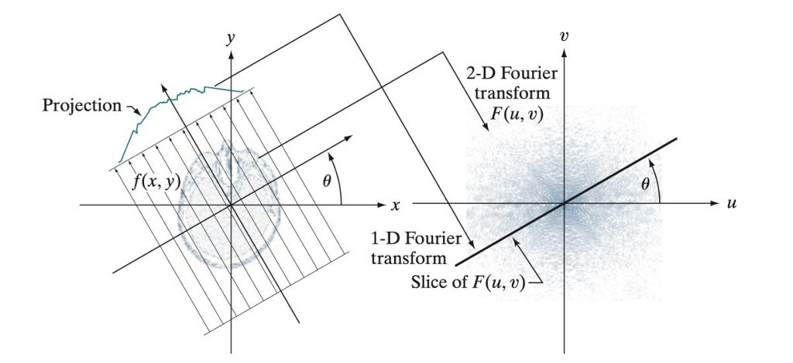
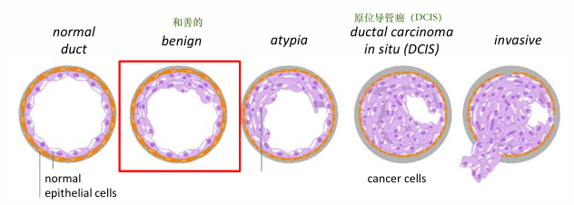

# Class 2 Study ：AI & Medical

**Summary:** Introduction to Medical Image Analysis

Background of MIA

- Medical imaging modalities

  - X-ray imaging
  - MRI
  - Nuclear imaging
  - Ultrasound imaging
  - Microscopy imaging
  - Other iamging

  

MIA：医学图像分析

- It can help the structures become visible and get the information of function and metabolic.
- MIA include: the anatomy of human body; physiological processes observe, function of organs...

## Background of MIA

分类：

| Anatomical imaging  | 解剖学成像                                             | Functional/Metabolic imaging | 功能/代谢成像 |
| ------------------- | ------------------------------------------------------ | ---------------------------- | ------------- |
| X-Ray Radiography | X光平片，穿透性强，适合骨骼、肺部等高密度 / 大体积结构。 | SPECT/PET | 和医学成像，通过放射性示踪剂检测组织代谢活性 |
|X-Ray CT|计算机断层扫描，多层 X 光扫描重建 3D 结构，密度分辨率高，适合解剖细节观察。|fMRI/pMRI|功能/灌注磁共振，fMRI通过血氧水平变化检测脑部神经活动那个（如脑功能区定位），pMRI评估组织血流灌注（如脑卒中后的血流监测）。|
|MRI|磁共振成像，软组织分辨率极高。|Ultrasound|功能超声，检测血流速度与方向，评估血管功能。|
|Ultrasound|超声，实时动态成像、无辐射，适合心脏、腹腔、等软组织动态观察。|Optical Fluorescence|光学荧光成像，用荧光探针标记特定分子，术中导航肿瘤边界或检测分子代谢活动。|
|Optical|光学成像，适合体表或腔道内的结构成像。|Electrical Impedance|电阻抗成像，通过组织电阻抗差异反映功能变化|

**四大核心成像技术**：

1. X-ray imaging：X射线成像测量短波电磁波的吸收，已知短波电磁波在不同组织之间变化。
2. MRI：磁共振成像测量选定原子（最明显的是人体中丰富的氢）的密度和分子结合，它因组织类型、分子组成和功能状态而异。
3. Ultrasound：超声成像捕获具有不同声阻抗的组织之间和内部边界的反射。
4. Nuclear：核成像测量通过血流给受试者的放射性示踪剂材料的分布。 它测量人体的功能。

## X-Ray imaging

X-Ray position：X射线属于高能短波电磁波，能量范围为103~104电子伏特（keV），具备**强穿透性**。

1. **X-Ray在CT中的应用**：从投影到图像的重建（**双方向投影成像**）

​	1) 投影采集：X射线从不同角度穿透人体，得到每个角度的投影数据。

​	2) 1-D Fourier transform：一维傅里叶变换，即对每个角度的投影数据做一维傅里叶变换，得到傅里叶空间“切片”。

​	3) 2-D Fourier transform：二维傅里叶变换，将所有角度的傅里叶切片拼接成完整的二维傅里叶空间，再通过逆变换重建出人体的断层图像。

​	[如何理解傅里叶变换]([【官方双语】形象展示傅里叶变换_哔哩哔哩_bilibili](https://www.bilibili.com/video/BV1pW411J7s8/?spm_id_from=333.337.search-card.all.click&vd_source=d1217b2cbffb17d57a9fefc1fbd471a7))

> **其实和OCT那一章找光程，垂直两方向的频率叠加显示位置一样**。

 2. X-ray的成像定义：直接体现在**单方向投影成像**——仅从一个角度发射X射线，得到二维投影图像，但存在结构重叠的局限。

    

 3. X-ray射线衰减的物理机制：光电效应&康普顿效应

​	X射线的衰减/吸收由光电效应和康普顿效应共同决定，因此骨骼的衰减远大于软组织或空气。

​	1) **光电效应**：Photoelectric effect，X 射线光子被原子的**内层电子**完全吸收，光子能量转移给电子使其脱离原子。这个过程的发生概率与原子序数的 3 次方成正比（Z³）。

​	2)**康普顿效应**：Compton effect，X 射线光子与原子的**外层电子**碰撞，光子发生散射（改变方向），仅损失部分能量。这个过程的发生概率主要与电子密度相关。

​	简单说：**光电效应主导了骨骼的强吸收，康普顿效应主导了软组织和空气的弱吸收**，两者共同作用导致了 X 光图像的黑白灰差异。

---

## Fluoroscopy and Angiography

**荧光透视与血管造影**

Fluoroscopy is a specific kind of X-ray imaging to visualize moving or changing objects in the human body.

- 荧光透视是连续动态成像，可以实时观察。
- 通过向血管注入**含碘造影剂**（碘的原子序数高，X射线衰减系数大），造影剂随血液充盈血管，使血管在X光下呈高密度。
- DSA（数字减影血管造影），Digital Subtraction Angiography：通过“两次成像相减”消除背景干扰，先拍摄一张**无造影剂**的背景图片，在拍摄一张血管显影的图像，相减后抵消骨骼、软组织等背景留下血管清晰影响。
  - DSA使血管疾病诊断和介入治疗的**“金标准”**。

---

## Computed Tomography

CT，计算机断层扫描：通过计算机，从沿轴采集的一系列平面截面投影中，重构出人体结构三维图像的放射学技术，也成为计算机轴向断层扫描。

- CT图像的灰度值本质是X射线的**衰减系数（μ）**，但不同设备、不同X射线能量会导致衰减系数的数值差异，无法直接对比。
- Hounsfield Scale（亨斯菲尔德标度，简称**HU 值**）的作用，就是把衰减系数做**标准化归一化处理**。

公式：$$ \text{HU}(\mu) = 1000 \times \frac{\mu - \mu_{\text{water}}}{\mu_{\text{water}} - \mu_{\text{air}}} $$​

1. **基准设定**：以水和空气的衰减系数为固定参照.
   - 水的衰减系数 μwater → 定义为 **0 HU**
   - 空气的衰减系数 μair → 定义为 **-1000 HU**
2. **数值含义**：任何组织的 HU 值，是它的衰减系数与水的衰减系数的相对差值，放大 1000 倍后的结果。HU 值是 CT 诊断的**量化依据**，HU值越大拍出来的照片越白。

CTA，CT Angiography（CT血管造影）：通过静脉注入含碘造影剂，让血管和血供在CT图像上显影更清晰的技术，用于无创显示全身血管的形态和病变。

---

## Magnetic Resonance Imaging

MRI，核磁共振：原理是激发并检测人体组织水中质子旋转轴方向的变化，MRI设备用**强磁场**让质子统一朝向，再用**射频脉冲**激发质子偏离方向，停止激发后质子恢复原位时会释放射频信号。

- 基于电磁感应的射频信号，来自体内被激发的、**具有磁矩和角动量**的原子核，最常见的是质子密度成像。
- MRI 序列的多样性（Sequences）:

> 信号由三个**弛豫参数**（relaxation parameters）决定：质子密度spin density、T1弛豫spin-lattice relaxation T1（自旋-晶格弛豫）、T2弛豫spin-spin relaxation T2（自旋-自旋弛豫），因此可以开发不同序列来突出其中任一参数。

1. 质子密度：组织内氢质子的数量（水含量），质子密度加权像突出组织含水量差异。
2. T1 弛豫：质子从激发状态恢复到平衡状态的时间，T1 加权像突出组织的 T1 差异（如脂肪与脑脊液）。
3. T2 弛豫：质子之间的自旋相互作用导致信号衰减的时间，T2 加权像突出组织的 T2 差异（如水肿与正常组织）。

---

## Nuclear imaging

核成像：

- 基础类型：
  - **闪烁扫描（Scintigraphy）**：用类似 X 射线投影的方式，测量放射性示踪剂在体内的分布投影。
    - 本质是二维平面的功能成像，示踪剂被组织摄取后发出 γ 射线，探测器从单一角度采集信号，生成投影图像，相比X光反应的是代谢而非密度。
  - **PET/CT（Positron Emission Tomography正电子发射断层扫描/计算机断层扫描）：**PET是通过注入正电子示踪剂（如 FDG），检测示踪剂的代谢分布；CT则是提供精确的解剖定位。通过融合PET的功能信息与 CT 的解剖信息叠加，能清楚肿瘤分期、复发监测。
  - **SPECT（Single Photon Emission Computed Tomography）：**单光子发射计算机断层扫描，是通过示踪剂的投影重建出三维的示踪剂分布，类似 CT 的多投影重建，但信号来自示踪剂的 γ 射线。

---

## Ultrasound Imaging

> An ultrasound reflection signal is created using a *<u>transducer</u>* which acts as <u>*sender*</u> and *receiver* of ultrasound waves.

超声反射信号由*<u>换能器</u>*产生，换能器同时充当超声波的<u>*发射器*</u>和<u>*接收器*</u>。

- 本质：发射高频声波（通常 2-15 MHz），声波遇到不同组织界面产生反射，换能器接受反射波，通过计算声波往返时间和振幅，转化为图像信号。

- 类型：

  - A-scan A型超声：单方向声波，一维波形图，横坐标为深度（时间），纵坐标为反射波振幅。
  - Ultrasound(US) = B-scan B型超声：多个不同角度的A-scan组成平面扇形波束，生成二维灰度图像。

- 特点与局限：Real-time imaging实时成像，能动态显示器官运动。但会受到**骨骼**（total reflection全反射）和**空气**（excessive attenuation过度衰减）的影响，导致声波无法穿透高密度骨骼或低密度空气。

- **Doppler imaging多普勒成像**：

  > Doppler imaging is a specific technique using the Doppler effect for estimating the speed and direction of moving objects (such as blood) in the ultrasound image.

  利用多普勒效应，估计超声图像中运动物体（如血液）的速度和方向。

  - 原理：当超声波遇到运动的红细胞时，反射波的频率会发生偏移（朝向探头时频率升高，远离时降低）。设备通过计算频率偏移，转化为血流的速度和方向信息。
  - 彩色多普勒图像：用颜色编码**血流方向**，亮度代表**血流速度**。

**超声成像的主要优势是其非侵入性，能够为浸入液体中的成像物体提供出色的信息。**

---

## Microscopy Imaging

- 光学显微镜可以分析尺寸大于约200纳米的活体结构。
- 在机器的图像显示可能的癌症后，医生会进行活检。
- 病理学家在显微镜下观察**活检（biopsy）**，传统上是在幻灯片上。
- 显微图像可用于细胞计数、细胞形状分析和肿瘤分化。（AI能帮助的地方）

1. H&E staining：是一种使用苏木精和伊红两种染料对组织切片进行染色的方法。苏木精是一种碱性染料，能够将细胞核内的染色质和胞质内的核酸染成蓝紫色；伊红是一种酸性染料，能够将细胞质和细胞外基质中的蛋白质等染成红色或粉红色。

2. Histopathology 组织病理学

- 正常导管（Normal duct） → 良性病变（Benign） → 非典型增生（Atypia） → 导管原位癌（DCIS） → 浸润性癌（Invasive carcinoma）

3. Fluorescence Microscopy 荧光显微镜

   > Instead of using reflection and absorption, the signal is generated by the fluorescence response of the living material to incident laser light

   信号不是来自反射和吸收，而是活体材料对入射激光的荧光响应.

   - 原理：用特定波长的激光（使用电子而非光来获取图像）激发样品中的荧光物质，这些物质被激发后会发出更长波长的荧光，设备通过检测荧光信号来成像。
   - 关键优势：**高特异性 + 高灵敏度 + 活细胞成像**

---

## Other Imaging

1. OCT Optical Coherence Tomography: 光学相干断层扫描 

> A light wave is sent into the probe, and reflections in the tissue are measured.
>
> 将光波送入探头，测量组织中的反射信号.

2. Photography 医学摄影
