# Class 3 study: Foundation of ML

**Topic: Introduction to Machine Learning**

**Summary:**

- Machine learning basics
- Deep learning
- Regularization for deep learning
- Optimization for deep learning
- Advanced deep learning models

围绕深度学习基础展开，涵盖机器学习基础、深度学习概念、正则化、优化算法以及高级深度学习模型等方面内容。

1. 机器学习基础：机器学习让计算机无需显式编程就能学习，通过对数据的学习进行预测，常涉及数据预处理和特征设计。监督学习依据已知联合概率分布的训练数据来评估条件概率，目标任务有分类、回归等；无监督学习旨在挖掘数据的潜在结构，如聚类、降维等。
2. 深度学习概述：深度学习试图模拟人脑行为，从大量数据中学习，以解决传机器学习手动设计特征的难题，神经网络是其重要基础，历经多个发展阶段，多层感知机由多个神经元连接构成，通过激活函数和多层结构进行复杂函数的拟合。
3. 深度学习的正则化：正则化用于降低深度学习模型的泛化误差，防止过拟合。常见方法包括扩大数据集、参数范数惩罚，还有数据增强、噪音鲁棒性处理、模型集成、早停法、随机失活（Dropout）、对抗训练等。
4. 深度学习的优化：随机梯度下降（SGD）是训练深度模型常用算法，反向传播算法用于计算梯度。此外，还有动量法、自适应学习率、批归一化等优化技巧辅助训练。
5. 高级深度学习模型：卷积神经网络利用卷积滤波器和池化操作提取图像特征；循环神经网络适用于处理序列数据；自动编码器用于数据压缩和特征学习；生成对抗网络、变分自编码器、去噪扩散概率模型等生成模型能生成新的数据。

---

## Machine Learning Basics

> Machine learning (ML) is a field of computer science that gives  computers the ability to learn without being explicitly programmed

### ML

机器学习（ML）是一个计算机科学领域，它使计算机能够在不明确编程的情况下进行学习。

- 经典流程：输入Labeled Data（带标签数据）→ 处理ML algorithm（机器学习算法 ）→ 输出Prediction（预测）

- Pre-work: 需要
  - **数据预处理（Data pre-processing）**：清洗原始数据（比如去除噪声、填补缺失值），让数据适合模型输入。
  - **特征设计（Feature design）**：从原始数据中提取有意义的特征（比如从医学影像中提取纹理、边缘等特征），帮助模型更好地学习规律。

---

### Supervised Learning

Supervised Learning，监督学习：是机器学习中最成熟、应用最广的分支。

#### 监督学习的数学本质

1. 核心假设：假设数据来自一个未知的**联合概率分布**$p_{X,Y}$，训练数据$(x_i,y_i)$是从这个分布中独立同分布（i.i.d., 即每个样本**互相独立**、来自同一分布）抽取的。

> 考虑位置的联合概率分布$P_{X,Y}$，并假设训练数据 $(x_i,y_i)∼P_{X,Y},x_i∈X,y_i∈Y,i=1,....,N$

- $x_i$是**特征向量**（比如患者的年龄、血压、影像特征），$y_i$**标签**（比如 “是否患糖尿病” 是离散类别，“血糖值” 是连续数值）。

  > 在大多数情况下，$x_i$是特征的向量，而 $y_i$ 是标量（例如，类别或实值）.
  >
  > 
  >
  > 训练数据生成i.i.d.（是 “独立同分布 independent and identically distributed” 的缩写，指训练集中每个样本互相独立，且都来自同一个概率分布，这是模型能有效泛化到新数据的基础假设.）
  >
  > 
  >
  > 对于任何新的 $(x,y)$，推理是估计条件：$p (Y=y|X=x)$

2. 目标与任务：

- 监督学习的目标是：对新输入的X，估计**条件概率**$P(Y = y|X = x)$，也就是给定特征x的情况下，预测标签y的概率。
  - 常见任务类型：
    - **Classification**分类：标签 $y$ 是离散的类别（比如 “良性 / 恶性”“猫 / 狗”），目标是预测输入属于哪一类。
    - **Regression**回归：标签 $y$ 是连续的数值（比如 “房价”“血糖值”），目标是预测输入对应的具体数值。

#### Supervised vs Unsupervised

| Dimension | Supervised                                                   | Unsupervised                                                 |
| --------- | ------------------------------------------------------------ | ------------------------------------------------------------ |
| Data      | $X$ (data), $Y$ (label)                                      | Just data $X$                                                |
| Goal      | Learn a function to map $X$ → $Y$                            | Learn some underlying hidden structure of the data           |
| Example   | Classification, regression,  object detection, semantic  segmentation, image captioning(分类、回归、对象检测、语义分割、图像字幕) | Clustering,  dimensionality reduction, density  estimation(聚类、尺寸缩小、密度估计) |

---

### Empirical Risk Minimization

经验风险最小化（**ERM**），是监督学习的**核心数学优化原则**，决定了模型如何从数据中学习到最优的预测规则：

**定义 “预测好坏” 的衡量标准**（损失函数概念） → **针对不同任务选择具体工具**（常见损失函数） → **明确优化的直接目的**（最小化 “整体预测误差”） → **理论层面**（1-3，真正想优化的目标） → **实践层面**（4-5，可实际执行的） → **Q&A**

#### **核心概念拆解**

- 模型函数 $f$：$X$ → $Y$：机器学习算法生成的预测函数，输入特征输出预测值。
- **损失函数**$\mathcal{L}(y, f(x))$：衡量预测值$f(x)$与真实标签 $y$ 之间的差距，满足$\mathcal{L}(y, f(x)) \geq 0$。
  - 损失值越小，说明预测越精准。
- **ERM**：模型的优化目标是**最小化训练集上的平均损失**（即“经验风险”），通过调整模型参数，让预测值和真实值的整体差距最小。

#### 常见损失函数

- **分类**任务选择**交叉熵损失 Cross-Entropy Loss**：

  $\mathcal{L}(y, f(x)) = -\sum y·logf(x)$

​	用来衡量预测的类别概率分布和真实标签分布的差异，值越小说明概率预测越准。

- **回归**任务选择**均方误差 MSE，Mean Squared Error**:

  $\mathcal{L}(y, f(x)) = \sum ||y-logf(x)||^2$

	用来衡量预测值和真实值的平方差之和，值越小说明数值预测越准。

#### 理论优化目标

从数学上通过定义获取机器学习算法的**理论优化目标**。

##### **Hypothesis Space 假设空间**

> Let $\mathcal{F}$ denote the set of all functions $f$ (hypothesis space) that can be produced by the chosen learning algorithm.

- **符号  $\mathcal{F}$ **：表示 “假设空间”，即选择的学习算法（如线性回归、神经网络）能生成的**所有可能函数 $f$ 的集合**。

  > > 譬如：若使用线性回归，则 $\mathcal{F}$ 就是形如：
  > > $f(x) = w_1x_1 + w_2x_2 +... + w_nx_n + b$的线性函数的集合。
  > >
  > > aka, 假设空间是算法 “能想到的所有可能模型” 的范围。 

##### **Expected Risk 期望风险**

> We are looking for a function $f∈F$ with a small expected risk:
>
> $R(f)= \mathbb{E}_{(x,y)\sim p_{X,Y}}[\mathcal{L}(y,f(x))]$

- **符号**$R(f)$：代表“期望风险”，是模型在整个**真实数据分布**$p_{X, Y}$上的平均损失。
- $\mathbb{E}_{(x,y)\sim p_{X,Y}}$：期望符号，代表对所有来自真实分布$p_{X, Y}$的样本$(x, y)$**求平均**。
- $\mathcal{L}(y,f(x))$：损失函数，衡量单个样本的预测值$ f(x)$ 与真实标签 $y $的**差距**。

**核心逻辑**：期望风险是**真正想最小化的目标**，反映了模型在 “所有可能数据” 上的泛化能力。但因为真实分布$p_{X, Y}$是未知的，无法直接计算$R(f)$，所以在实际中用**训练集上的经验风险（训练集损失的平均）**来近似它。

##### **理论最优函数 $f_*$** 

> $f_* = \arg \min_{f∈F}R(f)$

- 符号$\arg \min$：表示“找到使后面的函数取得最小值的**自变量**”。此处是寻找在假设空间  $\mathcal{F}$ 中，让期望风险$R(f)$最小的函数$f_*$ 。
- **含义**：$f_*$是理论上的“最优模型”，它在真实数据分布上的泛化能力最强。但由于真实分布位置，我们无法直接找到$f_*$​​，**<u>只能通过训练集上的经验风险最小化来逼近它</u>**。

##### **Empirical Risk 经验风险**

> If we have i.i.d. training data $d={(x_i,y_i)∣i=1,...,N}$, we can compute an estimate, the empirical risk (or training error).
>
> $\hat{R}(f, d) = \frac{1}{N} \sum_{(x_i, y_i)∈d}\mathcal{L}(y_i,f(x_i))$​

- **训练数据d**：包含$ N $个独立同分布（i.i.d.）的样本$ (x_i,y_i)$，是我们从真实分布中抽取的 “可见样本”。
- **经验风险$\hat{R}(f, d)$**：aka“训练误差”，是模型$f$在**训练集**上的**平均损失**。
  - $\frac{1}{N} \sum$：对训练集中所有样本的损失求平均。
  - $\mathcal{L}(y_i,f(x_i))$：单个样本的损失（比如分类任务的交叉熵、回归任务的均方误差）。

核心逻辑：用经验风险$\hat{R}(f, d)$替代期望风险$R(f)$​，从**<u>不可计算</u>**的理论目标到**<u>可计算</u>**的优化目标。

##### 经验风险最小化原则

> This results into the empirical risk minimization principle:
> $f^d_* = \arg \min _{f∈\mathcal{F}}\hat{R}(f, d)$

- $f^d_*$：在训练集 $d$ 上，$\hat{R}_{min}(f, d)$找到的“最优模型”。
- $\arg \min _{f∈\mathcal{F}}$：$\mathcal{F}$ 中，能使$\hat{R}_{min}(f, d)$的函数 $f$。

本质是所有监督学习算法的**实际优化目标**，譬如：

> > 线性回归中，最小化 “均方误差的平均值”（经验风险）来找到最优权重；
> >
> > 神经网络中，反向传播最小化 “训练集的交叉熵损失平均值”（经验风险）来更新参数。
>
> Most machine learning algorithms, including neural networks, implement empirical risk minimization.

​	ERM代表着无论是何种模型本质都在执行“ERM最小化”，**唯一区别**在于不同算法的 $\mathcal{F}$ 不同，以及使用的$\mathcal{L}(y,f(x))$不同。

#### Q&A

- Q：**啥是“真实分布”**？

  A：真实分布是生成所有数据的**潜在概率规律**。

  > 譬如所有可能的患者（收集和未收集的）的“年龄、血压、是否患糖尿病”数据，均来自一个真实分布。
  >
  >
  > 这个分布包含了所有可能的样本组合及其出现的概率，譬如50岁血压140患者糖尿病概率为30%。
  >
  > 训练集只能从真实分布中抽取一部分样本，而真实分布本身是**永远无法观测**，只能通过样本去估计它的规律。

- Q：**泛化能力是啥**？

  A：泛化能力的确是模型对不同输入数据的通用性，更准确些：

  > 泛化能力是指模型对**从未见过的新数据**的预测能力，而不是对 “不同输入” 的通用性。

  其本质，就是模型在**真实分布**$p_{X,Y}$上的表现，即期望风险$R(f)$​的大小。

---

## Capacity & Generalization & Regularization

从模型容量（Capacity）和泛化能力（Generalization）出发，解释机器学习中欠拟合（Underfitting）与过拟合（Overfitting）：

### Capacity of a Hypothesis Space

假设空间 $\mathcal{F}$ 的容量：

> The capacity of a hypothesis space induced by a learning algorithm intuitively represents the ability to find a good model $f∈ \mathcal{F}$​ for any functions.

​	**Capacity** 容量是 $\mathcal{F}$ 的“表达能力”，直观来说就是模型拟合**多复杂的函数**的能力

> > 容量低，如“线性回归”：只能拟合线性关系，无法处理复杂的非线性模式。
> >
> > 容量高，如“深度神经网络”：能拟合高度非线性的函数，甚至能记住噪点细节。

### Generalization

> ML algorithm must perform well on new, previously unseen inputs. The ability to perform well on previously unobserved inputs is called generalization.

- Generalization 泛化能力，上述**[Q&A](#q-a)**已解答

### Problem

决定算法性能的两个核心能力：

> The factors determining how well a ML algorithm will perform are its ability to:
>
> 1. Make the training error small and
> 2. Make the gap between training and test error small.

1. 让训练误差小 → 若过大 → Capacity 不足 → 没学到**基础规律**  → **Underfitting 欠拟合**。
2. 训练误差和测试误差的差距小 → 若差距大 → Generalization差  → **过度拟合**训练集的**细节** → 没学到真实分布规律 → **Overfitting 过拟合**。

常见的调节方法：

1. 选择$\mathcal{F}$ （用线性模型降低容量，用深度神经网络提升容量）；
2. 调整模型参数数量（更多参数通常代表更高容量）；
3. 使用正则化（如 L1/L2 正则化，降低模型容量以防止过拟合）。

> Capacity, Underfitting and Overfitting 可视化

### Core Visualization

**分阶段解析**：

- Underfitting zone：欠拟合区

  位于横轴最左侧（容量极低），训练误差、泛化误差极高，随着容量增加，两误差同步快速下降——模型开始能捕捉数据真实规律。

- Optimal Capacity：最佳容量

  红色竖线标注处，**泛化误差（绿线）最低点**

- Overfitting zone：过拟合区

  竖线右侧，容量过高，训练误差持续下降，模型过于复杂，泛化误差上升。

---

### Regularization

1. 机器学习的**正则化**：

> Regularization is any modification we make to a learning algorithm that is intended to reduce its generalization error but not its training error.

- 核心目标：正则化的唯一目的是**降低泛化误差（测试集误差）**，而不是降低训练误差。
- 关键逻辑：允许模型在训练集上**保持一定的误差**，但能让模型在**从未见过的新数据**上表现更好。
- 与过拟合的关联：过拟合的本质是模型容量过高，正则化通过**约束模型复杂度**，从根源上减少拟合的风险。

2. 作用原理：

> It discourages learning a more complex model, so as to avoid the risk of overfitting.

- **核心手段**：通过 “惩罚复杂模型” 来限制模型的容量（复杂度）。
  - 如：用 L2 正则化（权重衰减）时，会给损失函数增加一个 “权重平方和” 的惩罚项，让模型的权重尽可能小，从而避免模型学习到过于复杂的模式。

3. 机器学习的两大核心问题：

- **优化（Optimization）**：最小化<u>训练误差</u>；

- **正则化（Regularization）**：最小化<u>泛化误差</u>；

4. 典型正则化方法：

- **权重衰减（Weight Decay）**：aka L2正则化，通过在损失函数中加入权重的平方和惩罚项，让模型的权重尽可能小，从而降低模型复杂度。
- **早停（Early Stopping）**：在训练过程中，当验证集误差不再下降时就停止训练，避免模型过度训练而记住训练数据的噪声。
- 其他方法：L1 正则化（产生稀疏权重）、Dropout（随机丢弃神经元，防止以来特定特征）、数据增强（增加训练数据的多样性，让模型学习更鲁棒的规律）

---

## Deep Learning

何为深度学习？在ML中，手动过滤、提取特征的Data processing往往过度指定、不完整，需要很长时间来设计和验证。Deep Learning 试图模拟人类大脑行为——允许从大量数据中“学习”。

### 最Old School的Neural network

机器学习和人工智能的老资历Neural network神经网络最早可追溯到20世纪40年代。

- 1986，Artificial neuron 人工神经元开始可以接受一个或多个输入，并将它们相加以产出输出。

  此时每个输入都是单独加权的，总和通过一个成为**激活函数**的非线性函数传递。

  如果将其中许多单元连接到神经网络，这些单元会更强大。

---

### Activation Functions

激活函数是**MLP（多层感知机）**能拟合非线性关系的核心，常见有6种：

1. Sigmoid

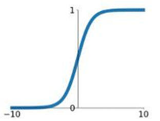

- 公式：$σ(x)=\frac{1}{1+e^{-x}}$
- 输出值映射0到1之间，通常用于二分类问题的输出层。其函数图像时一个平滑的S形曲线。

2. tanh（双曲正切）

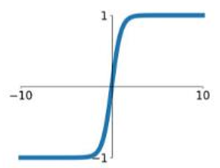

- 公式：$tanh(x)$
- 它将输入值映射到-1到1之间，相比Sigmoid函数其输出是以零为中心的。图像也是一个S形曲线，但范围在-1到1之间。

3. ReLU（Rectified Linear Unit）

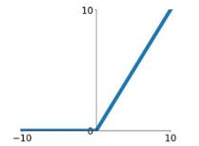

- 公式：$max(0,x)$
- 输入大于 0 时输出自身，否则输出 0；计算速度极快，有效缓解了梯度消失问题。输入为负时梯度为 0，可能导致**神经元死亡**（对应参数不再更新）。

4. Leaky ReLU

- 公式：$max(0.1x,x)$
- 给负输入保留一个小斜率（如 0.1），解决了 ReLU 的 “神经元死亡” 问题。

5. Maxout

- 公式：$max(w^T_1x+b_1,w^T_2x+b_2)$
- 输出多个线性变换中的最大值，是一种通用激活函数，能拟合更复杂的模式，无梯度消失问题。缺点在于会增加模型参数数量，提升计算成本。

6. ELU（Exponential Linear Unit）

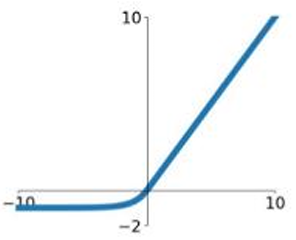

- 公式：$\begin{cases}x&x\geq0\\α(e^x-1)&x<0\end{cases}$
- 负输入有指数形式的饱和值，能加快模型收敛速度，同时解决 ReLU 的 “神经元死亡” 问题。

### Multilayer Perceptron, MLP

MLP，是一种前馈神经网络（Feed-forward Neural Network），由多层神经元（节点）组成，是一个有向无环图（信息从输入到输出单项传播，无循环）。

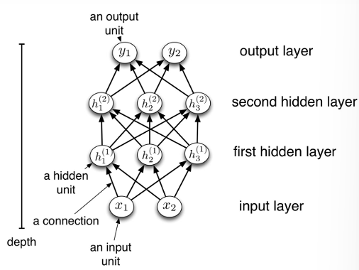

> 这下看懂了

> We can connect lots of units together into a **directed acyclic graph**.  
>
> This gives a feed-forward neural network, also called multilayer perceptron (MLP). 
>
> Typically, units are grouped together into layers.  
>
> AMLP consists of at least three layers of nodes: an input layer, a hidden layer and an output layer.

#### consist of MLP

- input layer：输入层，纯接受原始数据，不做计算只传输信息。
- Hidden layer：隐藏层，黑箱这一块，**至少$\geq1$**，通过Activation Functions提取数据的非线性特则。
- Output layer：输出层，给出预测结果。

#### Feature of MLP

- Fully connected：全连接，每一层的所有节点都与下一层的所有节点相连（不然会丢失信息）。
- Depth：深度，也就是说黑箱+输出一共有几层。
- 非线性能力：每个MLP都带的激活函数。

#### Fully connected

全连接层：每一层会将 **N 个输入单元** 连接到 **M 个输出单元**；

- 最简单的情况下，所有输入单元与所有输出单元都直接相连，这就是全连接层

- 单层输出的数学公式：$y=f(x)=ϕ(Wx+b)$

  - $x$：输入向量（维度为$N$），代表输入层的**原始特征**；
  - $W$：权重矩阵（维度为$M × N$），表示输入与输出之间的**连接强度**；
  - $b$：偏置向量（维度为$M$​），给每个输出单元添加一个**偏移量**；

  > 偏置向量$b$的核心作用，是打破线性变换“必须过原点”的限制，提升拟合能力和表达灵活度。
  > 数学上使x为0时y可以为b，从而覆盖整个向量空间（避免坍缩为0）。
  >
  > 模型上避免欠拟合。

  - $Wx+b$：对输入做**线性变换**，计算输入的加权和；
  - $ϕ$：激活函数，引入非线性变换；
  - $y$：输出向量（维度为$M$），代表该层的最终输出。

#### 堆叠

MLP是全连接的**堆叠**，也就是**每一层的输出作为下一层的输入**：

$$ \begin{align*} h^{(1)} &= f^{(1)}(x) \\ h^{(2)} &= f^{(2)}(h^{(1)}) \\ h^{(3)} &= f^{(3)}(h^{(2)}) \\ y &= f^{(L)} \circ \dots \circ f^{(1)}(x) \end{align*} $$​

##### 各部分含义

- $h^{(l)}$：第$l$层（隐藏层/输出层）的输出，代表该层提取的特征；
- $f^{(l)}$：第$l$层的变换，即$f^{(l)}(h^{(l-1)})=ϕ(W^{l}h^{(l-1)}+b^{(l)})$（线性变换+激活函数）；
- $\circ$：函数复合符号，表示”先算第一层，再算第二层，直到第$L$​层。

##### 核心意义

- 多层函数复合让MLP能逐层提取**更抽象的特征**；
  - 第一层提取简单特征（边缘、纹理等）；
  - 后面提取更复杂的抽象特征（物体部件、语义信息）；
  - 最终基于抽象特征完成预测。

#### 最后，损失函数长这样

$$\mathcal{L}\left(y_i,f^{(L)} \circ \dots \circ f^{(1)}(x_i)\right) $$

- 模型的优化目标是最小化**最终输出与真实标签的差距**
- $y_i$：第$i$个样本的真实标签；
- $f^{(L)} \circ \dots \circ f^{(1)}(x_i)$：第$i$个样本的模型预测输出；
- 训练时通过**反向传播（Backpropagation）**，根据损失函数的梯度，逐层优化所有层的权重$W^{(l)}$和偏置$b^{(l)}$。

---

### Regularization for DL

前面的章节学到了，ML里进行正则化的常用操作为权重衰减、早停、L1正则化等，目的是为了最小化泛化误差，也就是增加模型对陌生数据的泛用性。这里我们进行更详细的拓展：

#### For underfitting

对于欠拟合，可以通过以下途径防止：**增加模型复杂度**，譬如：

> For underfitting, it could be solved by increasing the model complexity.

- 使用更深的神经网络（增加层数）或更宽的网络（增加每层节点数）；
- 更换更具表达力的激活函数（如用 ReLU 替代 Sigmoid）；
- 减少正则化强度（如降低 L2 正则化的权重衰减系数）。

#### For overfitting

对于过拟合，可以通过以下途径防止：

- **Larger data set**：更大的数据集，让模型学习到更鲁棒的规律，减少对噪音的依赖。
- **Parameter norm penalty**：参数范数惩罚，如L1、L2正则化（权重衰减），通过惩罚大权重来限制模型复杂度。
- 其他方法：
  - Data augmentation：数据增强，通过变换训练数据，如旋转、裁剪图像，来增加数据多样性；
  - Model ensemble：模型集成，结合多个模型的预测结果，降低过拟合风险；
  - Dropout：随机丢弃神经元，防止模型依赖特定特征；
  - **Early stopping**：早停，监控验证集的性能，提前停止训练；
  - Adversarial training：对抗训练，让模型对微小噪声更鲁棒，提高泛化能力。

#### Early stopping: simple but high effect

> 早停，简单高效啊！

> Early Stopping: A method that allows you to specify an arbitrary large number of training epochs and stop training once the model performance stops improving on a hold-out validation dataset.

早停是一种简单但高效的正则化方法：通过在训练时实时监控验证集的性能指标（比如损失或准确率），当验证集性能不再提升（甚至下降）时，立刻停止训练避免模型过拟合训练数据。

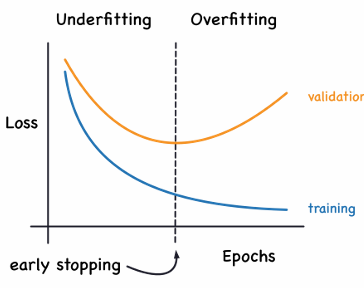

- 横轴：表示训练轮数（Epochs），即模型对整个训练数据集进行完整训练的次数。
- 纵轴：表示损失（Loss），衡量模型预测值与真实值之间的差异，损失值越低，说明模型的预测效果越好。
- 蓝色曲线 - 训练损失：随着训练轮数增加，训练损失逐渐下降。这是因为模型在训练过程中不断调整参数以最小化训练数据上的损失。
- 橙色曲线 - 验证损失：初期，验证损失随训练轮数下降，但当训练达到一定轮数后，验证损失开始上升。

#### Dropout：Random call

Dropout，随机失活。在训练过程中，**随机丢弃一部分神经元（及其连接）**，让每个神经元不能过度依赖其他特定神经元，迫使模型学习更鲁棒、更通用的特征。

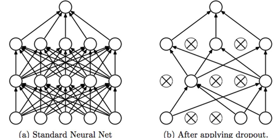

#### Adversarial Training

> 欢迎来到对抗路

这是一种**进阶**的正则化方法：

> Adversarial training: training on adversarially perturbed examples from the training set. Human cannot tell the difference between the original example and the adversarial example, but the network can make highly different predictions.

用对抗扰动样本（Adversarial Examples）来训练模型，这些样本用于在原样本上添加微小噪点扰乱模型预测的。

---

### Optimization for DL

和上述的正则化一样，优化其实也是已经聊过的内容，其实就是ML前面讲的一大坨损失函数，其主要目的就是优化，aka：“最小化<u>训练误差</u>”。

DL的优化和ML的些许不同，DL主要依靠的**核心优化算法**是 **SGD（Stochastic Gradient Descent）随机梯度下降**和**Backporpagation（反向传播）**。

#### SGD

> Stochastic gradient descent (SGD) is the most used algorithm when training deep models, which update the parameters based on the mini-batch samples.

- 随机梯度下降不再用整个训练集计算梯度（因为计算量太大），而是用一小批（mini-batch）样本的梯度来近似整个梯度，从而高效更新模型参数。
- **参数更新公式**：
  $$g=\frac{1}{m^′}∇_θ\sum\limits_{i=1}^{m^′}L(x^{(i)},y^{(i)},θ)$$
  - $g$：mini-batch（大小为$m^′$）的平均梯度；
  - $θ$：模型参数，权重和偏置；
  - $∇$：学习率，控制参数更新的步长；
- **优势**：计算效率高，适合大规模数据集，且噪音梯度能帮助模型跳出局部最优。

#### Backpropagation

> Backpropagation is the central algorithm for deep learning training, which is an algorithm for computing gradients iteratively.

- 反向传播是DL的核心，通过**链式法则**迭代计算每一层参数的梯度，让SGD能根据梯度更新所有层的参数。
- **本质**：从输出层反向传递损失的梯度，逐层计算每个参数对损失的贡献，是实现端到端训练的基础。

#### Other

> Other optimization tricks include momentum, adaptive learning rates, batch normalization, etc.

- 其实除了SGD和反向传播，还有其他优化方法：
- **Momentum**：动量，积累梯度的“惯性”，让优化过程更稳定，避免震荡；
- **自适应学习率**：如Adam、RMSProp，是自动为不同参数调整学习率，加快收敛；
- **Batch Normalization**：批量归一化，是对每层输入做归一化，缓解梯度消失，加速训练。

---

## CNN

何为CNN？**Convolution Neural Network**，是DL解决Fully connect处理图像时**效率低下**的Key method. 组成如下：

### Convolutional filters

> Convolutional filters to capture patterns in the input space instead of fully connection.

卷积核是**小尺寸的权重矩阵**，专用于捕捉输入的**局部模型**，譬如图像的边缘、纹理、角点，**替代了**全连接层的全局连接，仅关注局部依赖，从而大幅减少参数数量，提升计算效率。

> Shared convolution parameters across different locations instead of only focusing on local dependencies.

**同时**，CNN还通过**参数共享（Shared convolution parameters）**将同一卷积输入的**不同位置共享权重**（比如用同一个边缘检测核扫描图像的所有区域），这样便能进一步减少参数数量，无需为每个位置单独学习权重，并使平移不变性，让模型能在不同位置识别相同的模式。

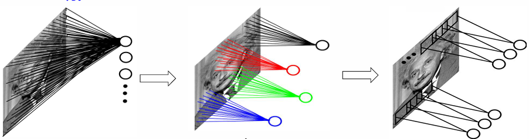

> A imaging shows from fully connect to convolutional filters, till shared convolution parameters.

> Convolution filters will be learned during training.

**更重要的是**，Convolutional Filters不用手动设计，而是通过反向传播和SGD在训练中自动学习，模型会根据任务自动提取最有用的特征。

以下是**卷积公式**：

$$w(x,y)⋆f(x,y)=\sum\limits^a_{s=-a}\sum\limits^b_{t=-b}w(s,t)f(x-s,y-t)$$

- 通过滑动卷积核并计算点积，捕捉输入的局部特征。

### Pooling

> Subsampling (or pooling): a reduction in spatial resolution for achieving translational invariance.

池化，CNN核心操作之一，主要作用是**降低**特征图的**空间维度**，提升模型的效率与鲁棒性。

**核心目的**：

- **Reduction in spatial resolution**：降维，**减少特征图的宽度和高度**，降低计算量和参数数量，防止过拟合。
- **Translational invariance**：平移不变性，让模型对输入的微小平移不敏感（比如图像中的物体稍微移动后，模型仍能识别）。

> Common pooling methods: Average pooling, max-pooling, and L2 pooling.

**常用池化方法**：

- **Max-pooling**：最大池化，在局部区域取最大值，能更好保留边缘、纹理等显著特征。
- **Average pooling**：在局部区域取平均值，能保留区与的整体强度信息。
- **L2 pooling**：在局部区域计算L2范数，能平衡最大值和平均值的效果，提升鲁棒性。

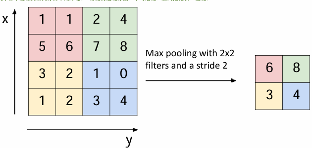

### Classic CNN

#### LeNet Architecture

LeNet架构是第一个成功应用于手写数字识别的CNN，架构展示了CNN的标准流程：

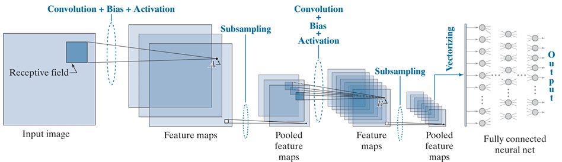

> 看图说话

注意倒数第二步：

- **Vectorizing**：向量化（一维化，概念来自Prof.邢的动力学），将最后一层池化后的特征图展平为一维向量，作为全连接层的输入。

LetNet展示了三个特点：

1. **Local receptive field**：局部感受域，每个神经元仅关注输入的局部区域，减少冗余计算。
2. 参数共享
3. 降维与抽象

#### Deep CNN(AlexNet)

AlexNet 是第一个在大规模数据集（ImageNet）上取得突破性成果的深度 CNN，它证明了深层网络在复杂任务上的有效性：

> AlexNet has a similar structure to that of LeNet, but uses more convolutional layers and a larger parameter space to fit the large-scale ImageNet dataset.

- 结构和LetNet相似，但Depth更多、输入尺寸更大、更多Filter和Bias，并改进了Pooling。
- 首次使用**ReLU 激活函数**缓解梯度消失、**Dropout**防止过拟合、**数据增强**提升泛化能力。

#### Networks Using Blocks(VGG)

VGG 在 AlexNet 的基础上，通过**模块化卷积块**和**小卷积核堆叠**，让深层网络的设计更规整、高效：

> VGG constructs a network using reusable convolutional blocks. The use of blocks leads to very compact representations of the network definition.

- 模块化是指将 “多层 3×3 卷积 + 2×2 池化” 封装为可复用的块，通过堆叠来构建深层网络。
- 同时VGG还用多层 3×3 小卷积替代大卷积，2 层 3×3 卷积的Receptive field等价于 1 层 5×5 卷积，且能引入更多**非线性变换**，提升特征表达能力。

#### Networks with Parallel Concatenations(GoogLeNet)

GoogLeNet 的核心是**Inception 模块**，它通过并行多路径提取不同尺度的特征，在保持准确率的同时大幅降低计算复杂度。

特点是：**四条并行路径**：1×1 卷积 + 1×1 卷积 → 3×3 卷积 + 1×1 卷积 → 5×5 卷积 + 3×3 池化 → 1×1 卷积，最后进行**拼接输出（Concatenation）**。

#### ResNet & DenseNet

1. **ResNet：残差连接**，用于避免网络过深时，梯度在反向传播种消失，导致模型无法收敛的问题。

   **公式**：$H(x)=F(x)+x$，其中$F(x)$是残差（层变换的输出），$x$是输入的直接传递。

2. **DenseNet：密集连接**，将残差连接的“加分”升级为“拼接”，每个层的输入是前面所有层的输出拼接，在复用特征的同时提高了参数效率（更少参数更多表达）。

ResNet 是 “跨层相加”，DenseNet 是 “跨层拼接”，后者的特征流动更充分，泛化能力更强。

---

## RNN

**RNN（Recurrent Neural Networks）**，通过**递归定义的动态系统**——时刻$t$的状态$s^{(t)}$，仅由前一个时刻$t-1$的状态$s^{(t-1)}$和参数$θ$决定。

> A classical dynamical systems: $s^{(t)}=f(s^{(t-1)};θ)$;

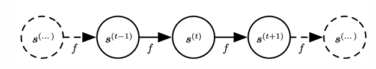

- **循环的直观体现**：状态的定义 “引用自身的前一时刻值”，因此系统是循环的。

> Consider a dynamical system driven by external signal x:

而当**外部输入**时，系统变成了：

  $$s^{(t)}=f(s^{(t-1)};x^{(t)};θ)$$​

- 此时，状态$s^{(t)}$不仅依赖前一时刻的状态，还依赖当前时刻的外部输入$x^{(t)}$。
- 因此，此时状态$s^{(t)}$​包含了**整个过去序列的信息**，这正是RNN能处理序列数据的核心原因。

> And we could unfold RNN as:

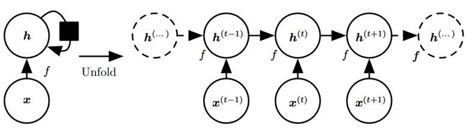

此时，便可以用**经典动态系统状态**$S^{(t)}$​，表达Mathematical formalization of RNN：

### Mathematical formalization of RNN

$$h^{(t)}=f(h^{(t-1)};x^{(t)};θ)$$

$$h_t=f(W_hh_{h-1}+W_ix_t+b)$$​

这两个公式是**抽象定义**和**具体实现**的关系，**完全等价**：

- $h^{(t)}$ or $h_t$：时刻$t$的**隐藏状态（Hidden State）**（上标括号$^{(t)}$是时序的抽象表示），是RNN的存储从序列开始到$t$​时刻的所有历史信息；
- $θ$：模型**所有可学习的参数**（权重和偏置），**展开**是具体的权重矩阵$W_h$、$W_i$和偏置$b$；
- $W_h$：隐藏状态到隐藏状态的**权重矩阵**，控制历史信息的传递强度；
- $W_i$：输入到隐藏状态的**权重举证**，控制当前输入对隐藏状态的影响；
- $f$：抽象定义中为表示“当前状态由历史状态、当前输入和模型参数决定”的抽象函数，具体实现中具体化为**“线性变换$(W_hh_{(t-1)}+W_ix_t+b)$非线性激活函数”**；
- $h_{t-1}$：时刻$t-1$的隐藏状态，当前状态依赖前一时刻的状态；
- $x_t$：时刻$t$​的输入，代表序列在该时刻的元素。

### Classic RNN architecture

> The outputs are depending on problem and computational resource.

There are five classic RNN architectures, 核心是通过匹配输入与输出的序列长度来适配任务需求：

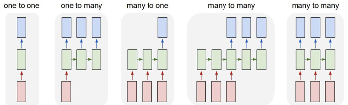

- One to one：一对一，输入为单个元素（粉色块），输出为单个元素（蓝色块），本质为普通的前馈神经网络（Vanilla NN），没有序列输入输出，仅用RNN框架实现但输入输出；
- One to many：一对多，核心逻辑时用单个输入初始化RNN的隐藏状态，然后逐步生成序列输出（image caption），譬如输入一张图片输出一段描述文本；
- Many to one：RNN处理整个输入序列，用最后一个时刻的隐藏状态单输出（sentiment classification），譬如用于情感分类，输入一段文本，输出“正面”或“负面”标签；
- Many to many（同步）：输入和输出为**等长序列**，核心逻辑是通过每个时间步的输入对应一个输出，序列长度相同（surgical video classification on frame level）；
- Many to many（异步）：输入和输出为**不等长序列**，这便是**编码器-解码器（Encoder-Decoder）**的架构，输入序列先被编码器处理成隐藏状态，再由解码器生成输出序列（machine translation）。

---

## Autoencoder

> The primary objective of Autoencoders is data compression.

Autoencoder：自编码器，是一种无监督学习方法，核心时从无标签数据中学习输入的**低维特征表示**（即“数据压缩”），通过“压缩 → 重建”的过程，让模型自动学习输入数据的关键特征，是一种典型的“自监督学习（用输入本身作为监督信号）”。

可见的，Autoencoder的设计初衷是**压缩并保留核心信息**。

### Autoencoder architecture

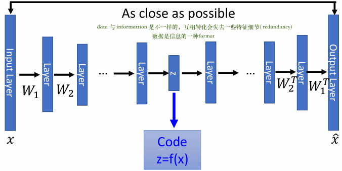

- Encoder：编码器，将输入$x$压缩到**低维的潜在空间（Latent Space）**,输出编码$z=f(x)$，通常由多层神经网络组成（如权重$w_1,W_2$层），逐步降低特征维度。
- Bottleneck：瓶颈层，编码器的最后一层，是整个网络最窄的部分，负责强制压缩输入信息，只保留最关键的特征。
- Decoder：解码器，从潜在编码$z$重建输入，重建结果$\hat{x}$，通常与编码器对称（如使用权重$W^T_2,W^T_1$的转置层），逐步恢复特征维度。

整个工作流程就是：提取核心特征 → 压缩核心特征 → 解压核心特征 → 编码器自动重构整个输入$x$（作为输出$\hat{x}$），对比原始输入$x$和处理后输出$\hat{x}$​的区别，再提取更多的核心特征或剔除噪声。

自编码器的本质是 **“自监督的特征压缩器”**。

---

## VAE

Variational autoencoder（VAE），自编码器的进阶版：变分自编码器。

> Latent variable models form a rich class of probabilistic models that can infer hidden structure in the underlying data.

VAE是一种**概率化的潜在变量模型**，既能自监督特征压缩，还能通过**概率分布**建模潜在空间，从而推断数据的**隐藏结构**（譬如数据的变体，人脸的“微笑程度”、“头部姿势”等）。

> By forcing latent variables to become normally distributed, VAEs gain control over the latent space.

**最神的地方**，VAE将Autoencoder的潜在编码$z$从原先的完全确定性，强制加上了服从**标准正态分布**$(z∼\mathcal{N}(μ,\sum))$，也就是说潜在编码$z$有了一个具备限制性的可浮动区块，使得潜在空间变得具有连续性（原先是定点）、平滑（有了连续性的区域）且可解释（限制性区域）。

> 红线代表标准正态分布

### VAE architecture

为了实现这种功能，VAE采用了双网络结构：

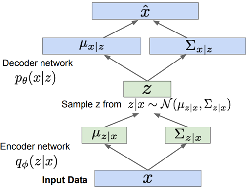

- Encoder network part：输入原始数据$x$，输出潜在变量的**均值**$μ_{z|x}$和**方差**$\sum_{z|x}$，定义了**后验分布**$q_ϕ(z|x)$​。
- 采样过程：从后验分布中采样得到了潜在编码$z$，
- Decoder network part：输入采样的$z$，输出重建数据的**均值**$μ_{z|x}$和**方差**$\sum_{z|x}$，并定义**生成分布**$p_θ(x|z)$，最终输出重建结果$\hat{x}$。

### 贝叶斯公式与基础

从上述内容不难看出，出现了新的数学公式，这些是来自高等数学中贝叶斯公式的基础内容，先从贝叶斯公式的核心逻辑入手，再去理解VAE：

$$P(z|x)=\frac{p(x|z)⋅P(z)}{P(x)}$$

- $P(z)$：**Prior，先验分布**——当不知道输入数据$x$时，潜在变量$z$的**“默认”**概率分布（VAE里面设置为标准正态分布）。
- $P(x|z)$：**Likelihood，似然**——给定潜在变量$z$时，生成数据$x$的概率（对应VAE的生成分布）。
- $P(z|x)$：**Posterior，后验分布**——给定$x$时，潜在变量$z$的概率fen步（对应VAE的近似后验部分）。

#### Posterior

1. 后验分布的定义：

由于真实的后验分布计算非常困难，因此采用$q_ϕ(z|x)$来**近似**$P(z|x)$的结果，其中$ϕ$是编码器的可学习参数。

2. 表达式——后验分布的**具体形式**：

$$z|x∼\mathcal{N}(μ_{z|x},\sum_{z|x})$$

- $z|x$：表示“在给定$x$的条件下的$z$”；
- $∼\mathcal{N}(⋅)$：表示“服从正态分布”；
- $μ_{z|x}$：编码器输出的**均值**，表示$z$的**最可能取值**；
- $\sum_{z|x}$：编码器输出的**方差**（或协方差矩阵），表示$z$的**不确定性**。

**总的来说**，编码器会根据输入$x$，算出$z$应该服从的正态分布的均值和方差，这样我们就能从这个分布里采样得到潜在编码$z$。

#### 生成分布, aka 似然

生成分布$p_θ(x|z)$，也被称为**Likelihood，“似然”**。

> 如果$z$是 “微笑程度 + 头部姿势” 的潜在编码，那么生成分布 $p_θ(x∣z)$ 就表示：用这个编码$z$，生成对应表情和姿势的人脸图像$x$​的概率。

总结上述，就像是：

> 输入的x，计算均值和方差，通过均值+方差给出一个大致的二维取值范围，然后随机取值，根据随机取值重新构建数据$\hat{x}$

---

## GAN

Generative Adversarial Network, aka GAN.

生成对抗网络！自己目前正在用，本质是生成器与判别器的攻防博弈。

组成有两位：

1. **Generator Network（G）**：生成器，专门接受**随机噪声**$z$的输入，目标则是利用随机噪声$z$输出看起来和真实图片一摸一样的Fake Image，以此“欺骗”判别器。

   **最终目标**，通过不断学习真实图像的特征，让生成的假图像越来越逼真。

2. **Discriminator Network（D）**：判别器，输入的是**两类图像**——Generator Network产出的Fake image，以及来自训练集的Real images。它的目标就是准确区分输入的图像是“Real”还是“Fake”。

   **最终目标**，通过不断优化判断能力，迫使生成器提升Fake image的真实度。

> 真是一对苦命鸳鸯。

### Key Concepts

> **Adversarial Training:** The competitive dynamic between G and D. The Generator tries to fool the Discriminator, while the Discriminator tries to get better at catching fakes. This process drives the Generator to produce high-quality, realistic images

补充一个GAN的损失函数（**GAN Loss Function**）：

$$\min\limits_{G}\max\limits_{D}V(D,G)=\mathbb{E}_{x∼p_{data}(x)}[logD(x)]+\mathbb{E}_{z∼p_{z}(z)}[log(1-D(G(z)))]$$

> 难绷

---

## Denoising Diffusion Probabilistic Model

去嘀扩散概率模型，aka **DDPM**。算是当下最热门的生成式模型之一：

> Learning to generate by denoising

**核心原理**：通过“去噪”来生成

- **Forward diffusion**：正向扩散（加噪），先给清晰的真实图片逐步添加随机噪声，直到图片变成完全的“噪声块”；
- **Reverse denoising**：反向扩散（去噪），训练一个去噪模型，让它从完全的噪声出发，一步步去除噪声，最终还原出清晰的图像。
- **Generate new images**：生成时，只需从随机噪声开始，用训练好的去噪模型逐步去噪，就能得到全新的逼真图像。

> 可曾听说过[喜多郁代]([孤独摇滚！ (动画) - 维基百科，自由的百科全书](https://zh.wikipedia.org/wiki/孤獨搖滾！_(動畫))小姐？

### Forward diffusion

从**起点**$x_0$（清晰真实图像）开始，从$x_1 → x_{T-1}$每一步，利用**Noise Scheduler** $β_t$，给图片添加少量高斯噪点，直到经过$T$步后，**终点**$x_T$完全编程随机噪声。

- **Noise Scheduler** $β_t$：噪声调度器，是一个预先设定好的参数序列($t=1,2,...,T$)，通常是**从小到大递增**的，其作用就是控制每一步加多少噪音， $β_t$​越大添加的噪声就越强。

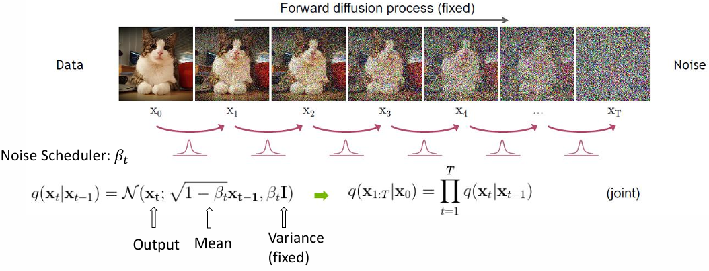

#### Single Step

**单步加噪**的数学定义如下：

$$q(x_t|x_{t-1})=\mathcal{N}(x_t;\sqrt{1-β_t}x_{t-1},β_t\mathbf{I})$$

- $q(x_t|x_{t-1})$：表示“给定前一步图像 $x_{t−1}$，当前步图像 $x_t$ 的概率分布”；
- $\mathcal{N}(·)$：表示$x_t$服从**正态（高斯）分布**；

- $\sqrt{1-β_t}x_{t-1}$：**Mean（均值）**，前一步的图像会被乘以一个小于 1 的系数（因为 $β_t∈(0,1)$​），相当于 “弱化原图信号”，为噪声腾出空间；

- $β_t\mathbf{I}$：**Variance（方差）**，$\mathbf{I}$是单位矩阵，表示每一步添加的噪声是**独立同分布的高斯噪声**，强度由$β_t$​​​控制。

#### Total present

因为正向扩散是**Markov process，马尔可夫过程**（每一步都依赖前一步），所以整个$T$​步的联合概率就是每一步的单步概率的**乘积**。

Therefore, the overall mathematical formalization of forward diffusion is:

$$q(x_{1:T}|x_0)=\prod\limits_{t=1}^Tq(x_t|x_{t-1})$$

#### What is Markov process?

> 未来只和现在有关，和过去无关。

简单来说，马尔可夫过程是一种**“无记忆”的随机过程**，未来（第$t$步）只有现在(第$t-1$步)决定，和过去（更早的步骤）无关。

[不能代表生活的Markov process](https://zh.wikipedia.org/zh-hans/%E9%A6%AC%E5%8F%AF%E5%A4%AB%E9%81%8E%E7%A8%8B)

### Reverse diffusion

反向过程是正向扩散的逆操作，也是 DDPM 生成图像的核心步骤,，整个流程就是把正向扩散倒过来。

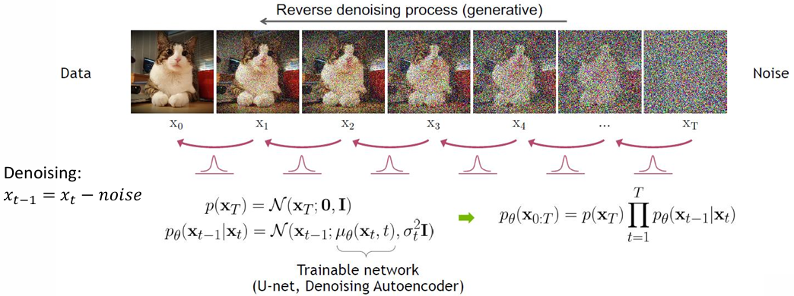

我们认为**起点**的噪声$x_T$服从标准正态分布：

$$p(x_T)=\mathcal{N}(x_T;\mathbf{0},\mathbf{I})$$

#### Single Step

每一步从$x_t$到$x_{t-1}$的去噪过程，由可训练模型（如U-net、去噪自编码器）建模：

$$p_θ(x_{t-1}|x_t)=\mathcal{N}(x_{t-1};μ_θ(x_t,t),σ^2_t\mathbf{I})$$

- $μ_θ(x_t,t)$：是模型预测的去噪后图像的均值；
- $σ^2_t$：是固定或学习的方差；

#### Total present

**联合概率**依旧符合马尔可夫过程：

$$p_θ(x_{0:T})=p(x_T)\prod^T_{t=1}p_θ(x_{t-1}|x_t)$$

### Loss function

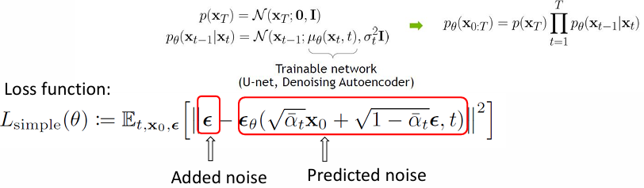

DDPM 的损失函数设计非常巧妙，它不直接预测图像，而是预测**正向过程中添加的噪声**，这让训练更稳定：

$$\mathcal{L}_{simple}(θ):=\mathbb{E}_{t,x_0,\epsilon}[||\epsilon-\epsilon_θ(\sqrt{\overline{a}_t}x_0+\sqrt{1-\overline{a}_t}\epsilon,t)||^2]$$​

- Added Noise，$\epsilon$：**真实噪音**，是正向过程中添加的随机噪音;
- Predicted noise，$\epsilon_θ(·)$：**预测噪声**，模型根据加噪图像$x_t$和时间步$t$，预测出的当前添加噪声；
- Input model，$\sqrt{\overline{a}_t}x_0+\sqrt{1-\overline{a}_t}\epsilon$：**模型输入**，是是正向过程中$t$步后的图像$x_t$（另一种等价表达式）

**核心逻辑**：模型通过学习”从加噪图像还原出当初的噪声” 后，在反向去噪时，就可以用这个能力**从当前图像中减去预测的噪声**，从而逐步生成清晰图像。这种 “预测噪声” 的设计让训练更稳定、计算更高效。

串联逻辑：

正向扩散：给图像加噪，得到加噪图像$x_t$和对应的真实噪声$\epsilon$

$\downarrow$

训练模型：用损失函数让模型学会从$x_t$预测$\epsilon$；

$\downarrow$

反向去噪：从纯噪声出发，用训练好的模型一步步去除噪声，生成清晰图像。

---

## Summary

> 真的、真的...绕了好大一圈的原路啊......

### “非显性编程”的开始

什么是**显性编程（Explicit programming）**？显性编程是**传统的编程范式**，核心是程序员通过手动、清晰地定义所有规则、逻辑、步骤和判断条件，计算机仅需严格按照编写好地代码指令执行，也就说计算机的行为完全依照人为设定的逻辑进行。

| Dimension    | Explicit programming                                         | Machine Learning                                             |
| ------------ | ------------------------------------------------------------ | ------------------------------------------------------------ |
| 核心逻辑     | 人总结设计规则$\rightarrow$代码写死规则$\rightarrow$计算机执行 | 人提供数据+目标$\rightarrow$计算机从数据中学习规则$\rightarrow$用规则做预测 |
| 规则来源     | 程序员的经验和对问题的理解                                   | 数据本身的内在规律                                           |
| 适用范围     | 规则明确、可精准描述的问题                                   | 规则复杂、难以手动总结的问题                                 |
| 应对问题变化 | 需手动修改代码规则                                           | 需补充新数据重新训练，无需手动修改核心逻辑                   |

### 问题/解决目标的分类：监督与非监督

Supervised Learning and unsupervised Learning，监督与非监督学习实际上**仅是对编程目标或解决问题的细分**，并不代表“Machine learning”或“Deep learning”，实际上后两者则是指**两种编程范式/方法**，这两类概念并不互相混淆。

Supervised Learning(SL) focus on data which carry on label, while unsupervised learning(USL) focus on data without any tag.

- Therefore, SL’s goal is to learn the mapping relationship between A(or C/D/E/F) element to B set：

$$A\ or\ C... \rightarrow B$$

- While the USL’s goal is try to figure out the potential inherent laws, structures, or characteristics:

$$ \begin{aligned}A\rightarrow\ ?\\B\rightarrow\ ?\\C\rightarrow\ ?\end{aligned}$$

### From “Model” to ERM

**“1.3”** 一整章是很连贯的内容，虽然看起来有点头晕，但只要理清楚逻辑就简单了：

1. ML或DL想要解决SL或USL的目标，那么就需要一个**标杆/标准**来定义程序范式的好坏（鲁棒性、稳定性、泛化能力等指标的优劣），因此我们在这里使用**“损失函数”（Loss function）**来量化标准。
2. 根据任务目标的不同，标准的设定也不同，针对具体任务选择对应的Loss function：
   - 分类任务（$A\rightarrow B$，SL类）$\rightarrow$用**交叉熵损失**；
   - 回归任务（$A\rightarrow\ B$，SL类）$\rightarrow$用**均方误差（MSE）**；
   - 无监督任务（$A \rightarrow\ ?$，USL类）$\rightarrow$用**重构损失、聚类损失**；
3. 具体落实到损失函数的量化，损失函数是单个样本的“错误值”，我们的目标是**让所有训练样本的整体错误最小**（越小，模型最好，模型的范围由**“Hypothesis Space，假设空间”**确定），而这个整体错误就是**“Expected Risk，期望风险”**。
4. 期望风险是**所有可能数据**的**平均损失**。然而，由于**“真实分布”**的存在，我们无法得到期望风险。因此，我们采用**“Empirical Risk，经验风险”**替代，它是**训练集**的**平均损失**。
5. 因此，ERM也就是最小化训练集的经验风险，便是Model所追求的目标，它代表着Model所使用的算法在假设空间中最接近的、最具鲁棒性、泛化能力最强、稳定性最高的算法。

### Which part we can do？

既然我们已经明晰了目标，接下来应该通过哪些方式来实现？有请Capacity & Generalization & Regularization（模型容量、泛化能力、正则化）登场。

> 这三位算最常规的缩小ER的手段/范式。

- 模型容量（Capacity）：决定 “能学到多复杂的规律”。
-  泛化能力（Generalization）：衡量 “学到的规律有多通用”。
- 正则化（Regularization）：直接 “缩小泛化差距” 的核心手段。

### See you again, Deep learning

> 这张图能让你意识到DL对比ML多出来的内容主要应用在了哪儿，如果你不清楚只能说明那一部分还不够熟练：

看懂了吗？一句话：**激活函数是赋予Feature extraction能力的必要组成部分**。

### Wait, what is generalization error?

好问题，看来没被上面的**经验风险和正则化**给迷惑了。

- Generalization error：泛化误差，是指模型在**“从未见过的新数据”**上的平均损失，映射到标准上是**EMR的近似**。它的计算依赖于**“测试集”（或真实分布）**，而非训练集。

- Training error：训练误差，则是不折不扣的**经验风险**，它就是模型在**训练集**上的平均损失，它们（经验风险、经验误差和训练误差）是**同义词**。

日常表述中，我们常用“测试集误差”来估计泛化误差，而测试集也是“样本数据”，但这并不代表泛化误差属于经验误差。

### So it’s the end？

> ML和DL的内容已经梳理完了，剩下的就是一大帮不同模型采用的算法、损失函数、正则化方法....

好了，到这里，咱们把ML和DL的核心逻辑都串完了✨

你问我剩下的是什么？接下来就要自己去探索那些五花八门的模型、算法和技巧啦，最重要的底层逻辑已经牢牢握在手里，相信再看那些信息便不再回迷茫了。

现在，正式欢迎来到 AI 的时代🚀
