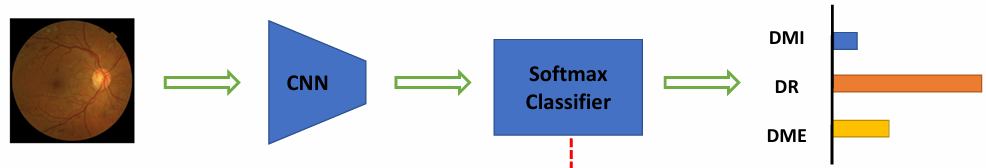
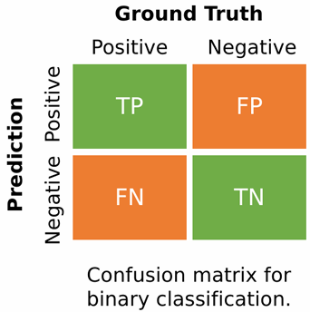
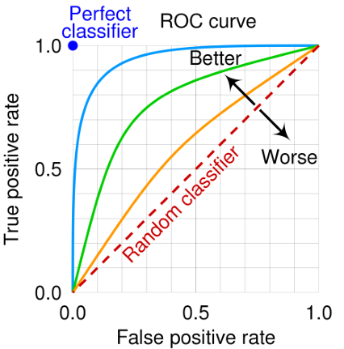
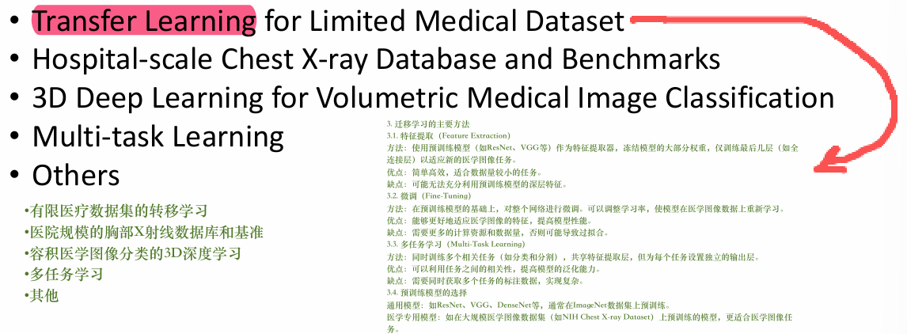
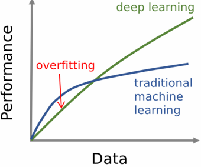
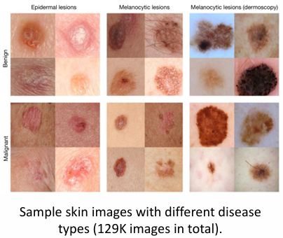
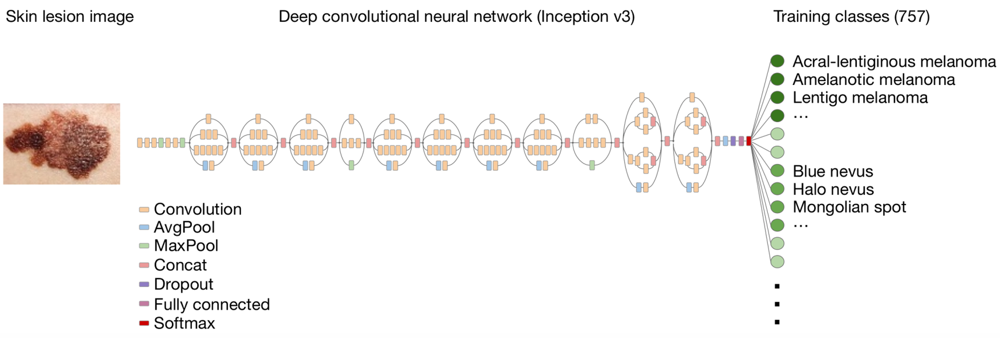
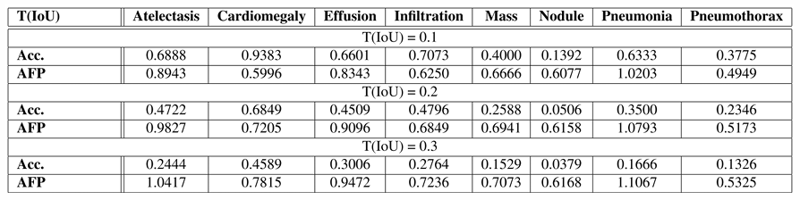
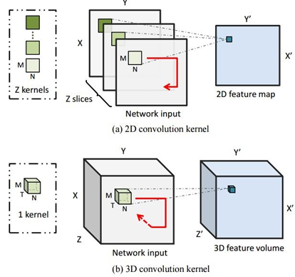
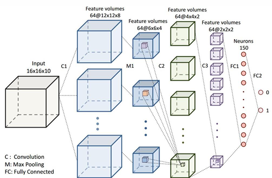

# Class 4 - Classification tissue

Since, the last time we have study the family of machine learning. The various model almost include the foundational model in the AI area, they all together contribute the basic of skyscrapers in developing AI.

Luckily, we have already touched the edge and prepared enough background. It’s time to move on and set aside those complex formulas for now.

> Be water my friend.

Next topic is **Classification**, which we have mentioned before:

> 监督学习的常见任务类型：
>
> - Classification：分类，标签$y$是离散的类型，目标是预测输入$x$属于哪一类；
> - Regression：回归，标签$y$是连续的数值，目标是预测输入$x$对应的具体数值。

回忆起来了吗？接下来的内容主要会深入这几个方向：

**Summary**

- Medical image classification task definition
- Classification task application area
- Classification performance evaluation methods
- Transfer learning
- 3D-deep learning
- Multi-task learning

Let’s start.

---

## What is Classification

It’s a briefly definition of Classification in the upper introduction. 

分类任务是SL类的核心任务之一，它的本质是：让模型从带Label的训练集中学习，建立“输入特征”到“离散标签”的映射关系，最终对新输入的样本，预测其属于哪一类。

$$A \rightarrow B$$

- A：输入样本的特征，eg. 医学影像的像素、患者的临床指标
- B：离散的类别标签，eg. “肺炎/正常”、“良性/恶性”、“糖尿病视网膜病变/无病变”

简单来说，Classification就是让模型学会做“选择题”——“作业帮app搜答案”。

---

## Common type of classification

### Binary Classification

Binary Classification，**二分类**：只有两个**互斥**的类别标签，输出T/F或P/N。

- Application area：胸部X光“肺炎/正常”；

#### Loss function

二分类交叉熵损失（**Binary Cross-Entropy**）

### Multi-Class Classification

Multi-Class classification，**多分类**：有**<u>三个及以上互斥</u>**的类型标签，每个标签**<u>只属于一类</u>**。演示：

流程拆解：

- **Input**：眼底医学图像

- **Hidden layer**：CNN自动特征提取

- **Hidden layer**：Softmax classifier进行分数$\rightarrow$概率分布，将CNN输入的原始分数$s_i$​转化为**0~1之间的概率值**，且所有类别的概率和为1（方便直接解读为“属于某类的可能性”）。

- 核心公式：$p_i(y=1|s)=\frac{e^{s_i}}{\sum_je^{s_j}}$

- > where $p$ is the predicton of the i-th class.

  - $s_i$：第$i$类的原始分数/输入分数（CNN输出）
  - 分子$e^{s_i}$：对分数做指数变换，放大类别见的差异，让高分类别概率更高
  - 分母$\sum_je^{s_j}$：**归一化项**，所有类别的指数和（aka，概率和为1）
  - $p_i$：模型预测该样本属于第$i$​类的概率

- **Output**：展示了3个类别（DMI、DR、DME）的预测概率，条形长度=预测概率大小。

  - > DMI——Diabetic Macular Ischemia：糖尿病黄斑缺血
    >
    > DR——Diabetic Retinopathy：糖尿病视网膜病变
    >
    > DME——Diabetic Macular Edema：糖尿病黄斑水肿

#### Loss function

多分类交叉熵损失（**Categorical Cross-Entropy**）

### Multi-Label Classification

Multi-label classification，**多标签分类**：一个样本可以**<u>同时属于多个</u>**类别，标签**<u>之间不互斥</u>**。

- Application area：胸部X光患者同时患有“肺炎”+“肺水肿”；

#### Loss function

二元交叉损失（对每个标签独立做二分类）

---

## Evolution methods

如何判断Classification分类模型的性能，有哪些指标能参考？

### 看**混淆矩阵（Confusion Matrix）**

先搞清楚Confusion matrix的指标：

- **TP，True Positive**：**真实**是阳性（有病），**模型预测**是阳性$\rightarrow$**正确识别的病例**
- **FP，False Positive**：**真实**是阴性（无病），**模型预测**是阳性$\rightarrow$**误诊的病人**
- **FN，False Negative**：**真实**是阳性，**模型预测**是阴性$\rightarrow$**漏诊的病人**
- **TN，True Negative**：**真实**是阴性，**模型预测**是阴性$\rightarrow$**正确识别的病人**

### 评估指标

1. **Sensitivity (Recall) / 灵敏度（召回率）**=True Positive Rate = $\frac{TP}{TP+FN}$

- 在**所有真实阳性（有病）样本**中，被样本正确识别为阳性的比例，是衡量模型**最关键**的指标之一。

2. **Specificity** **/ 特异度** = TN Rate = $\frac{TN}{TN+FP}$​

- 在所有真实**阴性（无病）**样本中，被样本正确识别为阴性的比例。

3. **Precision** **/ 精确率**（**阳性预测值**） = Positive Prediction Value = $\frac{TP}{TP+FP}$

- 在所有**模型预测为阳性**的样本中，**真实是**阳性的比例。指标代表预测结果的**可信度**。

4. **False positive rate** **/ 假阳性率**= 1- Specificity = $\frac{FP}{TN+FP}$​

- 越低越好

5. **Accuracy** **/ 准确率** = $\frac{TP+TN}{TP+TN+FP+FN}$​

- 所有样本中，被模型正确预测的比例。在**类别不平衡**的医学数据中（99%健康人+1%患病），准确率极易误导——模型全预测 “健康” 就能得到 99% 的准确率，但完全无法识别病例，因此医学任务中很少单独依赖准确率。

6. **F1 Score** 

> F1 Score is the harmonic mean of precision and sensitivity.

- F1是精确率和灵敏度（召回率）的**调和平均数**：

$$F1=2 \times \frac{Precision\times Sensitivity}{Precision+Sensitivity}$$

- 是用于平衡“不漏诊（高灵敏度）”和“不误诊（高准确率）”的综合指标，当两者都重要时，F1越高说明模型在二者间的平衡越好

在医学图像分类的场景下，**优先**看灵敏度（避免漏诊FN，因为漏诊可能延误治疗，代价极高），再看特异度和精确度（减少误诊FP，降低医疗资源浪费和患者心率负担），F1作为综合评估的平衡系数，准确率仅作为参考，不单独作为核心指标。

### 线性评估标准

> 用**ROC曲线**和**AUC指标**来衡量模型在不同判别阈值下的整体表现。

**Receiver operating characteristic**，ROC曲线：

- 横轴（X轴）：FP Rate，假阳性率，代表健康人**被误诊**为有病的比例，越低越好。
- 纵轴（Y轴）：TP Rate，灵敏度/真阳性率/召回率，越高越好

- **生成逻辑**：通过调整分类器的判别阈值（比如把 “预测概率> 0.5 判为阳性” 改成 > 0.3 或 >0.8），每一个阈值对应一个 `(FPR, TPR)` 点，把所有点连起来就是 ROC 曲线。

内容解读：

- **Random classifier**（红色虚线）：随机猜测的分类器，FPR和TPR始终相等（$y=x$），AUC=0.5，代表完全没有区分能力，对照组；
- **Perfect classifier**（蓝色曲线）：理论的完美分类器，FPR=0且TPR=1，AUC=1；
- 绿色/橙色曲线：真实模型的ROC曲线，越靠近左上角代表性能越好。

**Area Under Curve**，AUC：ROC曲线下的面积，取值范围`0.5~1`；AUC越大，模型在**所有可能阈值下的整体区分能力越强**——也就是高TPR和低FPR之间的平衡能力越好。

---

## Topic of Research Area in Medical Image DL

一图浏览所有的医学图像深度学习的核心研究方向与技术方案：

---

### Transfer Learning

**Transfer learning** for limited medical dataset，有限医疗数据集的**转移学习**：医疗数据通常存在样本量小（无法量产）、标注昂贵（需要人工标注，专业人员培养成本较高），直接训练DL极易Overfitting。

> Deep learning is data hungry and  limited medical data can lead to  overfitting problem.

**转移学习/迁徙学习**是解决这一问题的技术核心：

> One of the effective methods for alleviating overfitting is to transfer  the knowledge learned from a different (but related) domain/task to  current domain/task.

迁徙学习是缓解Overfitting的有效手段，通过把相关但不同的领域/任务（譬如用自然图像预训练的ResNet模型）的**通用特征知识**，迁移到当前的医学任务，让模型在数据有限的情况下，不从零开始学习，借助已有的知识提升泛化能力、避免过拟合。（***这样真的不会造成模型范式的污染么？***）

Workflow如下：

1. Feature Extraction，特征提取：使用预训练模型（如ResNet、VGG等）作为特征提取器，冻结模型的大部分权重，仅训练最后几层（如全连接层）以适应新的医学图像任务。

2. Fine-Tuning，微调：在预训练模型的基础上，对整个网络进行为欸条。可以调整学习率，使模型在医学图像数据上重新学习。

3. Multi-Task Learning，多任务学习：同时训练多个相关任务（如分类和分割），共享特征提取层，但为每个任务设置独立的输出层。

4. 预训练模型选择：通用模型一般选择ResNet、VGG、DenseNet等，**通常在ImageNet数据集上预训练**。

   医学专用模型：如在大规模医学图像数据集（譬如NIH Chest X-ray Dataset）上预训练的模型，更适合医学图像任务。

#### Why choose ImageNet

> A widely used technique: Fine-tuning from ImageNet pretrained models.
>
> 一种广泛使用的技术：从ImageNet预训练模型出发进行微调。

ImageNet具有**超大规模、类别分层结构化（从粗到细的层级）**的特征。ImageNet预训练+微调的方案能**解决数据量小、标注成本高**的问题：

- 复用通用视觉知识：底层和中层的通用特征（边缘、纹理、结构）同样适用于医学图像；
- 微调控制知识迁移：用少量医学数据只微调**模型上层**，把高层的“自然图像类别特征”替换成“医学病灶/病变特征”——即避免了从零训练的过拟合，又不会被自然图像的高层知识“污染”；
- 效果碾压从零训练：这种方案让医疗小数据任务的模型性能（准确率、泛化性）远超“从零训练”，是当前医学图像深度学习的标配。
- 它提供了**强大且通用的视觉先验**，能完美适配医疗小数据、高标注成本的视觉任务。

#### Case Study: Skin Lesion Classification

Skin Lesion Classification（皮肤病变分类）$\rightarrow$​目标是通过皮肤图像，自动鉴别病变的**类型与良恶性**，辅助皮肤癌早期筛查。

这是一个典型的医学图像**多分类+二分类**任务，核心目标是：

- 区别病变是**良性还是恶性**（二分类）；
- 进一步细分病变的**具体类型**（多分类）；

迁移学习步骤流程：

> Pretrained on ImageNet using Inception v3 network (1,000 classes)

1. 预训练：基于ImageNet的Inception v3；

   适用Inception v3卷积神经网络，现在ImageNet的1000类自然图像上完成预训练，让模型学习**通用视觉特征**；

> Resize the skin lesion image to the same size as pretrained model for  compatibility

2. 统一图片尺寸，进行输入适配：

   将皮肤病变图像resize为**预训练模型要求的输入尺寸**，保证输入格式与与预训练模型兼容，让预训练模型能正常处理医学图像输入。

> Replace the final classification layer, then fine-tune on skin lesion data  (757 classes)

3. 迁移与微调：替换分类曾+医学数据微调

   替换Inception v3的**最后一层分类层**：将原ImageNet的1000类输出层替换为757类皮肤病变类型，用皮肤病变数据（129K张图像）对模型进行**微调（Fine-tuning）**：学习率更新部分/全部网络权重，将模型从通用视觉特征适配到皮肤病变的专属特征。

#### Q&A

1. 迁徙学习真的不会造成模型范式污染么？
2. 为什么用的是迁徙学习而不是强化学习，迁徙学习+强化学习是否能用于需要长期跟踪的病例中，譬如营养状态与需求？
3. 迁徙学习+强化学习能否用于大脑培养？

4. 既然ImageNet+迁移学习在模型范式的泛化能力这么强，有没有可以用于脑神经信号分析的迁移学习的数据集？

5. 既然有“通用视觉特征”，那还有那些“通用特征”的模型？
NPL：自然语言，通用语言特征模型；
Audio：语言，通用声学特征模型；
Multi-model：多模态，通用跨模态特征模型；（医疗领域常用）
Time Series：时序/序列，通用时序特征模型;
Graph：图数据，通用图结构特征模型；

---

### Chest X-ray

Hospital-scale Chest X-ray Database and Benchmarks，大规模标准化胸片数据集，胸腔X-Ray拍片是**最适合Classification的设备**：

胸腔X-ray是最常用的放射学检查临床场景极广（肺炎、结核、肺癌、心衰、骨折等都靠胸片初筛），数据量大、标注相对成熟，具有Cost-effective（性价比高）、Low radiation dose（辐射剂量低）的优势，可覆盖数十种疾病的初筛与辅助诊断。

#### Case Study：ChestX-ray 8

ChestX-ray 8，是**第一个真正**做到医院级规模的胸部 X 光**公开基准数据集**，没有采用“逐张手动标注”的模式，而是通过**文本挖掘+NLP（通用自然语言特征模型）技术**，从配套的放射科文本报告中自动提取疾病标签。

同时证明了**弱监督学习**（标签来自报告，而非精细标注），在多标签胸部疾病分类+定位任务是可做到的。

DNorm workflow：

1. Mine disease concepts：挖掘疾病概念，适用语义学文本挖掘工具如**DNorm**，从自由文本的放射报告中识别并提取疾病相关术语（如 “肺炎”“肺不张”“心脏肥大”）。
2. Eliminate noisy labels：消除噪声标签（标准化阶段），通过NLP技术（**tokenization分词、parsing句法解析**）将提取的**术语标准化为统一的疾病概念**，解决缩写、同义词、变体表述的问题。通过BANNER等工具从文本中定位疾病描述片段，将缩写映射为全程，最后将文本表述映射为**标准医学编码体系**，确保同一疾病的不同表述被统一为同一个标签。

Results：

- **T(loU)**：定义的交并比阈值（Intersection over Union），衡量模型生成的边界框与真实病灶框的重叠程度。阈值越高，要求定位越精准。
- **Acc.(Accuracy)**：定位准确率$\rightarrow$模型生成的边界框与真实框loU$\geq$阈值的比例。
- **AFP(Average False Positives)**：平均假阳性数。

---

### 3D Deep learning

3D Medical image，容积医学影像（CT、MRI等）中三维空间信息具有高度重要性，其本质是**3D立体数据**，包含2D切片无法覆盖的关键信息：病灶的**立体形态、层间关联、空间位置关系**；器官/结构的完整3D轮廓与上下文。

因此，**3D深度学习（处理容积数据）**是这类任务的刚需，能充分利用三维空间信息，避免2D方法的误判（譬如噪声当病灶、遗漏立体结构特征）。

Comparison between 2D and 3D:

- 卷积核：2D $M\times N$，仅在$X、Y$二维空间上滑动
- Input：将3D容积数据拆分成$Z$个独立的2D切片，对每个切片单独做2D卷积，完全忽略$Z$轴（层面）的空间关联。
- Output：得到的是2D特征图($X'\times Y'$)，没有保留三维空间信息；
- 局限：无法捕捉病灶在连续切片中的立体形态、层间变化，容易把噪声 / 伪影误判为真实病灶。

- 卷积核：3D $M\times N\times T$，在$X、Y、Z$三维空间同时滑动；
- Input：直接将3D容积数据作为整体输入，**完整保留**并利用三维空间信息；
- Output：得到的是**3D特征体**（$X'\times Y'\times Z'$）能刻画病灶的立体分布与空间上下文；
- 完美适配CT/MRI等容积医学影像。

#### Case Study：Cerebral Microbleeds Detection

Cerebral Microbleeds detection，脑微出血检测，目标是定位分散在整个大脑中的稀疏脑微出血灶，这类病灶是脑血管疾病的重要标志物，特征是：

- 尺寸极小：2~10mm，MRI上表现为微小点状信号
- 存在大量**相似物（mimics）**：由大脑中血管断面、钙化、伪影等高度相似结构组成
- **无先验分布**：微出血在脑内随机分布、稀疏分布，没有固定位置规律

---

### Multi-task learning

---

### Other

---

