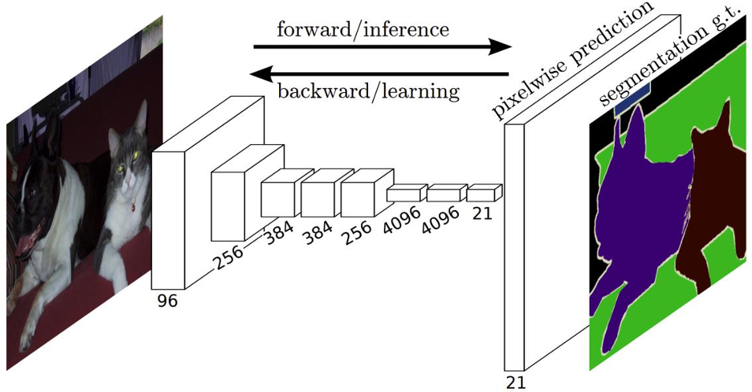

# Class 5 - Medical Image Segmentation

Original edit：2026-02-23

Last update：

Markdown type：Study markdown

Resources：BEHI_5011_5.assets 

Update log： 

---

## Medical Image Segmentation

Medical Image Segmentation: 医学图像分割

定义：医学图像分割本质是将医学影像划分为多个有语义的区域，核心是完成影像中特定解剖结构、病灶的轮廓精准划分，给图像里的像素/区域赋予对应的医学语义标签。

应用：临床与科研中，用于肿瘤、结节、细胞、器官等感兴趣的区域分割，可辅助疾病诊断、手术规划、放疗靶区勾画、病灶量化分析、病理细胞统计等场景。

分类：

- **`Semantic segmentation`**，语义分类：核心是`pixel-level`像素级分类，即给每个像素标注判定它的归属和语义类别，语义分类只按语义类别给像素分类，不区分同类别里的不同个体，比如区分“肝脏组织”和“肿瘤组织”；
- **`Instance segmentation`**，实例分类：核心是`Instance-level`个体对象划分，在语义分类的基础上进一步区分同类别中的不同独立个体，譬如将多个独立的肺结合、多个细胞分别标记区分。

### 核心基础架构 -- FCN

> A milestone model in DL-based semantic image segmentation.

在FCN出现之前，DL主要用于图像分类任务，无法实现端到端的像素级分割；FCN首次将卷积神经网络完整用于语义分割，奠定了技术范式。

完整流程如下：

1. **L**，input：提供原始的RGB图像；

2. **M**，下采样：图片中下方的数字是特征图的通道数，从$96\rightarrow256\rightarrow384\rightarrow256\rightarrow4096\rightarrow4096\rightarrow21$。这个过程是**下采样+特征提取**，通过卷积和池化，不断缩小特征图的空间尺寸，同时提升通道数，逐步提取从浅入深的语义信息，末尾的21对应实例数据集PASCAL VOC的21个分类（包含背景）。

   - 双箭头：代表**前向传播/推理**、**反向传播/学习**。

     前向传播为模型的推理过程——给一张新的输入图，直接输出对应的分割结果；

     反向传播是用输出的预测结果，和人工标注的真实分割图计算误差（`segmentation g.t.`，g.t. 是ground truth，即分割金标准），再反向传播更新网络的参数，让模型预测结果越来越精准。

3. **R**，output：`pixelwise prediction`，像素级预测结果，通道数为21个，每个像素都对应21个类别的预测概率；

#### 基础架构

全集卷网络（FCN），通过移除`Fully connect`全连接层，输出分割图；避免了传统CNN分类网络（如AlexNet、VGG）末尾用全连接层把特征图压缩为一维向量，仅能输出整张图的分类概率的情况。

通过将全连接层替换成卷积层，全程保留特征的空间结构，最终可以输出和输入图像尺寸一致的分割图，实现了“输入一张图，直接输出一张同尺寸的分割结果”。

#### 训练方式

- `end to end`，端到端：不需要传统分割方法分步骤（手动提特征$\rightarrow$分类$\rightarrow$后处理），输入原始图像，直接输出像素级分割结果，整个网络可一次性完成训练优化。

- `pixels to pixels`，像素到像素的映射：输入图像的的每个像素，都对应输出结果里每个像素的分类标签，完美匹配分割任务的需求。

#### 上采样技术

上采样技术采用**反卷积操作**，通过跳跃连接以保留结构细节：

由于卷积、池化等差错会让特征图尺寸不断缩小（下采样），深层特征的语义信息变强，但空间细节（比如目标边界、精细结构）会严重丢失，因此采用反卷积保留空间细节。

- **转置卷积（反卷积）**：上采样本质上是**反向的带步长卷积**（被称为反卷积），把缩小后的深度特征图，恢复到和输入原图一直的尺寸，输出完整的分割结果。
- **`Skip Connection`**，跳跃连接：把浅层（细节丰富、语义弱）的特征，和深层（语义强、细节少）的特征融合，解决上采样后边界模糊、细节丢失的问题。

> 跳跃连接也被后续医学分割的核心模型**U-Net**发扬光大，成为医学影像分割的标配设计。

### Loss function of FCN

> 一定要分一个高低吗？错误的，两个损失函数我都要（全加上>单个）。

#### Dice Loss，戴斯损失

Dice loss是医学图像分割最常用的损失函数，专门适配于解决核心问题——**前景/背景像素极度不平衡**（比如肿瘤、病灶像素往往只占整张图的1%不到，绝大部分为背景）。

公式如下：

$$L_{Dice}=1-\frac{2|G∩M|}{|G|+|M|}$$

- $L_{Dice}$：Dice损失，其最小化值是模型训练的目标；
- $G$：`ground truth`，人工标注的分割金标准掩码；
- $M$：`predicted mask`，模型预测的分割掩码；
- $|G∩M|$：金标准和预测结果的交集，即**预测正确的前景像素数量**；
- $|G|、|M|$：分别是金标准、预测掩码的**总像素数量**。

戴斯损失的核心优势在于其**对类别不平衡的不敏感**：它的计算核心是「前景的重合比例」，不会被占比极高的背景像素主导，因此只关注病灶/器官的预测是否准确。

#### Cross-entropy loss

交叉熵损失，又见面了，它是分类任务的基础损失。而在分割任务中的是`pixels-level`的分类损失，也是分割任务的基础损失之一。

---

## Context vs Localization

---

## Volumetric Medical Image Segmentation

---

## Instance-level Segmentation

---

## Interactive Segmentation

---

## Summary