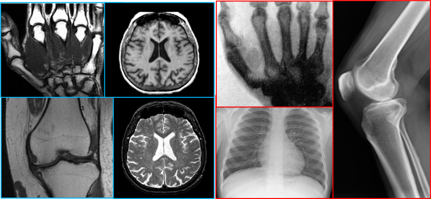
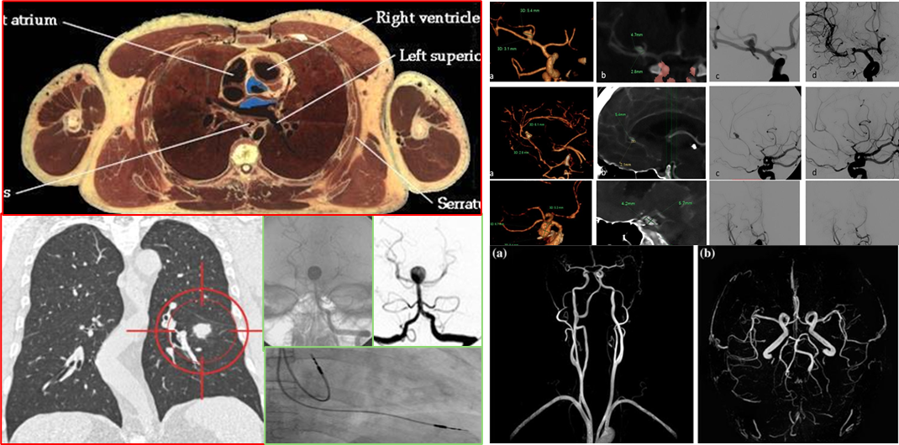
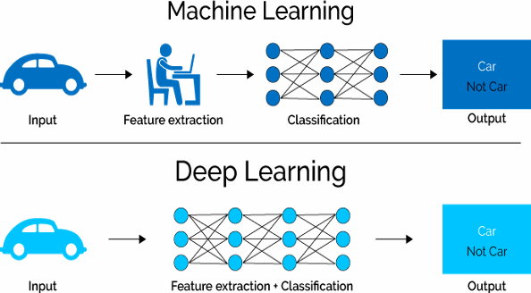
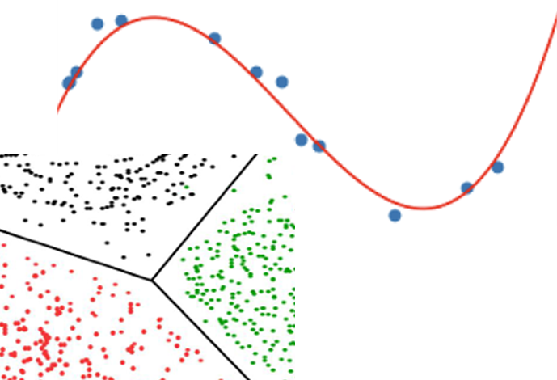
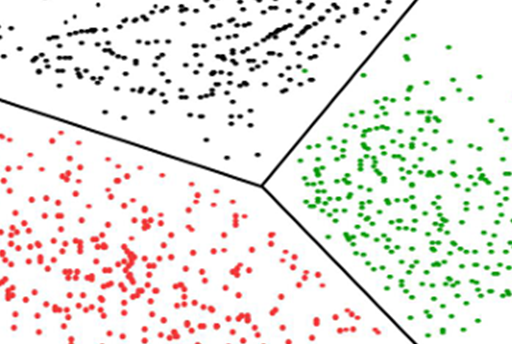
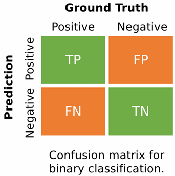
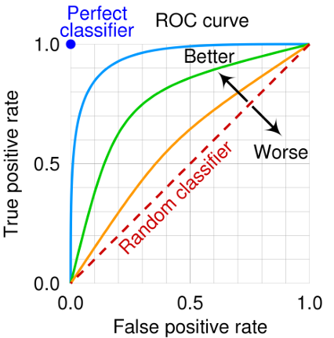
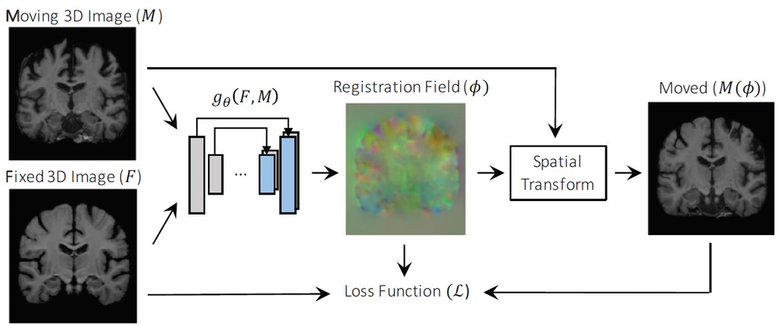
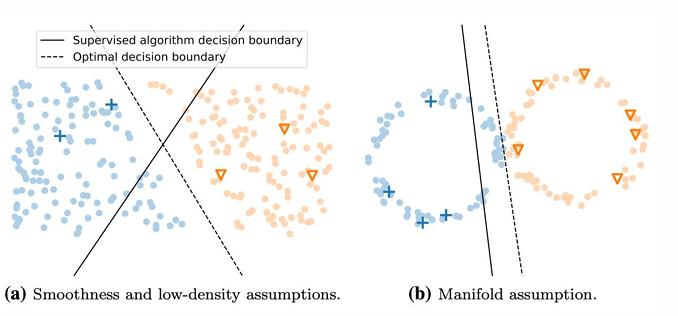
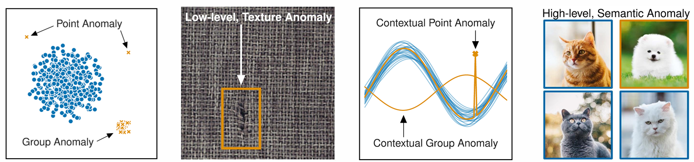

# Total_Review

## Distinguish medical images

第一章的考点在于如何区分**X-ray、Computed Tomography(CT)、Magnetic Resonance Imaging(MRI)、Fluoroscopy and Angiography(血管造影)、Nuclear imaging**等medical imagine analysis（MIA）工具，其中较为困难的是

- 【如何区分X-ray、CT和MRI之间的图像】
- 【Fluoroscopy and Angiography(CT、MRI)的细致区别】

通过下列图像和讲解进行区分：

### X-ray与MRI

蓝色（左侧）图片代表了**MRI**的图像：

1. 对**软组织**（肌肉、神经、大脑）的对比度高，极清晰；骨骼表现**较暗或中等**。

2. MRI为**3D断层图像**，其显示为**切面图**，同时展示**横截面**(横着)和**矢量图**(竖着)；
3. 若看见**脑部**则一定是MRI。

红色（右侧）图片代表了**X-ray**的图像：

1. X射线可以穿透空气，因此不透气的部分会呈现灰色，整体为**Gray scale image(灰度图)**。
2. X-ray为**2D投影图像**，其显示为**Overlap**的组织图像， 不存在层次。
3. 适用于**骨骼和肺部**

### CT、Fluoroscopy and Angiography

红色（左侧）的两张图像代表了Computed Tomography（计算机断层扫描）的图像：

1. 对**骨骼**的对比度极高**（纯白）**，而软组织之间的界限**相对模糊**；
2. CT为**3D断层图像**，其显示为**切面图**，且为平面**横截图**。
3. **Axial View (横截面)** - **无重叠** - 适合**精准 Detection** (红圈任务)

绿色（左侧）和右侧的图像均为Fluoroscopy and Angiography，其中：

1. 均用到了**造影剂，contrast agent**，与Nuclear imaging**不同**的是Nuclear imaging是收集造影剂自发的荧光。
2. 右侧主要不同的是：上边是CT血管造影，下边是MRI血管造影。

另外还有名称综合：

1. X-ray imaging

2. Fluoroscopy and Angiography

3. Mammography（乳房X光检测）

4. Computed Tomography

5. Magnetic Resonance Imaging

6. Nuclear Imaging

   SPECT(Single Photon Emission Computed Tomography)

   PET(Positron Emission Tomography)

7. Ultrasound imaging

8. 3D Mesh(3D 网格)

---

## Fundamentals of two learning

第二章主要涉及了Machine learning（机器学习）与Deep learning（深度学习），其中涉及了definition、range、why:

### Machine & Deep definition

Machine Learning is a process which the **Feature extraction** and **Classifciation** parts are separated, and it needs **Hand-crafted Features** relied on **human expertise**.

- 适用范围: **Small** datasets, or the features is **significate**(easy to recognize).

Deep Learning is a **End-to-End Learning** process which is **Automatic feature learning**, and it is SOTA(state of the art).

- 适用范围: **Large** datasets, **High dimension** dataset(Medical images)

### Supervised VS. Unsupervised

| Dimension     | Supervised                                                   | Unsupervised                                                 |
| ------------- | ------------------------------------------------------------ | ------------------------------------------------------------ |
| Data          | $X$ (data), $Y$ (label)                                      | Just data $X$                                                |
| Goal          | Learn a function to map $X$ → $Y$                            | Learn some underlying hidden structure of the data           |
| Range         | Classification, regression,  object detection, semantic  segmentation, image captioning(分类、回归、对象检测、语义分割、图像字幕) | Clustering,  dimensionality reduction, density  estimation(聚类、尺寸缩小、密度估计) |
| Range(figure) |  Including **Classification** and **Regression**. |  Including **Clustering**. |
| Loss Funciton | Classification $\rightarrow$ **Cross-Entropy Loss** Regression $\rightarrow $ **Mean Squared Error** | Clustering Loss and so on                                    |

### The target of supervised

**In Mathematics**, the target of supervised learning is to achieve the **Empirical Risk Minimization(ERM)**, which minimizes **the Average Loss** of the model on **the Train set** to finally obtain **the best model**.

And we called the average loss is **Empirical Risk(ER)**, which replaces the **Expected Risk** in **the Hypothesis Space** that contains all models.

> 有一说一这不就是函数求极限的思维么。

Aditionally, **Generalizaion Error** is the average loss of the model on **the Test set**. 

### The methods to minimize ER

Four Methods that can help us to minimize ER in deep learning:

1. **Capacity**: model capacity is the description of the complexity and expressive of hypothesis space.
   - deepening the network
   - widening each layer
   - adding more trainable parameters
   - **adopting more complex network structures, 改用复杂模型结构**
   - **enhancing nonlinear expressiveness, 适用非线性激活函数**
   
   > X，Y轴里边不能就只容忍y=kx，那求不出正确的函数
2. **Generalization**: model generalization is the ability of prediction in model with new datas.
   - increase datasets
   - Regularization, 正则化

3. **Regularization**: regularization is intended to minimizes **generalization error**.
   - **Weight Decay(L2 regularization)**
   - **Early stopping**
   - L1 regularization
   - **Dropout**
   - **data augmentation, 数据增强**
4. **Optimization**: optimization is intended to minimizes **Empirical Risk(ER)**.
   - Sotchastic gradient descent(SGD)
   - Backpropagation
   - Batch Normalization

### CNN structural

CNN = Convolutional Layer $\rightarrow$  Activation Layer $\rightarrow$ Pooling Layer $\rightarrow$ Fully Connected layer

- Convolutional filters Layer：Convolutional filters to capture features and patterns in the input space instead of fully connection.

- Activation Layer: using the activate function to normalizes the output from last layer.

  ​	**Activation function**: 

  ​	Sigmoid function = [0,1];	tanh function = [-1, 1];

  ​	ReLU function = $$\begin{cases}0 & x≤0\\ [0,1]&x≥0\end{cases}$$

- Pooling Layer: a reduction in spatial resolution for achieving translational invariance.
- Fully Connected layer: Each layer connects N input units to M output units, and MLP is formed by stacking fully connected layers, with the output of each layer acting as the input of subsequent layer.

---

## Classification

What is **softmax function**?  The softmax function 其实等于激活函数，只是ReLU、tanh等一般只作用于隐藏层(hidden layer)，而softmax function**（又被称为Sigmoid）**则是作用于output的多分类任务的输出层，把模型输出转成**可解释的类别概率**。

### Multi-Class 和 Multi-label

Multi-class (多分类) $\rightarrow$ “单选” $\rightarrow$ 一张图只能属于**一个**类别，各个类别之间是**互斥**的。

- 只能二选一
- 激活函数：softmax function（最后输出概率归一化，汇总结果等于1）
- 损失函数：**Cross-Entropy Loss (交叉熵损失)**

Multi-label（多标签）$\rightarrow$ “多选”$\rightarrow$一张影像可以**同时拥有多个**类别标签，各个标签之间是**独立, exclusive**的。

- 既有又有
- 激活函数：Sigmoid（每个类别的概率∈(0,1)，且互不影响**independent of each other**）
- 损失函数：**BCE Loss (Binary Cross-Entropy，二进制交叉熵损失)**

### Classification performance evaluation

**Sensitivity call /灵敏度**= True Positive Rate  =  $\frac{TP}{TP+FN}$

- Among all real positive samples, the proportion correctly identified as positive by the model is one of the most critical evaluation metrics.
- 在所有真的有病的病例中，模型识别成功的正确率。（最重要的）

**Specificity** **/ 特异度** = TN Rate = $\frac{TN}{TN+FP}$

- The ratio of true negative non-diseased samples correctly classified as negative.
- 在所有没病的样本中，样本识别成功的正确率。

**Accuracy** **/ 准确率** = $\frac{TP+TN}{TP+TN+FP+FN}$

- 模型很少依赖准确率

**F1 Score** = $$2 \times \frac{Precision\times Sensitivity}{Precision+Sensitivity}$$

- precision是所有样本里，真实有病的比例，代表了预期值；F1是用来衡量“不漏诊（高灵敏度）”和“不误诊（高准确率）”的综合指标

### ROC

ROC = **Receiver operating characteristic**；x轴=误诊率，y轴=灵敏度；

- 曲线越靠近左上角代表模型越**牛逼**
- AUC = **Area Under Curve**，曲线下面积，取值范围`0.5~1`，越大越好。

### Transfer learning

Transfer learning for **limited medical dataset**(适用范围) = Small datasets, high cost of label, high time for training expert, easily overfitting for dataset in deep learning.

- Goal: **Solve overfitting**
- materials: features is different but related domain/task.
- Workflow: **Feature Extraction** $\rightarrow$ **Fine-Tuning, 微调(如微调学习率)** $\rightarrow$ **Multi-Task Learning** $\rightarrow$ Select model(ResNet, VGG + ImageNet dataset)

### 3D deep learning

适用范围: 3D 图像(和X-ray没关系) = MRI, CT

差别：卷积核在X, Y, Z轴上依次提取特征，不局限于X, Y轴。

Input: 3D容积数据; Output: 3D特征体

### Multi-task learning

模型同时**适用多个不同但相关任务**的数据进行训练，而不是孤立地训练每个任务。

新结构：**Separate feature extractor，独立特征提取器** = 通过**Cross-stitch单元**（$\alpha$模板）插入特征层中，进行信息交互

### 两个问题

如何建造一个分类器 (How to build a classifier): input  $\rightarrow$  feature extraction  $\rightarrow$ **分类映射 (Classification Head)**  $\rightarrow$ 输出与优化 (Output & Optimization)

为啥要归一化 (Why Normalization)：

- Output：将这些无规则的分数强行压缩到 $0 \sim 1$ 之间，且使所有类别的概率之和等于 1，增加可读性和可解释性
- 输入端与特征层：跨模态的信息量不同，直接训练容易梯度爆炸或消失

---

## Segmentation

**Segmentation = Pixel-wise Classification** = 将医学影像划分为若干个特定的、具有独理解剖意义的区域。

> Divide medical images into several specific regions with independent anatomical significance.

普通分类是给整张图片打一个标间，而图像分割则是给每个像素点都打上标签，因此常见于分类任务的损失函数依旧适用于分割任务。

### U-Net

U-Net 呈现典型的 **U 型对称形态, U-shaped symmetrical structure**，是由于左右两个部分共同构成，两者在结构上完全对称：

1. Encoder（左）：通过卷积和**Max pooling的**下采样（Downsampling），负责**捕捉上下文信息（Context）, capture contextual information**。
2. Decoder（右）：通过上采样（Upsampling），负责**精准定位（Localization）**，恢复图像的分辨率, restore the image resolution.

3. Skip Connections（跨层连接）：通过Skip connections，在相同分辨率的层级上进行特征融合，将 Encoder 保留的**低级、高分辨率的空间细节（灰度、边缘）**，直接拼接到 Decoder 的**高级语义特征, high-level semantic features**中，以弥补下采样过程中丢失的空间位置信息。

优势：**适用于Small dataset**，同时跨层连接能保留器官/病灶边界细节（精准定位），可解决**Context vs localization**的平衡问题

### Evalution Metrics

**D**ice Coefficient, Dice系数 = 衡量**预测区域** $A$ 和**真实标签** $B$ 的**重合度**= $$Dice = \frac{2|A \cap B|}{|A| + |B|}$$；

- 比传统的Cross-entropy更好用：因为医学影像存在严重的类别不平衡**class imbalance**，譬如目标区域占有整个区域的比例极少，交叉熵会倾向于把所有像素都预测为背景；而 Dice Loss 只关注交集**intersection**，天生对小目标更鲁棒。

**P**A (Pixel Accuracy，像素准确率) = $ \frac{\text{对的像素}}{\text{总像素}}$

IOU / **J**accard Index (交并比) = $\frac{|G \cap M|}{|G \cup M|} = \frac{\text{交集}}{\text{并集}}$ = 两个圈的重叠部分 $÷$ 两个圈加起来的总面积。

**注意转化**：

$$D = \frac{2J}{1 + J}$$; $$J = \frac{D}{2 - D}$$

### V-Net

V-Net 是 U-Net 在 **3D 医学影像分割**的衍生，思路和前面第三章的3D deep learning理解起来差不多。

- 目标：解决 3D 影像中极度严重的 **Class Imbalance（类别不平衡）** ；
- 损失函数：**Soft Dice Loss**
- **区别**：U-Net下采样是Max pooling；V-Net是**Stride=2 的 3D 卷积**，用的**残差块（Residual Blocks）**。

**为啥呈现V** = 依旧是U-Net的回答模板。

### 两个问题

Semantic Segmentation VS Instance Segmentation？

- 思路和 **Multi-class vs Multi-label**差不多
- 实例分割（Instance Segmentation）的核心是**区分个体**，而非单个像素，用于区分不同个体/数数目；
- 语义分割 （Semantic Segmentation，本质是像素级 Multi-class），用于抠大块组织或器官。

---

## Registration

**Registration，配准**：寻找一种空间变换（Spatial Transformation），将两张（或多张）图像映射到一个公共的坐标系中，使解剖结构实现对齐 。

> Spatial transformation is sought to map two or more images to a common coordinate system for anatomical alignment.

- **Fixed Image (固定图/F)**：作为参考Reference，保持不动。
- **Moving Image (浮动图/M)**：adding spatial transformation to align to the fixed image.

**目标**：最大化两张图之间的相似度（Similarity） ，但不是最大化相似度损失 = **Loss = - Similarity**.

- **$\phi$: 配准场/形变场** **(Deformation Field)**：用于Moving image来进行像素级空间变换，**Registration 配准 = 找变形场 ($\phi$)**

### Supervised & Unsupervised

**Supervised（监督学习）**：**需要**真实的形变场（Ground Truth）作为标签来训练 。优点是推理速度极快（一次前向传播即可） ，缺点是医学上的真实形变场极难获取 。  

**Unsupervised（无监督学习，如 VoxelMorph）**：**不需要 Ground Truth** 。网络直接输出形变场，然后模型通过计算 $F$ 和 $M(\phi)$ 之间的**相似度**作为 Loss 进行反向传播 。

**多模态**： 先用Image-to-Image Translation 网络把图像统一成同一种模态，再做配准 。 

### Three type of registration

1. **Rigid Registration(刚性配准)**: 只允许**Translation平移**和**Rotation旋转** 。**适用于**骨骼对齐，或者同一病人短时间内的脑部扫描。
2. **Affine Registration(仿射配准)**：在刚性**基础上**加入**缩放 (Scaling)** 和剪**切/错切 (Shear)** 。**适用于**整体器官大小有变化的场景。
3. **Deformable Registration(可变形/非刚性配准)**：建立密集的**逐像素/体素的非线性空间对应关系** 。**适用于**软组织（如腹部、肺部呼吸造成的形变）。

### Similarity Loss

**SSD** (Sum of Squared Difference，平方差和) ：

- 计算两张图对应**像素的灰度差**的**平方和**，目的是要求像素值绝对一致，**目标**：**最小化 SSD**；
- 其中，D 表示空间中的坐标域。SSD 经过归一化处理，因此其值**不受** D 中像素数量的影响。
- **只适用于同模态**（如 CT 连 CT)。

**NCC** (Normalized Cross Correlation，归一化互相关)：

- 是图像配准中常用的相似度指标，**目标是最大化 NCC**，越接近1越好
- 看像素变化的趋势。也通常用于**同模态** 。  

**MI (Mutual Information，互信息)**：

- 用于评价不同仪器配准的指标，必须用信息熵来衡量相关性。 
- 目的是看两张图信息分布的相关性，**目标是最大化 MI**。

**MSE，均方损失**：监督学习用的。

### 评估系数

**DSC (Dice 系数)**：通常用来评估分割出的掩码（Masks）在配准后的重合度 。目标是最大化DSC

**TRE (Target Registration Error，目标配准误差)**：医生在两张图上手工标记几个对应的解剖关键点（Landmarks，比如特定血管的分叉处），配准后算这两个点在物理空间里还**差了多少毫米（欧氏距离）**。

**Visual Check (Checkerboard，棋盘格)**：纯肉眼评估。把 $F$ 和 $M(\phi)$ 像黑白棋盘格一样交替切块拼在一起。如果交界处的血管、脑沟轮廓能够像拼图一样**完美平滑连接**。

---

## Label-efficient Learning

解决原因：1. 专家标注成本高；2. 隐私保护导致数据共享困难；3. 稀少病例难以获得大量标注。
目标：使用尽量少的标注数据（Labeled data），结合大量的无标注数据（Unlabeled data），达到接近全监督学习（fully supervised learning）的效果。

### Semi-supervised

适用于：利用少量的 Labeled data 定基调，利用海量的 Unlabeled data 学习数据的整体分布规律。

一种结合少量有标签数据和大量无标签数据的范式。其核心在于利用大量无标签数据的特征，辅助有标签数据优化，从而提升模型的泛化能力。

- Smoothness (平滑假设)：距离近的样本类别应该相同，在数据密集的区域，物理距离挨得越近的两个样本，它们属于同一个类别的概率就越高。。
- Low-density (低密度假设)：分类边界应该穿过样本稀疏的区域。好的分类边界绝对不能硬生生地劈开一团密集相似的数据，必须划在数据最稀疏的地方。
- Manifold (流形假设)：高维数据其实分布在低维流形上。医学图像动辄上百万像素（极高维），但决定疾病特征的核心变量其实很少，它们铺成了一个低维的扭曲轨道。

**Supervised algorithm decision boundary（监督学习边界，实线）**

由于监督学习无法学习到无标签的数据，因此会违背平滑性 (Smoothness)，导致直接将相同的数据类型分给了不同的类别。同时由于无法学习到样本密度，违背低密度 (Low-density)，导致边界穿过了数据最拥挤（高密度）的地方，极其容易造成误判。

由于监督学习计算的是高维空间里的**欧氏距离**（Euclidean Distance，即直线距离），导致同一种疾病特征的无标签数据，在Manifold (流形假设)上被强行分成了两类。

**Optimal decision boundary（最优/半监督决策边界）**

半监督利用海量无标签数据看清了整体分布实现了最精准的分类。

### Self-supervised learning

一种无监督特征学习范式。适用于一张标注都没有的场景，网络通过在无标签数据上构造预设任务（Pretext tasks），从数据自身的结构属性中自动生成监督信号（伪标签）以完成预训练（Pre-training），提前训练好特征提取器（Pre-trained Backbone），再利用要极少量的标签微调（Fine-tune）完成训练，获得通用的特征表征。

- 额外： **噪音标签学习 (Learning with Noisy Labels)**：一种旨在提升模型鲁棒性的学习范式。其目标是通过标签清洗、重加权机制或设计鲁棒性损失函数，防止深度神经网络对错误标注产生过拟合现象。

### Active learning

一种交互式机器学习范式。系统利用特定的查询策略（Query strategy，如不确定性采样或多样性采样），主动从无标签数据池中筛选出对模型性能提升最具信息量（Informative）的样本，交由人类专家进行标注，旨在以最小的标注成本最大化模型性能。

### Multi-instance learning

**Weakly Supervised Learning / MIL (弱监督/多示例学习）**：一种弱监督学习范式。在该范式下，训练数据的监督信号（标签）被赋予在包含多个示例的“包（Bag）”层面，而非独立的“示例（Instance）”层面。标准定义为：当且仅当包内至少包含一个正示例时，该包被标记为正类；若包内全为负示例，则该包被标记为负类。

---

## Anomaly Detection

### 定义

识别与正常数据显著不同的样本或模式的过程，属于 Unsupervised

### 核心方法

核心方法论：
1.Reconstruction-based (基于重构): 使用 Autoencoder (自编码器) 或 GAN
2.Self-supervised

### 四种异常

1. Point Anomaly (点异常)：单个数据点远离正常群体
2. Group Anomaly (组异常)：单个点看可能正常，但它们聚集在一起的方式很奇怪
3. Low-level, Texture Anomaly (底层/纹理异常)：图像的局部细节出错
4. Contextual Anomaly (上下文/语境异常)：在特定环境下才是异常
5. High-level, Semantic Anomaly (高层/语义异常)：逻辑或类别上的错误

---

## Attention Mechanism

---

## Explainable model

什么是 Fully Explainable (完全可解释)：即模型本身就是**完全透明的（White-box / 纯白盒）**，从输入到输出的每一次计算、每一层逻辑，都可被理解和溯源，不需要额外的工具。

典型代表有：

- **线性回归 (Linear Regression)**
- **决策树 (Decision Trees)**：跟着树的节点条件（例如：肿瘤直径是否 > 2cm？）一步步走，就能走到最终结论。

### Fully Explainable vs Post-hoc Explainability

**Fully Explainable (纯白盒)**：

- *逻辑*：模型天生透明（如决策树）。
- *优缺点*：绝对可信，但**预测性能（Accuracy）通常较弱**，搞不定复杂的医学图像。

**Post-hoc Explainability (事后解释 / 深度学习的常规操作)**：

- 模型本身是个**黑盒（Black-box，比如各种复杂的 CNN、U-Net、ResNet）**，因此跑完后需要工具进行解释
- *经典工具*：**Grad-CAM（热力图 / Saliency Maps）**、SHAP。
- *优缺点*：模型性能极强，但给出的解释是**间接的、甚至可能是在“自圆其说”**

### Why we need

Trust (建立信任)、Accountability (责任归属)、Debugging / Bias checking (排查偏差)

---

## Domain adaptation

Why there have domain adaptation？原因有：

- Cross-center (跨中心/跨医院)：不同医院扫描的数据分布不同 。 
- 不同成像设备 (Imaging devices)：不同设备拍摄的图片不一样。
- **不同模态 (Modalities)**：比如想把在 CT 上学到的知识迁移到 MRI 上 。
- 不同病人群体 (Patient) 。
- **有data没有label**

旨在解决源域（Source Domain）和目标域（Target Domain）之间由于数据分布不一致（Domain Shift）导致的性能下降问题。

### Two type of domain adaptation

Domain adaptation属于迁移学习（Transfer Learning）的子类，学习类型属于：Unsupervised。

1. **Image-level Alignment (图像级对齐)**：在**像素层面**。通常涉及传统机器学习中的特征空间对齐或重加权。

   - > CycleGAN 或 Image-to-Image Translation

2. **Feature-level Alignment (特征级对齐)**：在网络的高维特征层搞定，利用deep learning network提取不随领域变化的特征（Domain-invariant features）。

   - > Adversarial Learning (对抗学习) 或 Domain Discriminator (领域判别器)

### Dataset

**Unsupervised Domain Adaptation (UDA，无监督领域自适应)**：

- Source (源域)：大量标注好的数据

- Target (目标域)：只有少量或没有标注的数据，通常UDA可用于目标域完全缺乏标注医生的情况。

---

## Federated Learning

Federated Learning, FL，**联邦学习**：去中心化（Decentralized）的协同机器学习范式，允许多个机构共同训练一个 AI 模型，但**原始数据绝对不需要离开本地**（Data kept localized）。

### 核心算法

最常用的是 **FedAvg（联邦平均）**，workflow流程：

- **Server $\rightarrow$ Local（下发）**：中央服务器（Central Server）将全局模型的权重（Global Weights）下发给各个参与的本地医院。
- **Local $\rightarrow$ Server（上传）**：各医院用自己的本地数据训练模型后，将更新后的模型参数/梯度（Model Updates / Gradients）上传回中央服务器进行聚合。

### 适用目标

打破医疗界的**“数据孤岛 (Data Silos)”**，在满足法律和隐私前提下，利用多国/多医院的庞大数据量训练出泛化能力极强的模型。

数据库选择：

- **Horizontal FL (横向联邦)**：两家医院，病人完全不同，但拍的都是肺部 CT（**特征相同，样本不同**）。
- **Vertical FL (纵向联邦)**：同一批病人，医院 A 只有 CT 影像，医院 B 只有血液化验单（**样本相同，特征不同**）。
- **Federated Transfer Learning (联邦迁移学习)**：两家机构病人群体不同，检查项目也不同（**样本和特征都不同**），需要结合迁移学习硬凑。

### 优势

**上传的是什么**：只在网络中传输**模型的参数或梯度矩阵（Model Parameters/Weights）**，**绝对不传输**原始的医学影像或病历。

**能保护什么**：从根本上保护了数据隐私（Data Privacy）与安全性，使其能够合法合规地绕过 GDPR 或 HIPAA 等严格的医疗数据保护法。

- **谁拥有数据**：**本地机构（Local Clients / 医院）**。
- **患者保密如何**：实现了**物理隔离级别的保密**。

---

## Multimodal learning

### 定义

提取并结合来自不同数据源的**互补上下文信息（Complementary Information）**，打破单一数据的局限性。

### 适用范围

当**单一模态的数据不足以看清疾病全貌**时，譬如光看一张胸片（影像）可能无法确诊肺炎的具体病原体。

### 主要应用

- 综合诊断 (Diagnosis)

- 预后与生存期预测 (Prognosis & Survival)

- 治疗反应评估 (Treatment Response)

### 如何做

1. 信息融合 (Information Fusion)：把多个模态拼在一起，做一个综合决定。
   - 早期融合 (Early Fusion)：直接把原始数据或最浅层的特征拼在一起（Concatenate），然后送进网络。
   - 晚期融合 (Late Fusion)：在输出端对各个网络得出的结果进行投票（Voting）或加权平均。
   - 中间/联合融合 (Intermediate/Joint Fusion)：网络前半段各自提取特征，到了网络中间的深层再把高级特征拼起来。
2. 数据互联 (Data Interconnection) ：在不同模态之间建立联系或转换
   - 跨模态检索 (Cross-modal Retrieval)：一种模态去搜另一种模态。比如输入一段文字病历，系统自动找出一张特征完全匹配的 X 光片。
   - 模态合成与翻译 (Modality Synthesis/Translation)：用现有的去“生成”缺失的。比如医院只拍了 CT，利用生成网络（如 GAN）直接“伪造/生成”出对应的 MRI 图像。