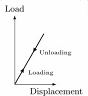
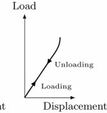

# Pre-study Notes

## Basic informa

- **Program Name**: BEHI 5002 - Biomaterials Engineering

- **Class Schedule**: We 06:00PM - 08:50PM
- **Place**: Rm 4502, Lift 25-26 (60)
- **Professor**: KUANG, Becki Yi
  - **Ust rank of professor**:  B-  [KUANG, Becki Yi](https://www.google.com/search?q=site%3Afacultyprofiles.hkust.edu.hk+KUANG%2C+Becki+Yi)

---

Feedback for prime student:

“becki可以选，英语好听，课上讲的东西她自己也是现场学的所以很浅薄”

---

## Pre-requisites of class

- You can try Biomaterials Engineering Class in MOOC.

---

## Grading scheme

- Homework (30%, each 10%,)
- Quiz (All need 2 quiz; only take the top 1 between two quiz, 40%, and only have multiple choices)
- Group presentation (30%, 10-10-10%, 10%presentation perform, 10%presentation materials, 10% pear review)

---

## Timeline and sub-group, etc rules

- Key Timeline:

  | Week   | Date    | Homework   |
  | ------ | ------- | ---------- |
  | Week 2 | Feb. 11 |  |
  |Week 4|Feb. 25|Homework 1|
  |Week 6|Mar. 11||
  |Week 7|Mar. 18|Quiz 1|
  |Week 9|Apri. 8|            |
  |Week 11|Apri. 29|Quiz 2|
  |Week 12|Presentation|Group I|
  |Week 13|Presentation|Group II|
  
- Class structure:

  2 hour lecture + 10 min break + 30 min reading/ practice/Quiz + 10 min review

---

# Class 1 Study

The definition of biomaterial:

>  a nonviable material used  in a medical device, intended to interact  with biological systems.

生物材料是一种用于医疗设备的**非生命材料**，旨在与生物系统发生相互作用。

The origin of biomaterials: From household materials to biomaterials.

| Original use               | Materials                          | Medical application                    |
| -------------------------- | ---------------------------------- | -------------------------------------- |
| Women’s girdles（腰带）    | Polyether urethane（聚醚型聚氨酯） | Artificial heart                       |
| A lot of purposes          | Gold; iron                         | Dental Implants（牙种植物）            |
| Sausage casing（香肠结衣） | Cellulose acetate（醋酸纤维素）    | Kidney dialysis membrane（肾脏透析膜） |
| clothing                   | Dacron（涤纶）                     | Vascular grafts（血管移植物）          |
| lubricant（润滑剂）        | Silicone（硅酮）                   | Breast implant（乳房植入体）           |

## The development history of biomaterials

There are five stage for the development of biomaterials:

1. Industrial material adaptation（工业材料适配阶段）：为设备选材料
2. Design of passive materials（被动材料设计阶段）：为设备设计材料
3. Design of bioactive & degradable materials（生物活性与可降解材料设计阶段）：为生物响应设计材料
4. Self-assembling materials（自组装材料阶段）：微纳尺度的智能组装
5. Constructive remodeling materials（构建性重塑材料阶段）：引导组织再生与重塑

Also, from the macro level to the micro level:

1. Bioinert（惰性材料，最低级）

   材料本身惰性，仅作为物理替代物，不与生物体主动交互，只承担结构支撑功能。

2. Bioactive/bioresorbable（活性材料）

   能主动释放生物活性物质（如药物、生长因子），但释放模式是预设的，无环境响应性。

3. Responsive（响应性材料）

   能感知环境刺激（如 pH、温度、酶浓度、机械应力），并针对性做出响应（如释放药物、改变结构）。

4. Autonomous（自主智能材料）

   具备感知 - 响应 - 释放 - 自适应的完整闭环，甚至支持多刺激 - 多响应通路，能动态调控生物过程。

### What is Biomimetic materials

Biomimetic materials，仿生材料：是一种具备高度模拟天然组织的微环境和功能的材料，是再生医学的核心方向。

常见的仿生材料如：水凝胶、3D 生物打印、工程化组织 / 器官

### The structure of modern biomedical device

三大核心组件：**支架（Scaffolds）、细胞（Cells）、药物（Drugs）**

这些组件既可以单独使用，也可以根据临床需求自由组合。

#### Scaffolds

**水凝胶支架（Hydrogel scaffold）**：高含水、柔软，模拟细胞外基质，适合细胞包裹与温和药物释放

**脱细胞支架（Decellularized scaffold）**：去除细胞的天然组织支架，保留天然解剖结构与生物信号，利于组织整合

**固体多孔支架（Solid porous scaffold）**：刚性多孔结构，提供机械支撑，同时允许细胞浸润和组织长入

**纤维支架（Fibrous scaffold）**：模拟天然组织的纤维排列，引导细胞定向生长，适合力学要求高的组织（如心脏瓣膜）

### The features of Biomaterials

**Biocompatible**

生物相容性：材料与人体组织、血液等生物系统相互作用时，不会引发炎症、免疫排斥或其他不良反应，保证材料在体内安全存在。

**Biologically active**

生物活性：主动调控的特性，材料能与生物体组织发生化学反应，或诱导特定生物反应（如促进细胞增殖、分化），从而加速组织修复与再生，比如骨修复材料能引导新骨生长。

**Biofunctional**

生物功能性：执行特定生物任务，承担功能，比如作为药物载体实现精准控释、作为组织工程支架承载细胞并引导组织形成。

**Bioinert**

生物惰性：稳定不反应，在体内化学性质极稳定，几乎不与周围组织发生相互作用，适合需要长期、可靠机械支撑的场景。

**Sterilizable**

可灭菌性：材料必须能通过高温高压、化学等方式灭菌，彻底杀灭微生物，避免植入后引发感染，保障医疗安全。

## Biomaterial Properties

Biomaterials properties and design considerations. 生物材料的属性与设计考量。

生物材料植入体内后，会与细胞、组织、体液等生物组分直接接触并发生**相互作用**，并非孤立存在的“替代物”。

### Dynamic changes at scales

动态变化的尺度从nanoseconds（纳秒）到years（数年），在极宽的时间尺度上发生动态变化：

- 纳秒~微妙级：水分子、离子在材料表面的吸附与重排；
- 秒~分钟级：蛋白质在材料表面的吸附、构想变化
- 小时~天级：细胞黏附、迁移、分化
- 周~ 月~ 年级：组织重塑、材料讲解、长期免疫反应。

绝大多数生物材料都处于**含水的生理环境**中，因此**水~材料界面的相互作用**是所有后续生物反应的起点。

### Attractive and  interactive forces

The nature of the materials basically drive all their properties, attractive and interactive forces between atoms.

| 相互作用力interatomic force   | 核心解释Explanation                                          | 相对强度Relative strength | Examples                                                     |
| ----------------------------- | ------------------------------------------------------------ | ------------------------- | ------------------------------------------------------------ |
| **范德华力（Van der Waals）** | 原子周围电子云的瞬时波动，产生瞬时正负电荷，引发弱相互作用（无永久极性）Transient fluctuations in the spatial localization of electron clouds  surrounding atoms lead to transient positive and negative charges,  and consequent interactive forces in molecules would seem to  have no permanent polarity | **Weak**                  | Argon at cryogenic temperatures Polyethylene(低温氩气聚乙烯) |
| **离子键（Ionic）**           | 带永久正电荷的原子与带永久负电荷的原子之间的静电吸引Atoms with a permanent positive (+) charge attract atoms with a  permanent negative (−) charge | **Very strong**           | 氯化钠（NaCl）、氯化钙（CaCl₂）                              |
| **氢键（Hydrogen bonding）**  | 共价键结合的氢原子，与电负性原子（如氧、氟）之间的相互作用The interaction of a covalently bound hydrogen with an  electronegative atom | **Medium**                | 冰；尼龙中链段间的作用力（形成高熔点固体）                   |
| **金属键（Metallic）**        | 带正电的原子 “海洋” 与离域自由电子之间的吸引力 The attractive force between a “sea” of positively charged atoms  and delocalized electrons | **Medium–strong**         | 金（Au）、金属钛（Ti）                                       |
| **共价键（Covalent）**        | 两个原子之间共享电子对 A sharing of electrons between two atoms | **Strong**                | 碳–碳键；聚丙烯酰胺水凝胶中的交联键                          |

>  Atoms can combine in defined ratios to form molecules. Molecules  also organize or assemble.
>
>  A key concept in appreciating the properties of materials is  hierarchical structures.

原子按固定比例结合成分子，分子进一步自组织、组装成更高级的结构；

这种**多级、有序的组装**就是**层次结构**，是理解材料宏观性能的关键概念。

#### 表面surface与体面相bulk的区别

> As assemblies of atoms and/or molecules form, within the **bulk** of the material, each unit is uniformly “bathed” in a  field of attractive forces. However, those structural units  that are at the **surface** are pulled upon **asymmetrically** by  just the units beneath them.

- 材料表面单元：仅被下方的单元不对称**asymmetrically**地拉动（上方没有其他单元平衡受力）；

- 体相（bulk）内部：每个原子 / 分子单元都被周围单元均匀吸引，受力对称、稳定。

因此，层次结构决定功能，表面效应主导生物交互（植入体内地生物材料与其细胞、蛋白的项目作用**完全发生在表面**）

### Surface properties

表面性，生物材料的**表面**虽然只占材料总体积的极小部分，但它是**与生物环境（细胞、组织、体液）直接相互作用的唯一区域**。

生物材料的表面性有5个核心要点：

1. Unique reactivity：独特反应性

   表面原子受力不对称（仅被下方的单元不对称地拉动），化学活性远高于体相原子，更容易发生氧化、吸附或化学反应。

2. Inevitably different from bulk：与体相必然不同

   缺乏上方原子约束，会导致表面结构/成分与内部不一致。

3. Very small mass：表面区域质量极小

   表面通常仅为数纳米或几十纳米厚，质量占比微乎其微，却主导了所有生物交互行为。

4. Readily contaminate：极易被污染

5. Considerable mobility：表面分子流动性高

#### surface properties type

**Surface topology，表面拓扑**

- 指材料表面的微观 / 宏观形貌，比如粗糙度、台阶、孔洞、纹理等。

**Cell-material interactions，细胞 - 材料相互作用**

- 聚焦于细胞在材料表面的行为。

**Homogeneity，同质性**

- 指表面成分 / 结构的均匀程度，实际生物材料表面通常由多种成分组成，存在异质性。

**Protein adsorption，蛋白质吸附**

- 指体液中的蛋白质在材料表面的自发吸附，这是植入后发生的第一个生物事件，后续所有细胞反应都建立在细胞吸附层地基础上。

**Bioinert surface，生物惰性表面**

- 是一种特殊设计地表面，目标是最大限度减少蛋白质吸附和非特异性生物反应，避免引发炎症或免疫排斥。

#### How to research

ESCA & FTIR：

1. ESCA，Electron spectroscopy for chemical analysis，电子能谱，是一种用于化学分析的电子光谱，核心是提供表面**全面的定性和定量概述**（Comprehensive qualitative and quantitative overview）。

2. FTIR，傅里叶变换红外光谱，能提供出色的信噪比（S/N）和光谱精度。

### The important between surface and bulk

表面性质决定**生物相容性Biocompatible**；

体相性质决定结构安全性与使用寿命。

### New properties

Mechanical properties，机械性能。其有两个核心概念：

1. **Elasticity，弹性**：是指材料在弹性变形范围内的**刚度（stiffness）**，关键指标是弹性模量（Young’s modulus, E），可用来衡量材料抵抗弹性变形的能力。
2. **Viscoelasticity，粘弹性**：是指材料的刚度与时间相关（time-dependent stiffness）。

 

#### Elastic behavior

linear elastic behavior，线性弹力行为，符合胡可定律：应力=模量×应变。

Nonlinear elastic behavior，载荷 - 位移曲线为曲线，但卸载后变形仍完全恢复，依然是弹性行为。

- 应变（Strain）：相对于参考位置的**相对变量量**（无量纲）
- 应力（Stress）：单位面积上的内力，描述变形时的受力状态。

韧性材料（ductile）：允许的工作应力。

脆性材料（brittle）：抗拉强度。
