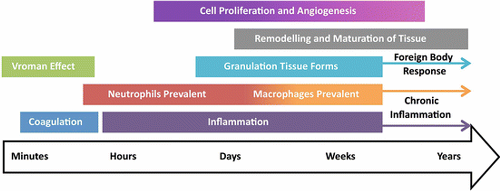

# Class 3 -- Host response & Biocompatibility

Original edit：2026-02-25

Last update：

Markdown type：Study markdown

Resources：BEHI_5002_3.assets

Update log：

---

## Host response

`Host response`，宿主反应，是一种身体对内部和外部压力因素的反应方式。宿主对生物材料的反应将决定生物医学设备的成败。通常，生物材料的宿主反应会在生物材料植入后立刻开始，包括对植入过程中不可避免的干扰组织损伤和对材料本身的反应。

### Total reaction and timeline

### Strategies to control host responses

There are several methods to control host responses:

- Biomaterial properties may be responsible for variations in intensity and duration of the inflammatory and wound-healing process phases.
- Degradation of biomaterials, either intended for the function or an unintended consequence of the environment, may produce degradation products or particulates which may stimulate inflammatory cells or have toxic effects.

---

## Blood Coagulation

`Blood Coagulation`，凝血，是主要依靠微小的`blood cell fragments`血细胞碎片：`Platelets`（血小板），来促进身体形成`clots`凝块。

灭活的血小板`inactivated platelet`形态可以被认为是类似于球状体`spheroids`，半轴约

### The process of platelet activaSution

血小板活化的过程主要受到细胞内钙离子浓度的影响：

$C_{ads}=\frac{C_{max}·K_a·C_{sol}}{1+K_a·C_{sol}}$

- $C_{max}$​：Maximum surface concentration；
- $K_a$：Adsorption equilibrium constant；
- $C_{sol}$：Concentration of proteins in solution.

---

## Biocompatibility

`Biocompatibility`，defines a particular host response that allows for the biomaterial to perform its intended function in a specific application context.