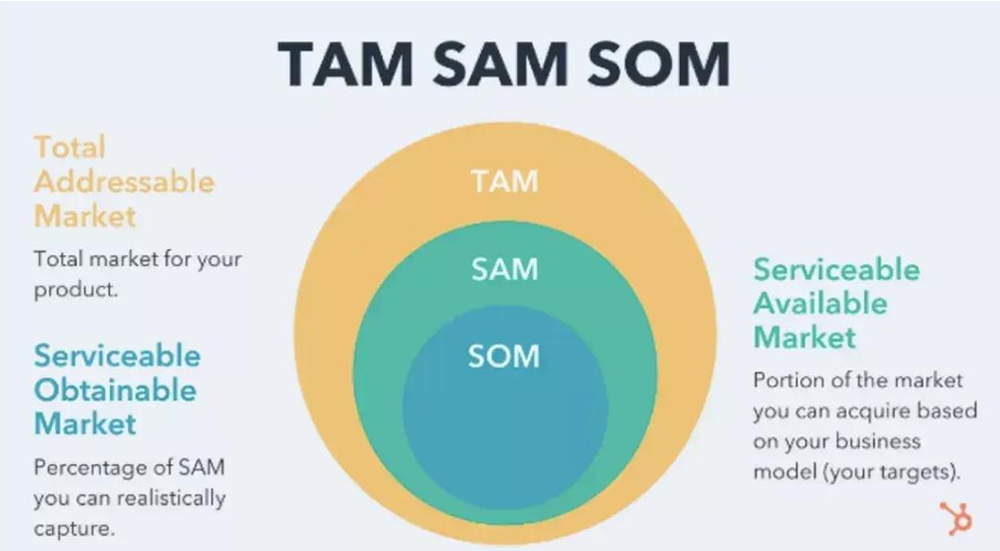

# Class 6 - Market analysis & Competitive Landscape for deep Tech

Original edit：2026-04-04

Last update：

Markdown type：Study markdown

Resources：MCEE_6000E_06.assets 

Update log： 

---

## The importance of Market Analysis

第一部分：市场分析的重要性。

市场分析对于化工行业具有重要意义，具有以下3个核心价值：

1. **Self-Validation（自我验证）**

> Conducting thorough market analysis ensures that your venture has substantial potential.

​	通过开展全面的市场分析，能确保创业/项目具备可观的发展潜力；用数据验证想法是否有人愿意买单、市场空间是否足够，通过分信息确认下游客户是否有需求、现有产品是否存在痛点，再决定是否投入研发。

2. **Avoiding Pitfalls（规避陷阱）**

> It helps in identifying whether the market is worth entering or if it's a "chicken rib" market—one that offers little reward despite the effort.

​	市场分析可精确判断一个市场是否值得进入，或是一个 “鸡肋市场”—— 投入大量精力却回报微薄。

- **chicken rib market（鸡肋市场）**：源自中文 “食之无味，弃之可惜”，是商务英语里的常用表达，特指**投入产出比极低、没有长期价值的市场**。

3. **Strategic Decision Making（战略决策）**

> Use insights gained from market analysis to make informed decisions about resource allocation and strategic direction.

​	用市场分析获得的洞察，为资源分配和战略方向做出明智决策。市场分析不是写报告交差，而是直接指导业务：资源分配（比如你的研发预算、销售团队应该重点投入哪个细分市场）；战略方向（是做高端高利润产品，还是走规模化低成本路线？是深耕国内还是拓展海外）

### Perspectives in Technical and Market

技术视角 vs 市场视角的不同：

1. In technical perspectives: Focus on the **Technical Indicators**. 

   The technical perspective focuses on "developing the product and achieving top-tier performance," centering on the inherent physical and chemical properties of the material itself.

   技术指标：技术视角是「把产品做出来、做到性能顶尖」，关注的是材料本身的物理化学属性。

2. In Market perspectives: 

   Step beyond technology to think about application implementation, customer needs, and commercial value—specifically, "who the product is sold to and in what scenarios it is used."

   跳出技术、去思考「产品卖给谁、用在什么场景」的应用落地、客户需求、商业价值

**Core Differences**: Each application presents unique market characteristics—size, growth rate, and specific customer needs.

每一个应用场景都有完全不同的市场特征：市场规模、增速、以及客户的具体需求。

### Defining the Specific Application Market

定义细分应用市场：

- 产品定位：市场决定产品，而非产品决定市场，必须通过精确定位应用场景，考虑不同场景是完全独立的市场，客户、竞品、定价逻辑天差地别。

- **First Step** in Market Analysis is **Define the specific application your product targets.** This definition is crucial for accurate market sizing and understanding customer needs.

In conclusion： To avoid **Replacing market-oriented thinking with technology-centric thinking**. The **logic of the market is: "I develop what the customer needs."**

避免用用技术思维代替市场思维，市场的逻辑是「客户需要什么，我就做什么」。

### Step for Market Analysis

Step 1: Define Target Application（定义目标应用场景）

> Clearly specify which market segments your product will serve.
>
> 清晰明确地界定你的产品将服务于哪些细分市场。

Step 2: Research Market Size and Growth（调研市场规模与增长）

> Gather data on current market size, projected growth rates, and trends.
>
> 收集当前市场规模、预期增长率和行业趋势的相关数据。

Step 3: Identify Customer Pain Points（识别客户痛点）

> Understand the specific challenges faced by customers in your target application.
>
> 深入理解目标应用场景中客户面临的具体痛点与挑战。

Step 4: Analyze Competitors（分析竞争对手）

> Evaluate existing solutions and identify gaps that your product can fill.
>
> 评估市场上现有的解决方案，找到你的产品可以填补的市场空白。

Step 5: Validate Your Findings（验证你的分析结论）

> Engage with potential customers through interviews or surveys to validate your assumptions.
>
> 通过访谈、调研等方式与潜在客户沟通，验证你的所有假设。

---

## Quantify Market Opportunities

分析市场时会遇到如何判断一个指标是否优劣的情况，这时候就需要我们通过量化市场机会来精确分析市场潜力。

### TAM/SAM/SOM

商业计划书、创业融资、项目立项中最核心的金字塔型**市场规模测算模型（The Market Size Pyramid）**

**TAM（最大）⊃ SAM（中间）⊃ SOM（最小）**，是从「理论最大」到「实际可获得」的层层收缩。

### Total Addressable Market, TAM

TAM (Total Addressable Market) 总可触达市场

> The entire market your technology could theoretically cover.
>
> 技术**理论上**能覆盖的全部市场

TAM是不考虑任何竞争、技术限制、地域限制，产品能触达的**全球最大市场规模**，也就是天花板，其核心作用是：

> Used to attract attention and show vision, used to attract investors' attention
>
> 用来吸引注意力、展示长期愿景，用来吸引投资人注意力

### Serviceable Available Market, SAM

SAM (Serviceable Available Market) 可服务市场

> The specific segment of the market where your technology applies.
>
> 是指技术**实际适用**的细分市场

在 TAM 里，**真正符合产品定位、技术能力、目标客户**的细分市场，剔除了不相关的部分，核心作用是把大市场缩小到「你能服务的范围」，证明你不是在画大饼，而是有明确的赛道

### Serviceable Obtainable Market，SOM

SOM (Serviceable Obtainable Market) 可获得市场

> The portion of SAM you can realistically capture within 3-5 years.
>
> 在 SAM 中，你**3-5 年内实际能拿到的市场份额**

 SOM是落地目标，考虑竞争、产能、销售能力、地域限制后，**你实际能抢到的份额**，核心作用是展示你的**可行性和执行力**，是投资人真正关心的「你到底能赚多少钱」

SAM & SOM的作用是：

> Demonstrate reasonableness and execution capability—what investors truly care about.
>
> 展示合理性和执行力，这才是投资人真正关心的

In conclusion: Avoid focusing solely on TAM as it can appear unrealistic without grounding in achievable goals. 避免过分关注于TAM，因为如果没有可实现的目标做支撑，TAM会显得完全不切实际。

### Three-Step Market Analysis Method

三步市场分析法：

<u>**Step 1: Top-Down Approach（自上而下法）**</u>

> Use industry reports, government data, and brokerage research to estimate TAM and SAM. 利用行业报告、政府数据、券商研报，估算 TAM 和 SAM，快速估算 TAM/SAM，给投资人展示赛道的宏观潜力。

Source: Industry Report、Government Data、 Brokerage Research Studies.

Purpose: Estimate the size of TAM and SAM by leveraging credible third-party sources.

**<u>Step 2: Bottom-Up Approach（自下而上法）</u>**

> Conduct interviews with potential customers to estimate individual customer value and total customer count, validating SOM.
>
> 通过对潜在客户的访谈，估算单个客户的价值和总客户数，验证 SOM。验证 SOM 的合理性，是投资人最认可的测算方法，因为它基于真实客户需求。

SOM = 潜在客户总数 × 单个客户年采购价值 × 预计市场份额

**<u>Step 3: Trend-Driven Analysis（趋势驱动分析）</u>**

> Identify macro trends driving the market.
>
> 识别驱动市场的宏观趋势。用「长期趋势」给你的市场规模做**动态调整**，而不是只看静态数据。给市场规模的增长做背书，证明你的赛道不是存量博弈，而是有长期增量。

Macro Trends（核心宏观趋势）、Impact on Market（对市场的影响）、Example（实操案例）

---

## Industry Chain & Client Analysis

 Understanding the B2B Value Chain in Chemicals，理解化工行业 B2B 价值链：

> Raw Material Suppliers → Polymer Factories → Compouders → Manufacturers (e.g., Cutlery, Packaging) → Brand Owners → Retailers → Consumers.
>
> 原材料供应商 → 聚合物生产厂 → 改性厂 → 制品加工厂（如餐具、包装） → 品牌方 → 零售商 → 终端消费者

**每一个环节都是 B2B 交易，只有最后一步是 B2C.**

### Who is your customer? 

Key Issues in Identifying Customers（客户识别的核心问题）

1. 客户身份区分（Customer Identification）

> Distinguish between **direct customer**s, **paying customer**s, and **end user**s.
>
> 必须严格区分「直接客户、付费客户、终端用户」三类主体

你的产品性能、定价、服务，要同时满足**直接客户的生产需求（直接对接、销售产品的对象）、付费客户的成本需求（给你付钱的主体）、终端用户的使用需求（最终使用你产品的主体）**，否则产品会卖不出去

2. 可降解塑料案例再说明

> For biodegradable plastics, raw material suppliers sell to polymer factories, but the final consumer may be someone purchasing eco-friendly cutlery at a retailer.
>
> 对于可降解塑料，原材料供应商卖给聚合物工厂，但最终消费者可能是在零售商处购买环保餐具的人。

卖的是原料，但最终买单的是终端消费者，所以你必须理解终端用户的需求（比如环保、安全、可降解），再反向传导给你的直接客户（聚合物厂、制品厂），才能让产品有市场。

3. B2B 采购的决策单元（Decision Unit in B2B Purchasing）

> Involves multiple stakeholders including technical departments (concerned with performance), procurement departments (focused on price and supply), and management (interested in strategic value).
>
> B2B 采购涉及多个利益相关方，包括：

**技术部门**：核心关注产品性能（比如膜的通量、抗污染性，塑料的强度、可降解性）

**采购部门**：核心关注价格、供货稳定性、交期

**管理层**：核心关注战略价值（比如国产替代、供应链安全、长期合作）

核心意义：B2B 销售不是「搞定一个人就行」，必须同时说服三类角色：

- 技术部门认可你的产品性能
- 采购部门认可你的价格和供应链
- 管理层认可你的长期战略价值

任何一个环节没搞定，订单都拿不下来。

### Your Value Proposition Must Appeal to All Stakeholders

你的价值主张必须打动所有利益相关方

> **Technical Departments**: Highlight product performance and reliability.
>
> **技术部门**：突出产品性能与可靠性

> **Procurement Departments**: Emphasize competitive pricing and consistent supply.
>
> **采购部门**：强调有竞争力的定价与稳定供货

> **Management**: Stress long-term strategic benefits and alignment with company goals.
>
> **管理层**：强调长期战略收益与公司目标的契合度

> **Unified Approach**: Develop a value proposition that addresses the needs of all decision-makers.
>
> **统一策略**：打造覆盖所有决策者需求的价值主张

### Channels for Gathering Market Information

市场信息收集渠道

**Primary Information Sources, 一手信息来源：**

Customer Interviews, 客户访谈、Expert Consultations, 专家咨询、Own Experimental Data, 自有实验数据。

**Secondary Information Sources:二手信息来源：**

Academic Databases学术数据库、Business Databases商业数据库、Company Websites, Industry Trade Shows, Patent Databases企业官网、行业展会、专利数据库。