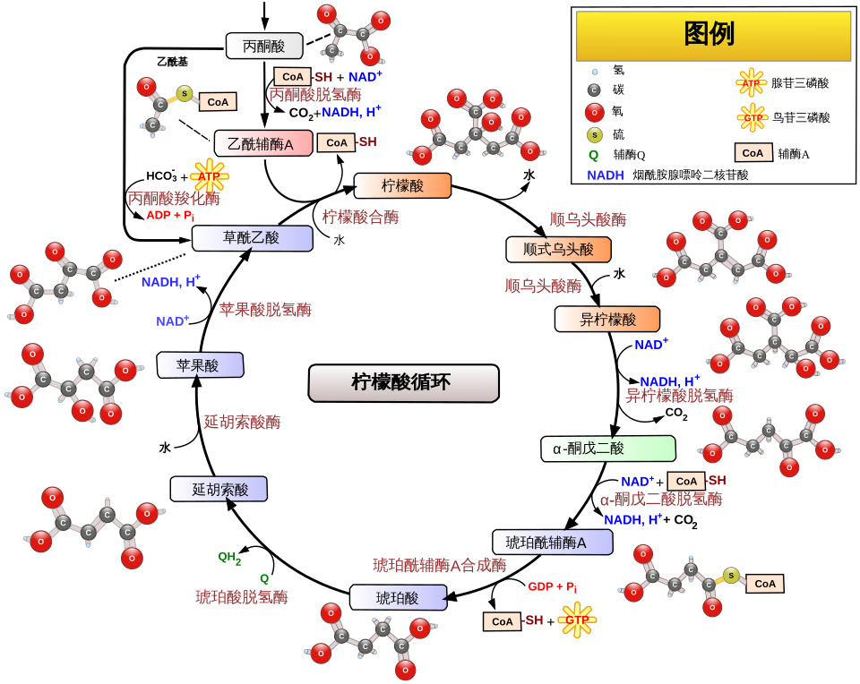
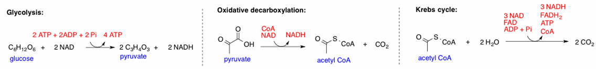
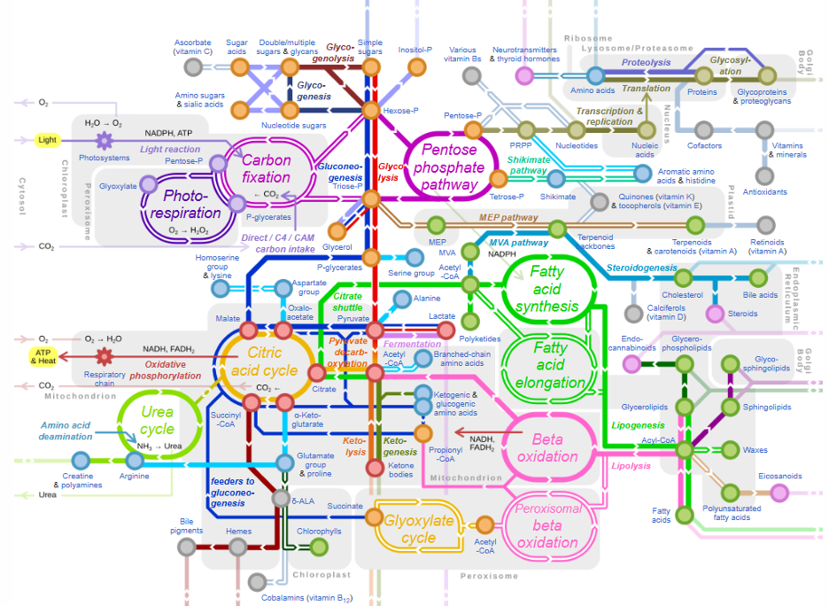

# Pre-study Notes

## Basic informa

- **Program Name**: BEHI 5007 - Genomics, Proteomics and Metabolomics

- **Class Schedule**: Tu 06:00PM - 08:50PM
- **Place**: Rm 4502, Lift 25-26 (60), There is no office hour, so you can only post email to appointment.
- Professor: LAM, Henry H N
  - **Ust rank of professor**:  A+ [LAM, Henry H N](https://www.google.com/search?q=site%3Afacultyprofiles.hkust.edu.hk+LAM%2C+Henry+H+N)

---

## Pre-requisites of class

- Require strong biological background for student.

---

## Grading scheme

- Assignments (20%, total 4 homework): 

​	Started during the lecture and bring it back to home to finish.

- **Exams(40% + 40%)**: 

​	1 mid-term exam in class on $24^{th}$ March;

​	1 final exam during hkust’s exam period：May 18 to 29.

- There is no presentation.

---

## Timeline and sub-group, etc rules

- Week 07 and Week 08 wouldn’t become the assignment or exam?
-  **NOT allowed to use AI to complete in-class assignments and exams.**

---

## Class Context

This Class will introduce “Omics”, it will base on the biology background which will be mentioned during the studying, focusing on declared the **Experiment Objective** of topics like genome、transcriptome、proteome... as the target by getting speeches of Omics technology and a bit of programming context.

# Class 1 Study

## Omics

Omics，组学，生物本质上是一系列**高度有序、能自我复制的化学反应集合**

> “Living things are just a bunch of highly ordered and self-replicating chemical reactions.”

which meaning，生命活动的本质是分子层面的动态反应网络，而组学正是解析工具。

- > Omics is the collective characterization and quantification of entire  sets of biological molecules and the investigation of how they  translate into the structure, function, and dynamics of an organism  or group of organisms.
  >
  > From wiki: [Omics]([组学 - 维基百科 --- Omics - Wikipedia](https://en.wikipedia.org/wiki/Omics#:~:text=Omics is the collective characterization and quantification of,as genomics%2C proteomics%2C metabolomics%2C metagenomics%2C phenomics and transcriptomics.))

  Omics是整套生物分子的集体**表征（外在表现）**、定量分析，并研究这些分子如何共同决定生物体（或生物群体）的结构、功能与动态变化。

- The layer of life system: 

  “DNA → Protein → Genes(基因) → Chromosomes → Genome(基因组) → Cell → Community of cells(细胞群落/组织/多细胞群体)”

---

## How many components are required?

For example: $C_6H_{12}O_6+6O_2 → 6CO_2+6H_2O$

有氧呼吸的总化学方程式，很简洁：

实际过程分为**糖酵解（还好）、氧化脱羧（有点难）、三羧酸循环（噩梦）**三个核心阶段：

- **Glycolysis**：糖酵解，葡萄糖在 ATP、NAD 等分子参与下，生成丙酮酸、NADH 和少量 ATP；
  - 需要 **10 种酶** 催化 10 步反应；
- **Oxidative decarboxylation**：氧化脱羧，丙酮酸在辅酶 A（CoA）、NAD 的参与下，生成乙酰 CoA、CO₂和 NADH；
  - 需要 **3 种核心酶**（多酶复合体形式）；
- **Krebs cycle**：三羧酸循环（aka，柠檬酸循环），乙酰 CoA 进入循环，生成 CO₂、ATP、NADH 和 FADH₂；
  - 需要 **8 种酶** 催化循环反应：

> 吓哭了，感觉在做zmd基建。

---

## Foundation Information of Omics

### The biomolecules in human:

1. Genes: 20,000-25,000
2. Transcripts（转录本） : 200,000
3. Proteins（proteoforms, 蛋白质变体 ）: 1,000,000

...and so on.

### The categories of Omics

| Categories                  | research target         | context                                                      |
| --------------------------- | ----------------------- | ------------------------------------------------------------ |
| Genomics（基因组学）        | 基因组（Genome）        | 研究所有基因的集合，解析 DNA 序列与遗传信息的传递            |
| Epigenomics（表观基因组学） | 表观基因组（Epigenome） | 研究 DNA 的化学修饰（如甲基化、组蛋白修饰），这些修饰不改变 DNA 序列但调控基因表达 |
| Transcriptomics（转录组学） | 转录组（Transcriptome） | 研究样本中所有 RNA 的集合，反映基因的即时表达状态            |
| Proteomics（蛋白质组学）    | 蛋白质组（Proteome）    | 研究所有蛋白质的集合，关注蛋白质的表达、修饰、相互作用及功能 |
| Metabolomics（代谢组学）    | 代谢组（Metabolome）    | 研究所有代谢物的集合，反映细胞或生物体的即时生理状态，是基因与环境作用的最终产物 |
| XXX-omics                   | 通用扩展                | 代表组学可扩展到任何生物分子集合（如脂质组学 Lipidomics、糖组学 Glycomics 等） |

---

## Living organism

### Genomics

### Transcriptomics

### Proteomics

### Metabolomics

### Cell

#### Eukaryotes vs. Prokaryotes

#### Composition of cell

##### Nucleus

##### Cell membrane

##### Mitochondrion

##### Ribosome

##### Endoplasmic reticulum (ER)

---

