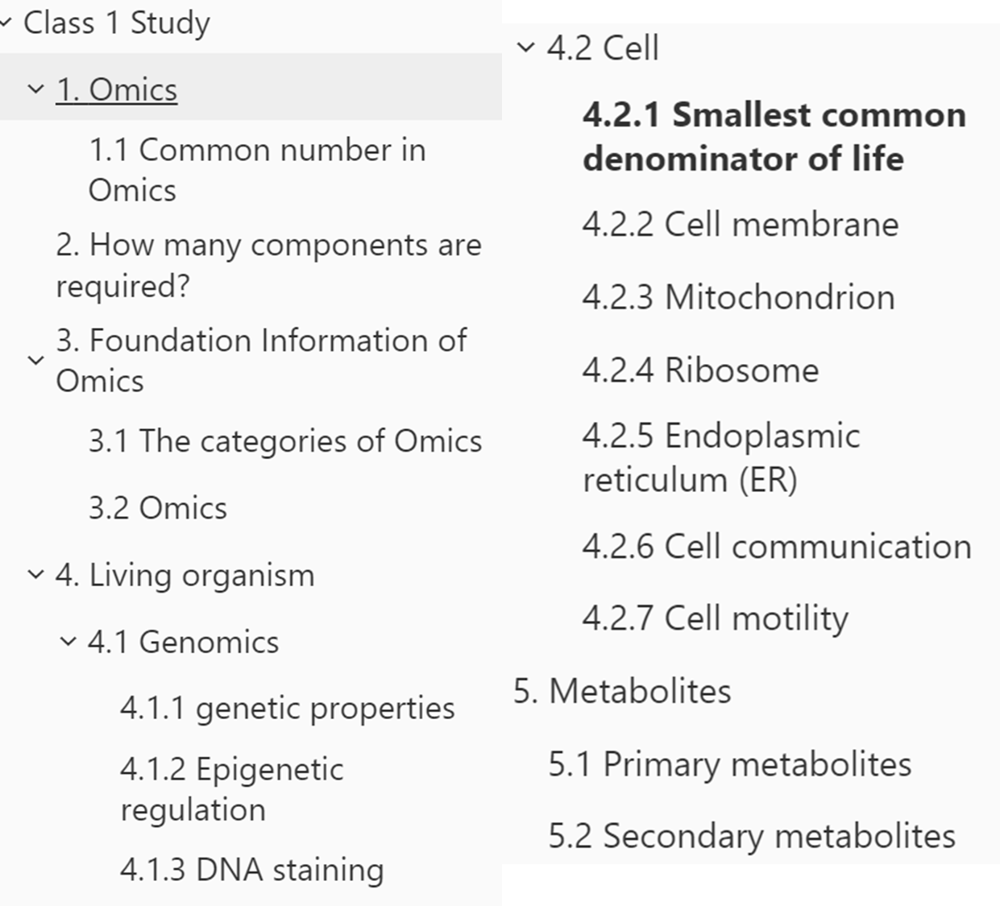
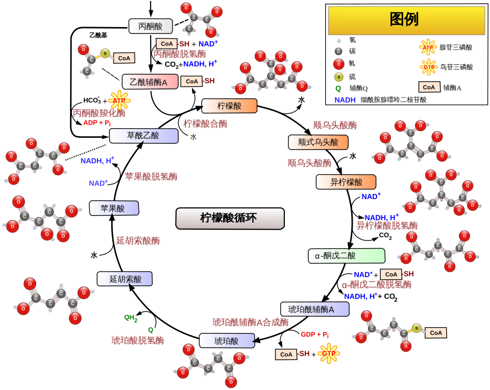
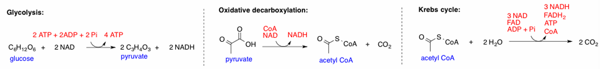
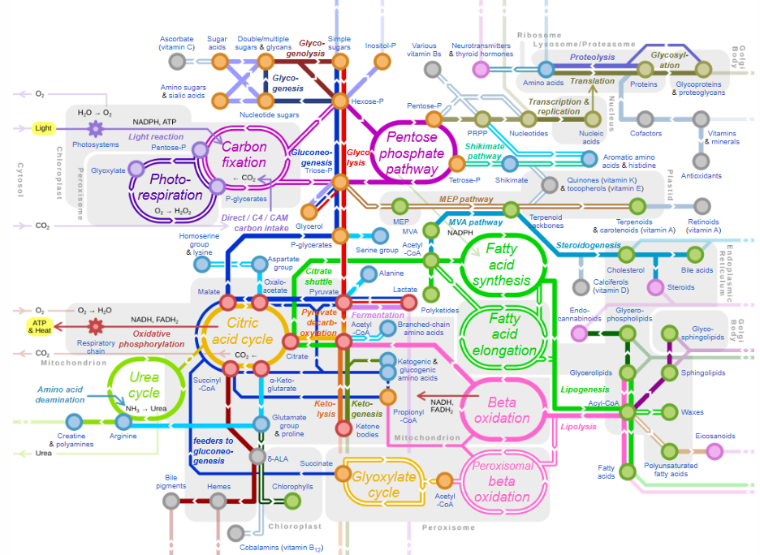

# Pre-study Notes

## Basic informa

- **Program Name**: BEHI 5007 - Genomics, Proteomics and Metabolomics

- **Class Schedule**: Tu 06:00PM - 08:50PM
- **Place**: Rm 4502, Lift 25-26 (60)
- Professor: LAM, Henry H N
  - **Ust rank of professor**:  A+ [LAM, Henry H N](https://www.google.com/search?q=site%3Afacultyprofiles.hkust.edu.hk+LAM%2C+Henry+H+N)
  - **Consultation**: There is no office hour, so you can only post email to appointment.

---

## Pre-requisites of class

- Require strong biological background for student.

---

## Grading scheme

- Assignments (20%, total 4 homework): 

​	Started during the lecture and bring it back to home to finish.

- **Exams(40% + 40%)**: 

​	1 mid-term exam in class on $24^{th}$ March;

​	1 final exam during hkust’s exam period：May 18 to 29.

- There is no presentation.

---

## Timeline and sub-group, etc rules

- Week 07 and Week 08 wouldn’t become the assignment or exam?
-  **NOT allowed to use AI to complete in-class assignments and exams.**

---

## Class Context

This Class will introduce “Omics”, it will base on the biology background which will be mentioned during the studying, focusing on declared the **Experiment Objective** of topics like genome、transcriptome、proteome... as the target by getting speeches of Omics technology and a bit of programming context.

# Class 1 Study

Update Log：

## Omics

Omics组学，<u>生物体是一系列**高度有序、能自我复制的化学反应集合**</u>。

> “Living things are just <u>a bunch of highly ordered and self-replicating chemical reactions</u>.”

其中，单个化学反应（如有氧呼吸）背后涉及大量的酶和分子。

> A single chemical reaction involves a huge number of enzymes and molecules behind it.

which meaning，生命活动的本质是分子层面的动态反应网络，而组学正是解析工具。

- > Omics is the collective characterization and quantification of entire  sets of biological molecules and the investigation of how they  translate into the structure, function, and dynamics of an organism  or group of organisms.
  >
  > Processes within cells are extremely complex and require holistic study.
  >
  > From wiki: [Omics]([组学 - 维基百科 --- Omics - Wikipedia](https://en.wikipedia.org/wiki/Omics#:~:text=Omics is the collective characterization and quantification of,as genomics%2C proteomics%2C metabolomics%2C metagenomics%2C phenomics and transcriptomics.))
  
  Omics是整套生物分子的集体**表征（外在表现）**、定量分析，并研究这些分子如何共同决定生物体（或生物群体）的结构、功能与动态变化。
  
  细胞内的过程极其复杂，需要整体性研究。

- The layer of life system: 

  “DNA → Protein → Genes(基因) → Chromosomes → Genome(基因组) → Cell → Community of cells(细胞群落/组织/多细胞群体)”

### Common number in Omics

人类体内的基因大约范围：20,000 -- 25,000

- 转录本（transcripts）~ 200,000
- 蛋白质形式（proteoforms）~ 1,000,000
- 人体细胞数量 ~ 10$^{13}$​
  - 体内微生物（microbes）~ 38-39 trillion
  - 微生物基因（bacterial genes）~ 2 million
  - _结肠中的微生物_（in the colon）~ 10$^{11}$​ 

---

## How many components are required?

For example: $C_6H_{12}O_6+6O_2 → 6CO_2+6H_2O$

有氧呼吸的总化学方程式，很简洁：

实际过程分为**糖酵解（还好）、氧化脱羧（有点难）、三羧酸循环（噩梦）**三个核心阶段：

- **Glycolysis**：糖酵解，葡萄糖在 ATP、NAD 等分子参与下，生成丙酮酸、NADH 和少量 ATP；
  - 需要 **10 种酶** 催化 10 步反应；
- **Oxidative decarboxylation**：氧化脱羧，丙酮酸在辅酶 A（CoA）、NAD 的参与下，生成乙酰 CoA、CO₂和 NADH；
  - 需要 **3 种核心酶**（多酶复合体形式）；
- **Krebs cycle**：三羧酸循环（aka，柠檬酸循环），乙酰 CoA 进入循环，生成 CO₂、ATP、NADH 和 FADH₂；
  - 需要 **8 种酶** 催化循环反应：

> 吓哭了，感觉在做zmd基建。

---

## Foundation Information of Omics

### The categories of Omics

| Categories                  | research target         | context                                                      |
| --------------------------- | ----------------------- | ------------------------------------------------------------ |
| Genomics（基因组学）        | 基因组（Genome）        | 研究所有基因的集合，解析 DNA 序列与遗传信息的传递            |
| Epigenomics（表观基因组学） | 表观基因组（Epigenome） | 研究 DNA 的化学修饰（如甲基化、组蛋白修饰），这些修饰不改变 DNA 序列但调控基因表达 |
| Transcriptomics（转录组学） | 转录组（Transcriptome） | 研究样本中所有 RNA 的集合，反映基因的即时表达状态            |
| Proteomics（蛋白质组学）    | 蛋白质组（Proteome）    | 研究所有蛋白质的集合（profile of cellular functions），关注蛋白质的表达（expression）、修饰（Post-translational modifications）、相互作用（complexes and interactions）及功能/降解（degradation） |
| Metabolomics（代谢组学）    | 代谢组（Metabolome）    | 研究所有代谢物（only small molecule metabolites，excluding macromolecules and salts）的集合，反映细胞或生物体的即时生理状态，是基因与环境作用的最终产物 |

### Omics

The relationship between **transcriptome** and **proteome**:

Proteoforms are far more numerous than transcriptome, and proteins are more direct representations of cellular functions.

蛋白质形式数量远多于转录本数量，蛋白质是细胞功能的更直接代表。

---

## Living organism

### Genomics

真核细胞（Eukaryotic）和原核细胞（Prokaryotic）之间：

| Dimension         | Eukaryotic                                                   | Prokaryotic |
| ----------------- | ------------------------------------------------------------ | ----------- |
| 直径（diameter）  | ~10 - 40 μm                                                  | ~1-2 μm     |
| 细胞核（Nucleus） | compartment surrounded by the nuclear membrane. Pores control transport into and out of the nucleus. |             |

核仁（Nucleolus）：核仁负责制造核糖体。

> The Nucleolus makes ribosomes.

#### genetic properties

有关于细胞的遗传特性：

1. When cell divide, they replicate, making a copy of their instructions.

2. Epigenetic regulation als affects cell properties.

   > 表观遗传调控也影响细胞特性

3. All cell contain the same genetic material, but express it differently.

   > 所有细胞都包含完全相同的遗传物质，但表达不同

4. Genetic information can flows from DNA to proteins and reverse(by reverse transcription).

#### Epigenetic regulation 

表观遗传调控，核心是影响基因表达而不改变DNA序列。

Epigenetics changes the DNA sequence, but is not heritable and only occurs during development. It affects gene expression without changing DNA sequence.

#### DNA staining

First, the DNA staining can be used for both live cells and dead cells. **HeLa** cell nuclear DNA can be stained with **Hoechst dye**. Cells going through **mitosis**（有丝分裂）have condensed DNA. The nucleolus can be stained.

### Cell

There are more than 200 types of cells in humans. 人类有超过200种不同类型的细胞。

> 不同类型的细胞具有不同的形态和功能。

Different cell types have different **morphologies** and functions. The properties of all cells include: Metabolism, growth, evolution. Differentiation（分化）is a property of some cells.

Hepatocytes（肝细胞）and macrophages（巨噬细胞）are examples of highly specialized cells.  Porperties of some cells include: differentiation, communication（通讯）, Genetic exchange（遗传通讯）, Motility（运动性）.

Cells evolve to display new properties, and **phylogenetic trees** capture evolutionary relationships. 系统发育树捕捉进化关系。

#### Smallest common denominator of life

How to understand Smallest common denominator of life? All living organisms are composed of cells. The cell is the smallest unit that can live independently. Also, Cells have all the basic characteristics of life.

#### Cell membrane

The cell membrane is a lipid bilayer composed mostly of phospholipids. 细胞膜主要由磷脂组成的脂质双层构成。

A phospholipid has a hydrophilic phosphate “head” and two hydrophobic fatty acid “tails”. 磷脂由亲水性磷酸"头部"和两个疏水性脂肪酸"尾部"组成。

The cell membrane also contains other fats, such as cholesterol. 细胞膜还含有其他脂肪，如胆固醇。

Many proteins are bound to the cell membrane, including receptors and transporters. 许多蛋白质结合在细胞膜上，包括受体和转运蛋白。

#### Mitochondrion

Mitochondrion 线粒体，is responsible for respiration and energy production. 负责呼吸作用和能量生产。 Also it is **membrane-bound organelles**. 由膜包围的细胞器

The mitochondrion has its own DNA and the DNA is inherited through the **maternal lineage**. 线粒体拥有自己的DNA且通过母系遗传。

#### Ribosome

The ribosome is the ranslation machine and is a large complex <u>consisting of</u> proteins and RNAs. It can be found in the cytoplasm and on the rough endoplasmic reticulum. 在细胞质和粗糙内质网上有分布。

#### Endoplasmic reticulum (ER)

Endoplasmic Reticulum内质网，分为 Rough ER和 Smooth ER. Also it is **membrane-bound organelles**.

Rough ER is responsible for protein production and  transport. 粗面内质网负责蛋白质生产和运输。

Smooth ER has no ribosomes and is responsible for synthesis and transport of other biomolecules. 滑面内质网没有核糖体，负责其他生物分子的合成和运输。

#### Cell communication

Cells ineract with each other by chemical messengers. 细胞通过化学信使相互作用。 Communication not only occurs between nerve cells.

#### Cell motility

About the cell motility, only some cells can be capable of **self-propulsion**. 关于细胞运动性，是某些细胞才具备自我推进的特性。

---

## Metabolites

### Primary metabolites

Primary metabolistes, 初级代谢物的功能：

1. Carriers of chemical energy. 能量载体
2. Building blockes of other biomolecules. 其他生物分子的构建块
3. Substrates, intermediates, and products of metabolism. 代谢的底物、中间体和产物。
4. Signaling molecules. 信号分子

### Secondary metabolites

Secondary metabolites, 次级代谢物的功能：

1. Growth-related.
2. Serve ecological functions, such as defense.
3. Essenetial for all organisms.
4. only exist in plants.

---

