# Class 2 - Central Dogma of biology

Original edit：2026-02-10

Last update：2026-03-23

Markdown type：Study markdown

Resources：BEHI_5007_2.assets 

Update log： 

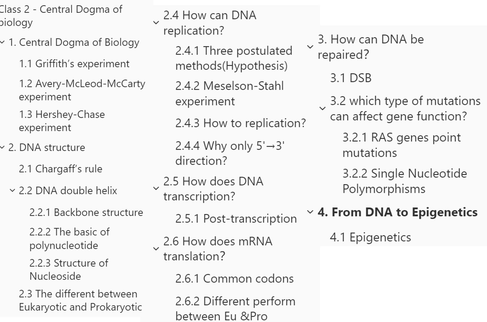

## Central Dogma of Biology

**The Central Dogma** (in one picture):

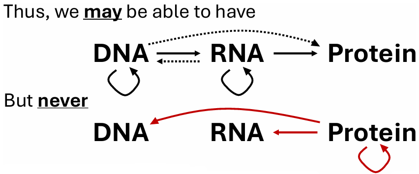

To understand the central dogma, we first need to look back to **Griffith’s experiment** with Streptococcus pneumoniae: 

### Griffith’s experiment

回顾Griffith的肺炎链球菌实验。

| Catelogy          | Method                                                       | Result |
| ----------------- | ------------------------------------------------------------ | ------ |
| Control（对照组） | Rough strain(R)                                              | Live   |
| Group 1           | Heat-killed smooth strain(S)                                 | Live   |
| Group 2           | Rough strain and heat-killed smooth strain                   | Dead   |
| Group 3           | smooth strain(virulent strain recovered from dead mice in Experiment 2) | Dead   |

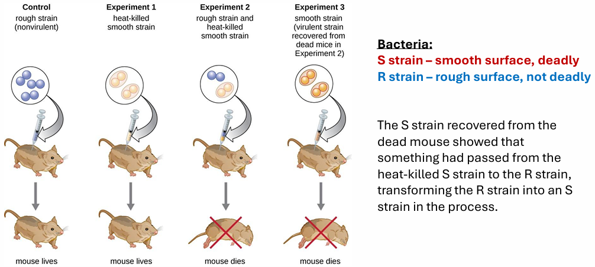

Overall, we can see:

The S strain has a smooth surface and is deadly to mice. The R strain has a rough surface and is not deadly to mice. The mix of heat-killed S and R input to mice and finally come out live S.

这份实验证明了“Transformation”转化现象，即“**遗传物质可以在不同细菌间转移**”，但并没有直接证明DNA是转化因子。

> **Genetic material can be transferred between different bacteria.**

### Avery-McLeod-McCarty experiment

为进一步探索转化现象， 我们继续研究Avery-McLeod-McCarty实验：

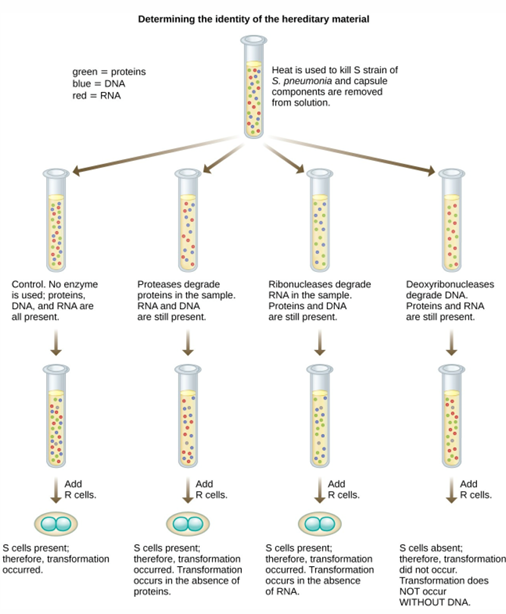

通过**试剂（reagents）**预处理杀死S菌，去除荚膜等结构，提取细胞内的混合物（蛋白质、DNA、RNA），分为四种不同处理：

| 组别     | 处理方式    | 剩余成分                                 |
| -------- | ----------- | ---------------------------------------- |
| 对照组   | 不加酶      | 蛋白质（绿）、DNA（蓝）、RNA（红）都保留 |
| 蛋白酶组 | 加入蛋白酶  | 降解蛋白质，保留 DNA、RNA                |
| RNA 酶组 | 加入 RNA 酶 | 降解 RNA，保留蛋白质、DNA                |
| DNA 酶组 | 加入 DNA 酶 | 降解 DNA，保留蛋白质、RNA                |

结果发现：

只有DNA被破坏的组别失去了转化能力

> Only the group where DNA was destroyed lost the ability to transform.

**DNA = transforming principle (genetic material)**

### Hershey-Chase experiment

Hershey-chase在Avery等人的实验上更进一步，使用**Isotope labeling同位素标记**噬菌体：

一组用$^{32}P$（磷-32）标记**Phage / bacteriophage噬菌体**的**DNA**（因为DNA含磷，而蛋白质几乎不含磷）；另一组用$^{35}S$（硫-35）标记噬菌体的**蛋白质外壳**（同上）；

让两组噬菌体分别去感染大肠杆菌，噬菌体把自己的遗传物质注入细菌内部，蛋白质外壳留在外面，再搅拌 + **离心（Centrifugation）**分离，提取**上清液（Supernatant）**和**沉淀（Pellet）**检测放射性。

最后得出结论：**只有 DNA 进入了宿主细胞，并传递给了子代噬菌体**，蛋白质没有参与遗传过程。

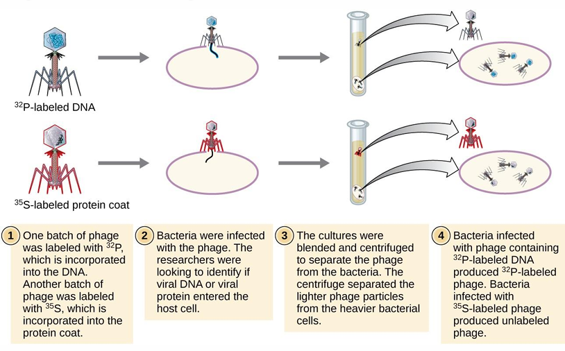

这一实验让科学界更广泛接受：

> Used radioactive ³²P to label DNA and ³⁵S to label protein. And found that only the ³²P-labeled DNA entered the bacteria. While ³⁵S-labeled protein remained outside the bacteria.

## DNA structure

To understand the DNA structure, first we can’t avoid **the Chargaff’s rule**: 

### Chargaff’s rule

何为查加夫法则：由两个核心规律 **物种特异性** 和 **碱基等量关系** 组成：

- Species specificity / species-specific base composition: 

  DNA碱基组成在**不同物种之间存在差异**，说明 DNA 具有物种特异性，是携带遗传信息的分子。

- Base parity rule / base equivalence rule / Chargaff's parity rule：

  在**同一物种**中：A = T；G = C；A + G = T + C

> **But why ?**
>
> 查加夫法则直接否定了 “四核苷酸假说”（认为 DNA 是 4 种碱基简单重复的单调分子）

### DNA double helix

由James Watson和Francis Crick在1953年提出的**DNA双螺旋结构**完美地阐释了查加夫法则。

<u>**The DNA structural features include:**</u>

1. Two **antiparallel polynucleotide** chains, they are complementary DNA strands./两条反向平行的多核苷酸链，他们是互补链.

   >  The base sequence of one strand determines the sequence of the other strand, which forms the foundation of DNA replication and the transfer of genetic information.
   >
   > 一条链的碱基序列决定了另一条链的序列，这是 DNA 复制和遗传信息传递的基础

2. Bases are inside the helix, paired by **hydrogen** bonds./碱基位于螺旋内部，通过氢键配对

3. A pairs with T (2 H-bonds), G pairs with C (3 H-bonds)./A与T配对形成两个**氢键**，G与C配对形成三个**氢键**

4. The **sugar-phosphate** backbone is on the outside./糖-磷酸骨架位于螺旋外部 

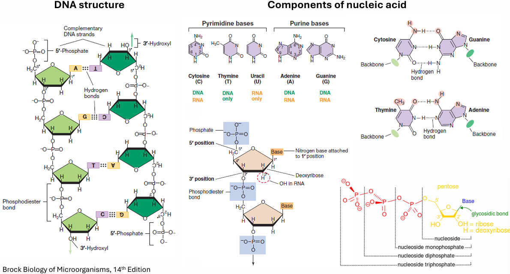

#### Backbone structure

由 **脱氧核糖（Deoxyribose）** 和 **磷酸基团（Phosphate）** 通过 **磷酸二酯键（Phosphodiester bond）** 连接而成。链有方向性：**5′- 端（5′-Phosphate）** 和 **3′- 端（3′-Hydroxyl）**，两条链反向平行（antiparallel）。

#### The basic of polynucleotide

- **嘧啶（Pyrimidine bases）**：单环结构
  1. 胞嘧啶（Cytosine, C）：DNA/RNA 共有
  2. 胸腺嘧啶（Thymine, T）：**仅 DNA**
  3. 尿嘧啶（Uracil, U）：**仅 RNA**
- **嘌呤（Purine bases）**：双环结构
  1. 腺嘌呤（Adenine, A）：DNA/RNA 共有
  2. 鸟嘌呤（Guanine, G）：DNA/RNA 共有

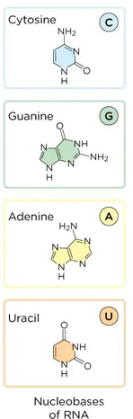

#### Structure of Nucleoside

**核苷（Nucleoside）** = 戊糖（Pentose） + 碱基（Base）（通过糖苷键 Glycosidic bond 连接）

**核苷酸（Nucleotide）** = 核苷 + 磷酸基团（Phosphate）

<u>戊糖</u>差异：

- DNA：**脱氧核糖（Deoxyribose）**（2′ 位是 H）
- RNA：**核糖（Ribose）**（2′ 位是 OH）

### The different between Eukaryotic and Prokaryotic

- 从DNA结构上来看：

原核生物通常有**一个环状染色体** / Prokaryotes typically have a **single circular chromosome**. 而真核生物有多个**线性**染色体 / Eukaryotes have multiple **linear** chromosomes. 原核生物可能含有**质粒（plasmid）** / Prokaryotes may contain plasmids.

- 从质粒上来看：

质粒可以赋予细菌多种特性，譬如：

> 抗生素抗性、毒素、代谢功能、接合、细菌素产生、致病性等。antibiotic resistance, toxins, metabolic functions, conjugation, bacteriocins, virulence, etc. 

---

### How can DNA replication?

#### Three postulated methods(Hypothesis)

为了推导DNA的复制，科学家提出了三种DNA复制假说，而最后**半保留复制（Semi-Conservative）** 最终被实验证实是正确的。这里介绍一下三种：

1. Semi-conservative/半保留复制

   亲代DNA双链解开，每条链作为模板合成一条新链。

2. Conservative/全保留复制

   亲代 DNA 双链保持完整，直接合成一条全新的双链 DNA。

3. Dispersive/分散复制

   每个子代 DNA 分子都是亲代片段和新片段的**镶嵌混合体**。

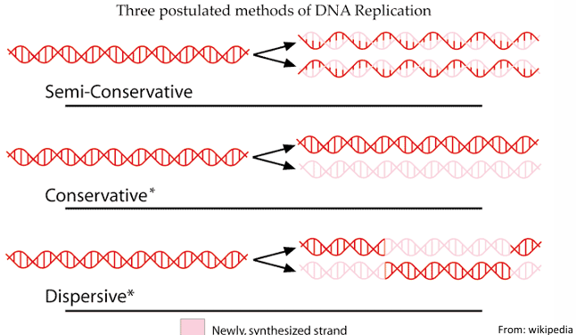

#### Meselson-Stahl experiment

为了验证科学家的假说，Meselson-Stahl等人选择使用**密度梯度离心（Density gradient centrifugation）**，用$^{15}$N（重氮）标记**亲代链**，¹⁴N（轻氮）标记新链。

> labeling **parental strands** with heavy ¹⁵N and **new strands** with light ¹⁴N.

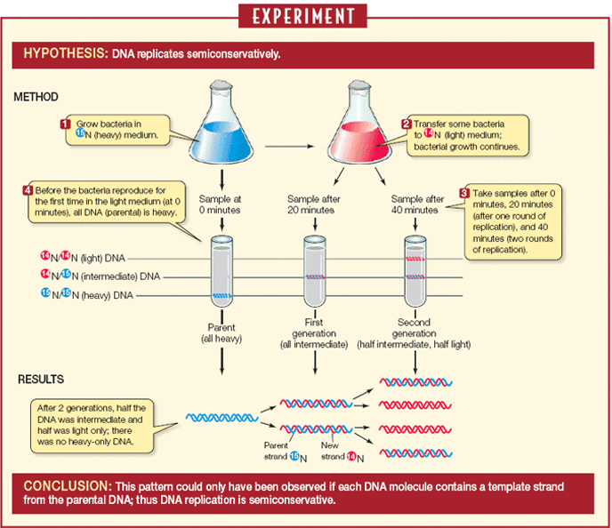

#### How to replication?

流程如下：首先是解旋与稳定，使用**解旋酶（Helicase）**将ATP水解能量，解开DNA双螺旋，形成**复制叉（Replication fork）**。

之后，**单链结合蛋白（Single-strand binding protein，SSB）**结合并稳定解开的**单链 DNA（single-strand DNA，ssDNA）**，防止其重新配对。

最后，**拓扑异构酶（Topoisomerase）**负责通过切割并重新连接DNA链来解决解旋过程中产生的**超螺旋 / 打结问题（supercoiling/knotty problem）**，避免 DNA 链缠绕断裂。

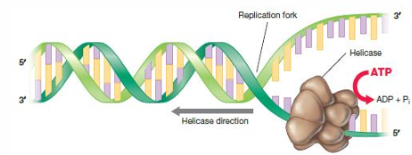

接下来是链的**合成（synthesizes）**：

- **先导链（Leading strand）**利用RNA 引物沿着复制叉方向，**连续合成** 。
- **后随链（Lagging strand）**方向相反，**不连续合成**，需要多个 RNA 引物，利用**DNA聚合酶（DNA polymerase III）**合成**冈崎片段（Okazaki fragments）**，再用 **DNA 连接酶（DNA ligase）** 将这些片段连接成完整的 DNA 链。

- 其中**引物酶（Primase）**是一种合成 RNA 引物，为 **DNA 聚合酶**（DNA polymerase）提供 3′-OH 起点，同时DNA聚合酶 can only catalyze DNA synthesis in the 5'→3' direction.

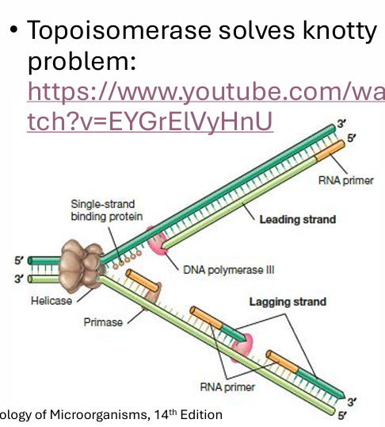

最后是检查：利用**DNA 聚合酶 I（DNA polymerase I）**切除 RNA 引物，填补缺口，和**拓扑异构酶 IV（Topoisomerase IV）**在复制结束后，解开**连环的子代 DNA 环**（Unlinking of interlocked circles），让两个子链分离。

#### Why only 5'→3' direction?

因为新链的延伸依赖于3'-OH对dNTP的**亲核攻击** / Elongation depends on the 3′-Hydroxyl (3′-OH) **nucleophilic attack** on the incoming **dNTP（Deoxyribonucleoside triphosphate）**.

这个反应过程会形成**磷酸二酯键（phosphodiester bond）**，将新核苷酸连接到链的 3′ 端。

同时反应中发生**焦磷酸释放（Pyrophosphate cleavage）**，反应中，dNTP 会脱去**两个磷酸基团（焦磷酸，PPi）**，释放大量能量，推动反应不可逆地进行。

只有 3′-OH 能执行这个亲核进攻，5′- 磷酸无法反过来进攻 3′ 端，因此链只能向 3′ 方向延长。

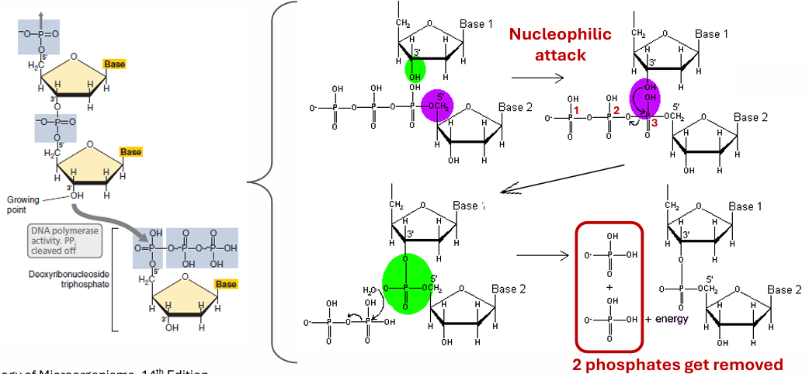

如果尝试反向，则**化学上不具备亲核进攻的条件**，同时5′ 端的磷酸基团无法像 3′-OH 那样提供稳定的亲核位点，也无法通过释放焦磷酸来驱动反应。

>  chemical conditions would not be met. 5′-phosphate group cannot provide a stable nucleophilic site.

---

### How does DNA transcription?

转录是RNA聚合酶以DNA为模板合成RNA的过程，是**遗传信息**从 DNA 流向 RNA 的关键步骤。

> Transcription is the synthesis of mRNA from a DNA template by RNA polymerase.

分为三个阶段：

1. 起始（Initiation）

   **RNA 聚合酶（RNA polymerase）** 紧密结合到 DNA 的 **启动子（promoter）** 区域。酶会解开并打开待转录的 DNA 片段，形成**转录泡（transcription bubble）**。

   > 转录泡是转录过程中，DNA 局部解旋形成的、包含 RNA 聚合酶和正在延伸的 RNA 链的单链区域.
   > RNA polymerase maintains a **transcription bubble** where the DNA template is exposed for base pairing.

2. 延伸（Elongation）

   DNA 双链局部解开，**模板链（template strand /antisense strand）** 作为合成 RNA 的模板。**RNA 聚合酶** 沿着模板链 3′→5′ 方向移动，以 **NTP （ Nucleoside Triphosphate，核苷三磷酸AGCU，是 RNA 合成的原料）**为原料，按碱基互补配对原则（A-U，T-A，G-C，C-G）合成 RNA 链。

   RNA 链同样**从 5′→3′ 方向延伸**（和 DNA 复制方向一致）。

   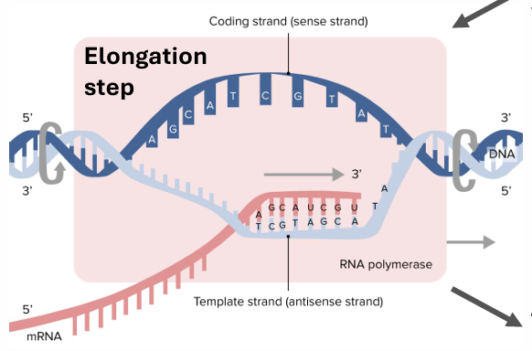

   **编码链（coding strand /sense strand）**：序列与新合成的 RNA 基本一致（仅 T 替换为 U），不直接作为模板。

   **模板链（template strand /antisense strand）**：真正指导 RNA 合成的 DNA 链。

   **mRNA**：新合成的 RNA 产物，从 5′ 端开始延伸。

   **转录本（transcripts）**：从 DNA 上伸出的 RNA 链，越靠近转录起始端越短（short transcripts），越靠近终止端越长（longer transcripts）。

3. 终止（Termination）

   当 RNA 聚合酶到达 DNA 上的 **终止子序列（termination sequence）** 时，转录停止。RNA 链、RNA 聚合酶从 DNA 模板上释放，DNA 重新形成双螺旋。

#### Post-transcription

转录后 mRNA 加工是**真核生物**特有的步骤：

> Alternative splicing occurs in eukaryotes.

1. **5′ 端加帽（5' cap）**

   在 pre-mRNA 的 **5′ 端** 加上一个 **甲基化鸟苷（methyl-guanine）** 帽子结构。作用：保护 mRNA 不被降解，同时帮助核糖体识别并结合 mRNA，启动翻译

2.  3′ 端加尾（Poly-A tail）

   在 pre-mRNA 的 **3′ 端** 加上一串 **腺嘌呤核苷酸（polyadenosine, poly (A)）** 尾巴。作用：增强 mRNA 的稳定性，延长其寿命，并协助 mRNA 从细胞核转运到细胞质。

3. RNA 剪接（RNA splicing）

   切除 pre-mRNA 中的**内含子（introns，非编码序列）**，将**外显子（exons，编码序列）** 连接起来。最终形成只包含编码序列的成熟 mRNA。

   > 外显子是编码蛋白质的序列 / Exons are sequences that code for proteins.
   >
   > 内含子在转录后被剪接去除 / Introns are spliced out after transcription.

4.  选择性剪接（Alternative mRNA splicing）

   同一个 pre-mRNA 可以通过**不同的剪接方式**，保留不同的外显子组合，从而产生多种不同的成熟 mRNA。意义：一个基因可以编码多种不同的蛋白质，极大地增加了蛋白质组的多样性。

   >  A single gene can produce multiple different mRNAs via alternative splicing. And different mRNAs can be translated into different proteins.
   >
   > Alternative splicing increases proteome diversity.

---

### How does mRNA translation？

- 核糖体（Ribosome）：由**大亚基 + 小亚基（large subunit + small subunit）**组成，提供 mRNA 和 tRNA 的结合位点（binding site）。沿着 mRNA 5′→3′ 方向移动，催化（catalysis）氨基酸之间形成**肽键（peptide bond）**，**延长多肽链（elongate the polypeptide chain）**。

- tRNA（转运 RNA）

  结构呈**发夹环（Hairpin loop）**，一端是**反密码子（Anticodon）**，通过**反密码子**识别mRNA上的密码子（recognizes codons on mRNA via **anticodons**）；另一端结合特定氨基酸。每种 tRNA 只携带一种氨基酸，确保密码子与氨基酸的精准对应。

- 翻译的完整流程

1. **氨基酸活化（amino acid activation）**：**氨酰 - tRNA 合成酶（aminoacyl-tRNA synthetase）**将氨基酸加载到对应 tRNA 上，形成 “氨酰 - tRNA”。
2. **起始**：核糖体小亚基结合 mRNA **起始密码子（initiation codon）**，携带起始氨基酸的 tRNA 进入，形成起始复合物（initiation complex）。
3. **延伸**：核糖体**依次读取密码子（sequentially read the codons）**，tRNA 携带氨基酸进入，通过肽键连接成多肽链。
4. **终止**：遇到终止密码子，**释放因子（release factor）**结合，多肽链和核糖体从 mRNA 上解离。

遗传密码由三个核苷酸组成的密码子决定 / The genetic code is determined by codons of three nucleotides.

#### Common codons

initiation codon: **AUG**

Stop codons: **UAA、UAG、UGA**

#### Different perform between Eu &Pro

原核生物的转录和翻译可以同时进行（在细胞质中） / In prokaryotes, transcription and translation can occur simultaneously (in the cytoplasm).
真核生物的转录在细胞核，翻译在细胞质，两者在空间和时间上分离 / In eukaryotes, transcription occurs in the nucleus, translation in the cytoplasm, separated spatially and temporally.
原核生物的mRNA通常是多顺反子（编码多个蛋白质） / Prokaryotic mRNA is often polycistronic (encoding multiple proteins).
真核生物的mRNA通常是单顺反子 / Eukaryotic mRNA is usually monocistronic.

---

## How can DNA be repaired？

### DSB

DNA double-strand breaks  (DSBs)，**DNA双链断裂（DSB）**：是 DNA 的两条链同时发生断裂，双螺旋结构被彻底打断。

> A **DNA double-strand break (DSB)** is a type of DNA damage in which **both strands of the DNA double helix are broken simultaneously**, resulting in the complete disruption of the DNA molecule.

There are two way to repair：

1. **同源重组修复（Homologous recombination, HR）**

   HR需要同源DNA序列作为模板进行精确修复 / HR requires homologous DNA as a template for accurate repair. 主要发生在细胞周期的S期和G2期（有姐妹染色单体可用时） / HR mainly occurs in S and G2 phases (when sister chromatids are available).

2. **非同源末端连接（Non-homologous end joining, NHEJ）**

   NHEJ直接将断裂末端连接，可能引入突变 （容易丢碱基、出错、突变）/ NHEJ directly ligates broken ends, potentially introducing mutations. 在整个细胞周期都活跃 / NHEJ is active throughout the cell cycle.

### which type of mutations can affect gene function?

哪些类型的突变会影响基因功能？

1. **非整倍体（Aneuploidy）**染色体数目异常 / Aneuploidy – abnormal chromosome number.

   > 常见症状有，但不总是致死（lethal）：
   > 唐氏综合征（Down Syndrome）是21号染色体三体 / Down Syndrome is trisomy 21.
   > 克氏综合征（Klinefelter Syndrome）是XXY / Klinefelter Syndrome is XXY.

2. 大片段染色体易位/截断（Large chromosomal translocations/truncations）：是指一段染色体断裂后连接到另一条染色体上 / Translocation is when a segment of one chromosome breaks off and attaches to another chromosome. 易位可以产生融合基因，编码异常蛋白质 / Translocations can create fusion genes encoding abnormal proteins.

   > 费城染色体（Philadelphia chromosome）是由9号染色体和22号染色体易位形成的 / It is formed by a translocation between chromosomes 9 and 22. 产生了BCR-ABL1融合基因 / It produces the BCR-ABL1 fusion gene. 其是一种"持续激活"的酪氨酸激酶 / The BCR-ABL1 fusion protein is a "always on" tyrosine kinase. 与慢性髓性白血病（CML）相关 / This mutation is associated with Chronic Myelogenous Leukemia (CML).

3. 点突变中的无义突变（Nonsense mutation）

   > 亨廷顿病（Huntington's disease）的拷贝数变异（CNV）机制：
   >
   > 由CAG三核苷酸重复序列扩增引起/ caused by expansion of a CAG trinucleotide repeat. 正常人的CAG重复次数较少，患者通常超过44-46次 / Normal individuals have fewer repeats; patients typically have >44-46 repeats. 突变的亨廷顿蛋白（mHtt）损害神经元功能 / Mutant huntingtin (mHtt) damages neuronal function.

**需要注意的是：点突变中的同义突变（Silent mutation）并不会影响基因功能**：其仅将一个氨基酸密码子变为终止密码子，导致蛋白质截短。而其它类型的突变：错义突变（Missense）改变一个氨基酸、同义突变（Silent）不改变氨基酸序列、移码突变（Frameshift）由插入或缺失非3倍数的核苷酸引起，改变下游所有氨基酸。

#### RAS genes point mutations

RAS蛋白是参与信号转导的GTP酶，在正常细胞中，它在信号转导途径中发挥关键作用，调节细胞的生长、增殖和分化等过程。 / RAS proteins are GTPases involved in signal transduction. 正常RAS在GTP结合状态（激活）和GDP结合状态（失活）之间循环 / Normal RAS cycles between GTP-bound (active) and GDP-bound (inactive) states. 突变型RAS蛋白持续处于激活状态（组成型激活） / Mutant RAS is constitutively active (always "on"). RAS突变破坏了正常的负反馈调节机制，使得细胞生长和增殖失去控制，从而导致癌症 / RAS mutations often lead to cancer.

#### Single Nucleotide Polymorphisms

单核苷酸多态性（SNP）是指在基因组水平上由单个核苷酸的变异引起的DNA序列多态性 / SNPs are DNA sequence polymorphisms caused by variation at a single nucleotide. SNP与个性化医疗相关 / SNPs are relevant to personalized medicine.

SNP在人群中的丰度通常大于1% / SNPs typically have an abundance >1% in the population. 人类已记录的SNP超过300万个 / Humans have over 3 million recorded SNPs.

其中CCR5受体就是SNP的例子，CCR5是HIV进入某些免疫细胞所需的共受体之一 / CCR5 is one of the co-receptors required for HIV entry into certain immune cells. 某些CCR5基因的SNP可以影响受体功能，使个体对HIV感染具有抵抗力 / Certain SNPs in the CCR5 gene can affect receptor function, making individuals resistant to HIV infection.

---

## From DNA to Epigenetics

人体细胞如何将大量DNA包装进微小空间？

首先DNA缠绕在组蛋白上形成核小体 / DNA wraps around histones to form nucleosomes. 核小体进一步折叠成更高阶的染色质结构 / Nucleosomes further fold into higher-order chromatin structures. 在细胞分裂时，染色质凝缩成染色体 / During cell division, chromatin condenses into chromosomes.

###  Epigenetics

表观遗传学（Epigenetics）的调控机制包括： / Regulatory mechanisms of epigenetics include: DNA甲基化（DNA methylation）/组蛋白修饰（Histone modifications）/microRNA沉默（miRNA silencing）/长链非编码RNA（lncRNA）调控 / Long non-coding RNA (lncRNA) regulation.

其中：

1. **组蛋白及其修饰**：

   > 组蛋白是为将DNA包装成染色质提供结构支持的蛋白质 / Histones are proteins that provide structural support for packaging DNA into chromatin.
   > DNA缠绕在组蛋白八聚体上形成核小体 / DNA wraps around a histone octamer to form a nucleosome.
   > 组蛋白经历翻译后修饰，如乙酰化、甲基化、磷酸化等 / Histones undergo post-translational modifications (PTMs) such as acetylation, methylation, phosphorylation, etc.
   >
   > 乙酰化的作用是与基因激活相关，目的是中和组蛋白的正电荷，使其与DNA的结合减弱，染色质结构更开放。
   > Typically associated with gene activation. Acetylation neutralizes the positive charge on histones, weakening their binding to DNA and opening chromatin structure.
   >
   > 组蛋白修饰模式形成"组蛋白密码"，调控基因表达 / Patterns of histone modifications form a "histone code" that governs gene expression.

2. 如何读懂**组蛋白修饰的标准化命名**？

   > 以H3K4me3为例：
   > H3表示组蛋白H3家族 / H3 means Histone H3 family.
   > K表示赖氨酸（Lysine） / K stands for lysine.
   > 4表示从N端开始的第4个氨基酸残基 / 4 means the 4th amino acid residue from the N-terminus.
   > me3表示添加了三个甲基基团 / me3 means three methyl groups added.

3. **DNA甲基化**：

   > DNA甲基化通常发生在CpG位点 / DNA methylation typically occurs at CpG sites. 
   > 甲基化由DNA甲基转移酶（DNMT）催化 / Methylation is catalyzed by DNA methyltransferase (DNMT).
   > 甲基供体是S-腺苷甲硫氨酸（SAM） / The methyl donor is S-adenosylmethionine (SAM).
   > CpG位点的甲基化通常使基因沉默 / Methylation of CpG sites typically silences genes.
   >
   > 启动子区域的CpG岛甲基化通常导致基因沉默， 甲基化可以阻止转录因子与DNA结，甲基化可以招募甲基结合蛋白，这些蛋白进一步招募其他沉默复合物 

4. ENCODE项目/表观遗传学路线图项目（Roadmap project）的目的是什么？

   绘制人类基因组中所有功能元件的图谱 / To map all functional elements in the human genome. 研究不同细胞类型中的表观遗传标记 / To study epigenetic marks in different cell types.
