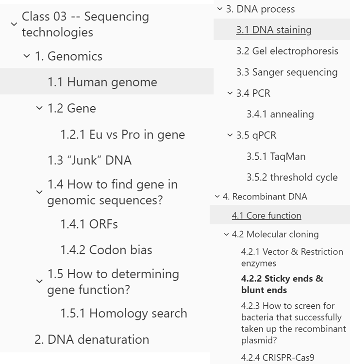

# Class 03 -- Sequencing technologies

Original edit：2026-02-24

Last update：2026-03-23

Markdown type：Study markdown

Resources：BEHI_5007_3.assets 

Update log： 

---

## Genomics

**Genomics**，译为**基因组学**，是一门研究**基因组（genome）**的学科。基因组是生物体的全部遗传组分，由DNA编码（RNA病毒除外） 

>  The genome is the entire genetic component of an organism, encoded by DNA (except RNA viruses). 

**基因组学包括**：

活细胞中提取基因组信息（测序） 

解析基因组的组成成分（delineating the components of a genome）

阐明基因组各组成成分的功能

研究不同生物之间的基因组差异

> Genomics involves extracting genome information from living cells (i.e., sequencing) .
>
> Delineating the components of a genome.
>
> Understand the functions of the components of a genome.
>
> Studying genomic differences between organism.

### Human genome

人类基因组分为**核基因组**和**线粒体基因组** / The human genome is divided into the **nuclear genome** and the **mitochondrial genome**. 基因组长约30亿个核苷酸，组织成**染色体** / The nuclear genome is ~3 billion nucleotides long, organized into **chromosomes**. 同时，线粒体基因组长约17,000个核苷酸 / The mitochondrial genome is ~17,000 nucleotides long.

- **体细胞（somatic cells）**含有 22 对**常染色体**（**autosomes**，即非性染色体）和 2 条性染色体，为**二倍体（diploid）**

  >  Somatic cells has two copies of the 22 autosomes (non-sex  chromosomes) and two sex chromosomes (diploid

- **配子（gametes）**是生殖细胞（精子/卵子），仅含 1 套染色体，为**单倍体（haploid）**

  > Gametes is germ cells(sperm or ovum) and have one copy (haploid).

- 所有细胞都含有数千份线粒体基因组的拷贝

  > All cells have thousands of copies of the mitochondrial genome

### Gene

Gene，依旧是基因，是可以遗传生物信息的基本单位，曾错误被定义为「能表达为蛋白质的 DNA 片段」。

> Basic unit of heritable biological information. 

因为其中包含**非编码 RNA（non-coding RNAs）**：如 rRNA（核糖体 RNA）、tRNA（转运 RNA），以及具有调控功能的非编码 RNA，它们由基因转录而来但不翻译为蛋白；**非翻译区（Untranslated regions, UTRs）**：基因中不被翻译为蛋白的序列；**内含子（Introns）**：基因中被转录但在 RNA 加工时被剪切掉的序列。

> Because it includes **non-coding RNAs** (e.g., rRNA, tRNA, regulatory RNAs) that are transcribed but not translated; **untranslated regions (UTRs)**; and **introns** that are spliced out during RNA processing.

因此，**分子生物学**定义：基因是一段**能被转录为 RNA 的 DNA 序列**（即与 RNA 加工前的初始转录本完全匹配的 DNA 片段）

>  Molecular definition: A gene is a piece of DNA that is transcribed to RNA  (i.e. one that should match a transcript before it is processed)

#### Eu vs Pro in gene

原核生物基因组大部分是基因，没有内含子 / Prokaryotic genomes are mostly genes, with no introns. 基因组织成**操纵子（operons）**，多个基因一起被调控和表达 / Genes are organized into operons, groups of genes regulated and expressed together. 即使是大肠杆菌（E. coli），也有超过25%的基因功能未知 / Even for E. coli, >25% of genes have unknown functions.

### “Junk” DNA

垃圾DNA"是指不编码蛋白质的DNA序列 ，人类基因组中大部分是非编码DNA ，然而非编码DNA可能具有重要的调控功能，并非代表这些序列完全没有功能 。

> "Junk DNA" refers to DNA sequences that do not code for proteins. Most of the human genome is non-coding DNA. While non-coding DNA may have important regulatory functions and not just implies these sequences have no function at all.

### How to find gene in genomic sequences?

答案：

1. 扫描**开放阅读框（ORFs）**，寻找起始密码子和终止密码子之间的序列 / Scanning for **open reading frames (ORFs)** between start and stop codons.
2. 利用**密码子偏好性（codon bias）** / Using codon bias.
3. 寻找**外显子-内含子边界基序**（如GT-AG规则） / Searching for **exon-intron boundary motifs** (e.g., GT-AG rule).
4. 寻找**上游CpG岛**（脊椎动物） / Searching for **upstream CpG** islands (in vertebrates).

#### ORFs

Open Reading Frames, ORFs，是**蛋白质编码区**，由起始密码子（start codon，ATG）开始，到终止密码子（stop codon，TAA/TAG/TGA）结束，中间长度通常>100 个密码子。本质是一段**可能编码蛋白质的 DNA 序列**，是找基因的最基础方法。

DNA 是双链，每条链有 3 种可能的阅读框（密码子 3 个碱基一组），因此总共有**6 种翻译方式（六框翻译，Six-frame translation）**，预测时需要遍历所有 6 种框。

为何ORF 法对原核生物有效，对真核生物效果差？

| 生物类型 | 基因结构特点                             | ORF 法效果                                            |
| -------- | ---------------------------------------- | ----------------------------------------------------- |
| 原核生物 | 基因是**连续的**，无内含子               | 直接找 ATG→终止密码子，中间就是完整的编码区，无干扰   |
| 真核生物 | 基因被内含子打断，外显子和内含子交替排列 | 直接找 ORF 会被内含子里的终止密码子干扰，导致预测不准 |

#### Codon bias

**密码子偏好性**，是指大多数氨基酸由多个密码子编码，而在**蛋白质编码基因**中，某些密码子比其他密码子使用更频繁。

> Most amino acids are coded by more than one codon. And Some codons are used more frequently than others in **protein-coding genes**.

### How to determining gene function?

**同源性搜索（homology search）**序列相似可能意味着功能相似 / Homology search: similar sequence may imply similar function.
**基因失活（gene inactivation）**敲除或敲低基因，观察表型变化 / Gene inactivation: knock out or knock down the gene and observe phenotypic changes.
**基因过表达（gene overexpression）**强制基因高表达，观察表型变化 / Gene overexpression: force high expression and observe phenotypic changes.
**组学与系统生物学（omics and systems biology）**研究 / Omics and systems biology studies.

#### Homology search

核心逻辑是通过序列相似来推导其编码的蛋白质地功能可能相似。即即使整体序列不相似，只要共享相同的蛋白结构域，也可能具有相似功能 / Even if overall sequences are not similar, sharing the same protein domain may indicate similar function.

- **Orthologous gene，直系同源基因**：存在于不同物种中，源自物种形成事件 / Orthologs are genes in different species that evolved from a common ancestral gene by speciation. 其功能通常相似。
- **Paralogs gene，旁系同源基因**：存在于同一物种中，源自基因复制事件 / Paralogs are genes within the same species that evolved by gene duplication. 其基因可能进化出新的功能 / Paralogs may evolve new functions.

---

## DNA denaturation

`DNA denaturation`，DNA**变性**：是指dsDNA（`double-stranded DNA`，双链DNA）在加热等条件下，双链间互补碱基的氢键断裂，双螺旋结构解旋，分离为两条ssDNA（`single-stranded DNA`，单链DNA）的过程。

- 加热条件达到**Tm**（`DNA melting temp`，DNA解链温度）时才能进行DNA denaturation，此时一半DNA为双链、一边为单链。

- **低盐**浓度**促进**DNA变性 / Low salt concentrations favor denaturation.

  > 由于DNA是聚阴离子分子，两条链带负电 / DNA is a polyanionic molecule; both strands are negatively charged. 高盐浓度中的阳离子"屏蔽"磷酸基团的负电荷，减少链间排斥 / High salt concentrations have cations that "shield" the negative charges on phosphates, reducing inter-strand repulsion. 低盐浓度下，静电排斥力更强，使链分离在能量上更有利 / At low salt, electrostatic repulsion is stronger, making strand separation energetically favorable.

- 高pH（**碱性**条件）**促进**DNA变性 / High pH (basic conditions) favors denaturation.

与DNA denaturation相对应的，是``DNA annealing`，即DNA**复性**（又被称为**退火**）

---

## DNA process

### DNA staining

DNA染色，是指某些染料可以**嵌入（intercalate）**到DNA碱基对之间，其可用于可视化DNA且不分细胞的生命状态，是定量PCR（qPCR）的基础之一。

> Some dyes can intercalate between DNA base pairs. Intercalating dyes can be used to visualize DNA. DNA staining can only be used for dead cells. DNA staining is one of the bases for quantitative PCR (qPCR).

### Gel electrophoresis

**琼脂糖凝胶电泳（Agarose gel electrophoresis）**，则是利用凝胶将不同大小的DNA/RNA片段（**separate DNA, RNA, or protein fragments by size**）分开的方法，由于DNA带**负电（negatively charged）**，会在电磁作用下向正极跑，而片段越小跑得越快越快，最终染色后能看到一条条**条带（bands）**。

### Sanger sequencing

什么是Sanger测序法，：是使用**双脱氧核苷酸（ddNTPs）**来终止DNA链的延伸，由于ddNTPs缺乏3'-OH基团，无法形成**磷酸二酯键**，利用放射性标记，可**自动化测序**使用荧光标记，一次只能测试一条。其**下一代测序 NGS / 高通量测序**对DNA测序能一次测序数百万条DNA片段。

> It uses dideoxynucleotides (ddNTPs) to terminate DNA strand elongation. ddNTPs lack a 3'-OH group and cannot form phosphodiester bonds. Traditional Sanger sequencing used radioactive labels; automated sequencing uses fluorescent labels.  NGS can sequence millions of DNA fragments at once.

### PCR

PCR是聚合酶链式反应适用于在体外扩增特定的DNA片段，需要DNA模板、引物、DNA聚合酶和dNTPs，其中三个基本步骤是变性、**退火和**延伸，同时反应中使用的DNA聚合酶通常耐热。

> PCR is used to amplify specific DNA fragments in vitro. CR requires a DNA template, primers, DNA polymerase, and dNTPs. The three basic steps of PCR are denaturation, **annealing**, and elongation. The DNA polymerase used in PCR is usually heat-resistant.

PCR引物必须与模板链的3'端结合，使聚合酶能向3'方向延伸 / PCR primers must bind to the 3' end of the template strand so the polymerase can extend in the 3' direction.

引物的方向决定了扩增产物的序列 / The orientation of primers determines the sequence of the amplified product.

#### annealing

退火的问题取决于Tm溶解温度，延伸温度是耐热DNA聚合酶（如**Taq酶**）的最适温度，变性温度（94-96°C）是为了使DNA双链分离。

### qPCR

定量PCR可以实时监测PCR的进展，通过观察dsDNA丰度超过阈值的时间（Ct值）来推断起始DNA量，非特异性qPCR使用能标记任何双链DNA的染料（如SYBR Green），特异性qPCR使用TaqMan探针，其荧光信号与目标扩增偶联 。

> qPCR monitors the progress of PCR in real time. qPCR infers the amount of starting DNA by observing when dsDNA abundance passes a threshold (Ct value). Non-specific qPCR uses dyes that label any double-stranded DNA (e.g., SYBR Green). Specific qPCR uses TaqMan probes, where fluorescence signal is coupled to target amplification.

#### TaqMan

 **TaqMan探针**通过同时标记荧光染料和淬灭剂，来特异性检测目标 DNA 片段，当探针完整时，荧光被淬灭，PCR扩增时，DNA聚合酶的5'→3'外切酶活性会切割探针，探针切割后，荧光染料与淬灭剂分离，产生荧光信号。

> The probe is labeled with both a fluorescent dye and a quencher. When the probe is intact, fluorescence is quenched. During PCR amplification, the 5'→3' exonuclease activity of DNA polymerase cleaves the probe. After cleavage, the dye is separated from the quencher, producing a fluorescent signal.

#### threshold cycle

**Ct值（threshold cycle）**是荧光信号超过设定阈值时的循环数 / Ct value is the cycle number at which the fluorescence signal crosses a set threshold.起始模板量越高，Ct值越小/ Higher starting template quantity leads to a smaller Ct value.

---

## Recombinant DNA

`Recombinant DNA`，rDNA（**重组**DNA）：

重组DNA是通过实验室基因重组技术（最典型的是分子克隆）人工构建的DNA分子。将来自多个不同物种/不同来源的遗传物质拼接在一起，创造出天然生物基因组中原本不存在的基因序列。

> Recombinant DNA is DNA formed by combining genetic material from multiple sources in the lab.

**rDNA的前置条件**是：所有生物的DNA分子具有相同的化学结构 。

> The prerequisite for rDNA is that the DNA molecules of all organisms share the same chemical structure.
>
> 

### Core function

rDNA技术最核心的用途，是**目的基因的克隆（Cloning genes of interest）**，也就是把不同来源的DNA片段精准拼接为一个完整的重组DNA分子，实现对基因的人工改造、扩增和功能研究，以及广泛用于疾病诊断和治疗。

同时，rDNA还可用于生产融合蛋白、在现有基因组中表达新蛋白、大量生产蛋白。

> Recombinant DNA technology can be used to produce fusion proteins, express new proteins in existing genomes, and produce proteins in large quantities.

### Molecular cloning

#### Vector & Restriction enzymes

**载体（vector）**是用于将外源遗传物质人工携带进入另一个细胞的DNA分子;

> A vector is a DNA molecule used to artificially carry foreign genetic material into another cell.

**限制性内切酶（restriction enzymes）**是细菌自然产生，用于防御病毒的一种防御机制，其在特定的核苷酸序列处切割DNA，使其产生双链断裂，而细菌则可以通过甲基化修饰自己的DNA来保护自身不被自己的限制性内切酶切割。

> Restriction enzymes are naturally produced by bacteria for defense against viruses.
>
> Restriction enzymes cut DNA at specific nucleotide sequences, producing double-strand breaks.
>
> Bacteria protect their own DNA by modifying it (e.g., methylation) at the recognition sequences.

#### Sticky ends & blunt ends

在分子克隆中，使用产生黏性末端（sticky ends）的限制性内切酶比产生平末端（blunt ends）的酶更有优势。/In molecular cloning, using a restriction enzyme that produces sticky ends is advantageous over one that produces blunt ends. 

因为黏性末端通过互补碱基配对，可以提高连接效率，同时可以防止载体自我连接，且可以定向插入片段 。

> Sticky ends can increase ligation efficiency through complementary base pairing and can prevent vector self-ligation.
>
> Sticky ends allow directional insertion of the insert.

#### How to screen for bacteria that successfully taken up the recombinant plasmid?

在分子克隆实验中，如何筛选出成功摄入重组质粒的细菌:

1. 抗生素筛选：质粒上带有抗生素抗性基因，只有摄入质粒的细菌才能在含抗生素的培养基上生长。

   > Using antibiotic selection: the plasmid carries an antibiotic resistance gene; only bacteria with the plasmid grow on antibiotic-containing media.

2. 蓝白斑筛选：如果质粒含有lacZ基因，插入片段会破坏lacZ，导致菌落呈白色而非蓝色 。

   > Using blue-white screening: if the plasmid contains the lacZ gene, insert insertion disrupts lacZ, resulting in white colonies instead of blue.

3.  使用PCR直接检测菌落中是否有插入片段

#### CRISPR-Cas9

CRISPR-Cas9是一种源自细菌适应性免疫系统的基因编辑工具 / CRISPR-Cas9 is a gene editing tool derived from the bacterial adaptive immune system.
Cas9是一种核酸内切酶，可以在guide RNA的引导下在特定DNA序列处产生双链断裂 / Cas9 is an endonuclease that creates double-strand breaks at specific DNA sequences guided by a guide RNA.
双链断裂后，可以通过同源重组修复（HR）引入精确的编辑，或通过非同源末端连接（NHEJ）引入插入/缺失突变 / After double-strand break, precise edits can be introduced via homologous recombination (HR), or insertions/deletions via non-homologous end joining (NHEJ).

同时，CRISPR-Cas9不仅能用于敲除基因，还用于基因修复或插入 / CRISPR-Cas9 can not only be used for gene knockout, but also for gene repair or insertion.

其中**基因敲除（knock out）**是完全删除基因，使基因功能完全丧失 / Knockout completely removes the gene, resulting in complete loss of function. 通常使用基因编辑技术（如CRISPR）实现 / Knockout is usually achieved by gene editing (e.g., CRISPR).

而**基因敲低（knock down）**是降低基因的表达水平，但不完全去除 / Knockdown reduces gene expression levels but does not completely eliminate it. 通常使用RNA干扰（RNAi）实现 / Knockdown is usually achieved by RNA interference (RNAi).
