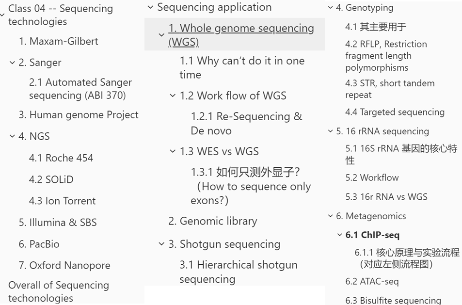
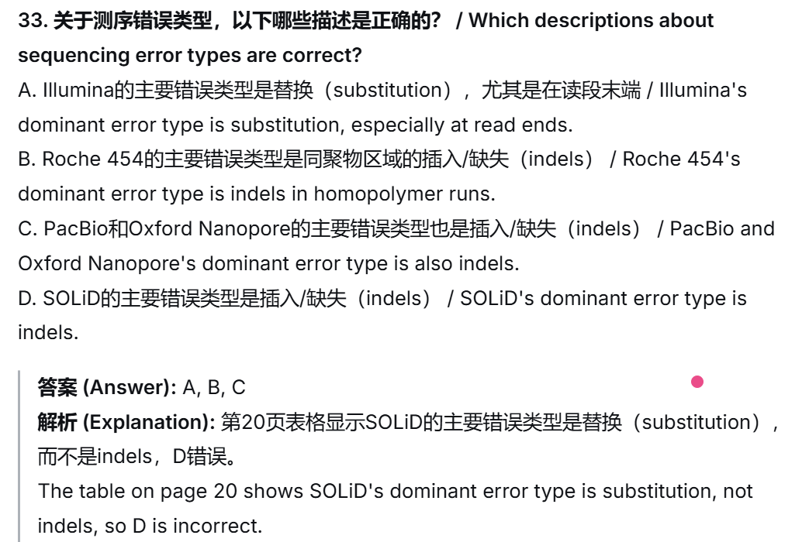

# Class 04 -- Sequencing technologies

Original edit：2026-02-24

Last update：2026-03-23

Markdown type：Study markdown

Resources：BEHI_5007_3.assets 

Update log： 

---

本章（Lecture 04）可能出现的其他题型预测

本章内容聚焦**测序技术的发展史、原理、数据和应用**，非常适合考察**对比分析、技术选择、原理理解**。以下是我预测的可能题型：

1. **对比分析题/简答题**
   - **对比第一代、第二代、第三代测序技术**：要求从原理、读长、通量、成本、错误类型等角度对比Sanger、Illumina、PacBio/Nanopore。
   - **对比鸟枪法（Shotgun）和参考基因组辅助组装（mapped assembly）**：解释两者在基因组组装中的区别和适用场景。
   - **对比RFLP、STR和SNP作为遗传标记的优缺点**：用于基因分型和DNA指纹分析。
2. **技术选择/实验设计题**
   - **给定一个研究目标，选择最合适的测序平台并说明理由**：例如：*“你要对一个新发现的细菌进行de novo测序，你会选择哪种测序平台？为什么？”*（参考第21页的表格）
   - **设计一个实验来检测基因组中的DNA甲基化位点**：你应该想到**亚硫酸盐测序（Bisulfite sequencing）**。
   - **如何研究某个转录因子在全基因组范围的结合位点？**：你应该想到**ChIP-seq**。
3. **图表解读题**
   - **解读Sanger测序图谱**：根据荧光峰图读出DNA序列。
   - **解读GWAS曼哈顿图（Manhattan plot）**：识别与疾病/性状显著相关的SNP位点（第44页）。
   - **解读RFLP或STR电泳图**：判断基因型或进行亲子鉴定/法医分析（第30-31页）。
4. **名词解释/概念辨析题**
   - Contig, Scaffold, Coverage depth
   - De novo sequencing vs. Resequencing
   - Whole genome sequencing (WGS) vs. Whole exome sequencing (WES)
   - Metagenomics
   - ChIP-seq, ATAC-seq, Bisulfite-seq
   - GWAS
5. **计算/推理题**
   - 根据测序读长和基因组大小，估算所需覆盖度和数据量。
   - 根据STR位点的重复次数，推断亲子关系或个体身份。

---

## Maxam-Gilbert

是一种通过化学裂解进行测序的方法 / It is a sequencing method by chemical cleavage. DNA分子需要进行放射性标记 / DNA molecules need to be radioactively labeled. 通过特定核苷酸处的化学裂解产生片段 / Fragments are generated by chemical cleavages at specific nucleotides. 通过凝胶电泳读取序列 / Readout is by gel electrophoresis.

具体步骤包括：首先用放射性同位素标记DNA的5'端，然后将DNA变性为单链，并用特定化学试剂处理，使DNA在特定碱基位置断裂，生成一系列不同长度的片段。这些片段通过聚丙烯酰胺凝胶电泳分离，并通过放射自显影检测，从而推断出DNA序列。该方法无需体内克隆和单链DNA制备，可以直接对纯化的DNA进行测序。然而，由于其使用有毒化学品、技术复杂且难以规模化，逐渐被更简便的Sanger测序法取代。

---

## Sanger

Sanger**测序法（链终止法）** Sanger sequencing (chain termination method)

- 通过合成测序

​	DNA分子通过DNA聚合酶复制

​	“正负”方法：排除每个反应中的一个dNTP

​	“二脱氧基”方法：合并的ddNTP将终止复制的链•通过凝胶电泳读数

利用DNA聚合酶合成DNA链 / It uses DNA polymerase to synthesize DNA strands. 使用双脱氧核苷酸（ddNTPs）来终止DNA链的延伸 / It uses dideoxynucleotides (ddNTPs) to terminate DNA strand elongation. ddNTPs缺乏3'-OH基团，无法形成磷酸二酯键 / ddNTPs lack a 3'-OH group and cannot form phosphodiester bonds. 自动化Sanger测序使用不同荧光标记的ddNTPs，通过毛细管电泳分离 / Automated Sanger sequencing uses differently fluorescently labeled ddNTPs and capillary electrophoresis.

###  Automated Sanger sequencing (ABI 370)

**与传统Sanger测序相比，自动化Sanger测序**使用荧光标记代替放射性标记 / Using fluorescent labels instead of radioactive labels.
使用毛细管电泳代替平板凝胶电泳 / Using capillary electrophoresis instead of slab gel electrophoresis. 计算机可以自动分析数据 / Computers can automatically analyze the data. 测序通量大幅提高，成本大幅降低 / Sequencing throughput greatly increased and cost greatly decreased.

---

## Human genome Project

**人类基因组计划（Human Genome Project）**它基于Sanger测序技术 / It was based on Sanger sequencing technology. 历时约13年（1990-2003） / It took approximately 13 years (1990-2003).

旨在全面测定人类基因组的30亿个碱基对序列，识别所有人类基因并确定其在染色体上的位置。

---

## NGS

特点：大规模并行测序（massively parallel） / Massively parallel sequencing.
数据产出量大 / Huge output of data.
成本不断下降 / Decreasing costs.
测序速度快 / Fast sequencing speed.

下一代测序技术（Next-Generation Sequencing，NGS）是一种高通量测序技术，能够在短时间内对大量DNA或RNA样本进行并行测序，显著提高了测序速度和降低了成本。与传统的Sanger测序相比，NGS技术通过将DNA片段化并同时对数百万个短序列进行测序，能够快速生成海量的基因组数据。

> Next-Generation Sequencing (NGS) is a high-throughput sequencing technology that enables parallel sequencing of numerous DNA or RNA samples within a short time, significantly increasing sequencing speed and reducing costs. Compared with traditional Sanger sequencing, NGS fragments DNA and simultaneously sequences millions of short reads, allowing rapid generation of massive genomic data.

### Roche 454

**Roche 454测序平台**使用焦磷酸测序（pyrosequencing）原理 / It uses the pyrosequencing principle. 通过检测DNA合成时dNTP掺入时释放的焦磷酸（PPi）产生的光信号来识别碱基，利用生物发光翻译实现序列的实时检测 / It detects light signals generated from pyrophosphate (PPi) released upon dNTP incorporation. 读长比其他大多数NGS平台长 / It has longer reads than most other NGS platforms.

主要测序错误类型是同聚物区域的插入/缺失（indels） / Its dominant sequencing error type is indels in homopolymer runs.

### SOLiD

SOLiD代表"**寡核苷酸连接和检测测序**" / SOLiD stands for "**Sequencing by Oligonucleotide Ligation and Detection**".

一种基于连接酶法的第二代高通量测序平台。其核心原理是利用荧光标记的8碱基寡核苷酸探针与单链DNA模板进行配对连接，通过荧光信号读取碱基序列。SOLiD采用独特的双碱基编码方式，每次测序反应通过两个碱基确定一个荧光信号，从而显著提高了测序的准确性。

> It is a second-generation high-throughput sequencing platform based on the ligation method. Its core principle involves using fluorescently labeled 8-base oligonucleotide probes to hybridize and ligate with single-stranded DNA templates, followed by reading the base sequence through fluorescent signals. SOLiD adopts a unique two-base encoding scheme, in which each sequencing reaction determines one fluorescent signal from two bases, thereby significantly improving sequencing accuracy.

使用连接酶（ligase）而不是DNA聚合酶 / It uses ligase instead of DNA polymerase. 使用连接酶（ligase）而不是DNA聚合酶 / It uses ligase instead of DNA polymerase.

主要优点是准确性高，在15×覆盖度下准确率可达99.99% / Its main advantage is high accuracy, reaching 99.99% at 15× coverage.

### Ion Torrent

**Ion Torrent测序技术**是一种基于半导体芯片的下一代测序（NGS）平台，该技术的核心原理是利用半导体芯片直接将化学信号转换为数字信号，无需光学检测设备。

类似于焦磷酸测序，但检测的是H⁺的释放而非焦磷酸 / It is similar to pyrosequencing but detects the release of H⁺ instead of pyrophosphate

在测序过程中，DNA聚合酶将核苷酸掺入DNA链时会释放氢离子，导致局部pH值变化，离子传感器检测到这种变化并将其转换为电信号，从而确定碱基序列。

Ion Torrent技术的优点包括**快速测序（通常2-3小时完成）、成本低**、操作简单且无需荧光标记。然而，其测序通量相对较低，适合小规模测序项目

> **Ion Torrent sequencing technology** is a next-generation sequencing (NGS) platform based on semiconductor chips. The core principle of this technology is that semiconductor chips are used to directly convert chemical signals into digital signals without the need for optical detection equipment. 
>
> During sequencing, the incorporation of nucleotides into the DNA strand by DNA polymerase releases hydrogen ions, causing a local pH change. Ion sensors detect this change and convert it into an electrical signal, thereby determining the base sequence. Advantages of Ion Torrent technology include rapid sequencing (typically completed in 2–3 hours), low cost, simple operation, and no requirement for fluorescent labeling. 
>
> However, its sequencing throughput is relatively low, making it suitable for small-scale sequencing projects.

## Illumina & SBS

llumina的Sequencing-by-Synthesis（SBS）技术是一种基于可逆终止的荧光标记dNTP的高通量测序方法，广泛应用于基因组学研究。

> 使用可逆终止子（reversible terminator）进行边合成边测序 / It uses reversible terminators for sequencing-by-synthesis.

其核心原理是通过DNA聚合酶逐个掺入带有荧光标记的dNTP到正在合成的DNA链中，每次掺入一个碱基后，荧光信号被检测并记录，随后化学试剂去除荧光标记并释放下一个碱基的掺入位点，从而实现逐个碱基的测序。

> NA片段固定在流动槽（flowcell）表面，通过桥式PCR扩增形成DNA簇 / DNA fragments are attached to a flowcell surface and amplified by bridge PCR to form clusters.
>
> 使用带有荧光标记和末端封闭的核苷酸 / It uses fluorescently labeled and end-blocked nucleotides.

该技术具有高通量、高准确率和低单碱基测序成本等优势

> 主要测序错误类型是替换（substitution），尤其在读段末端 / Its dominant sequencing error type is substitution, especially at read ends.

> Illumina’s Sequencing-by-Synthesis (SBS) is a high-throughput sequencing method based on reversible terminator–labeled fluorescent dNTPs, which is widely used in genomic research.
>
> Its core principle is that DNA polymerase incorporates fluorescently labeled dNTPs one by one into the growing DNA strand. After each single-base incorporation, the fluorescent signal is detected and recorded. Chemical reagents then remove the fluorescent label and unblock the incorporation site for the next base, enabling base-by-base sequencing.
>
> This technology offers advantages including high throughput, high accuracy, and low cost per sequenced base.

## PacBio

它是一种单分子实时（SMRT）测序技术 / It is a single-molecule real-time (SMRT) sequencing technology.
使用零模式波导（ZMW）作为检测单元 / It uses zero-mode waveguides (ZMWs) as detection units.
它的读长较长，可达数万碱基 / It has long read lengths, up to tens of thousands of bases.
它的主要测序错误类型是插入/缺失（indels） / Its dominant sequencing error type is indels.

## Oxford Nanopore

测序（Nanopore Sequencing）是一种基于单分子实时检测的第三代测序技术。

> 通过监测DNA分子穿过纳米孔时引起的电流变化来识别碱基 / It identifies bases by monitoring changes in electrical current as DNA molecules pass through a nanopore.

其核心原理是利用纳米级蛋白质孔作为生物传感器，嵌入高电阻率的聚合物膜中。通过施加跨膜电压，带负电荷的单链DNA或RNA分子在马达蛋白的驱动下穿过纳米孔，不同碱基在纳米孔中引起的电流变化被实时监测并解码为核苷酸序列。

该技术具有长读长（可达数十kb甚至更长）、无需PCR扩增、实时测序、便携性强和成本低等优点

> 读长非常长，可达数十万碱基甚至更长 / It has very long read lengths, up to hundreds of thousands of bases or more.
>
> 设备小巧便携，如MinION是USB设备大小 / Its devices are small and portable.

> 主要测序错误类型是插入缺失序列（indels） / Its dominant sequencing error type is substitution.

> Nanopore Sequencing is a third-generation sequencing technology based on single-molecule real-time detection.
>
> Its core principle uses nanoscale protein pores as biosensors embedded in a high-resistivity polymer membrane. When a transmembrane voltage is applied, negatively charged single-stranded DNA or RNA molecules are driven by motor proteins to pass through the nanopore. Distinct current changes caused by different bases within the nanopore are monitored in real time and decoded into nucleotide sequences.
>
> This technology offers advantages including long read lengths (up to tens of kb or longer), no need for PCR amplification, real-time sequencing, high portability, and low cost.

# Overall of Sequencing techonologies

| 测序平台            | 核心优势                 | 最适合的项目                         |
| ------------------- | ------------------------ | ------------------------------------ |
| **Sanger**          | 高准确率、快速、简单     | 短片段测序（质粒、克隆验证）         |
| **Illumina**        | 高通量、高准确率、低成本 | 重测序、靶向测序、常规转录组         |
| **PacBio**          | 超长读长、无 GC 偏差     | 从头测序、完整基因组组装             |
| **Oxford Nanopore** | 便携、实时、长读长       | 现场快速检测、病毒测序、长读长转录组 |

| Project（研究项目）                                          | Which sequencing platform (s) would you propose?（推荐测序平台） | Why?（选择理由）                                             |
| ------------------------------------------------------------ | ------------------------------------------------------------ | ------------------------------------------------------------ |
| **De novo sequencing and assembly of a microbial genome**（微生物基因组从头测序与组装） | PacBio（主平台）+ Illumina（辅助纠错）                       | PacBio 为第三代长读长测序，读长可达数十 kb，能跨越基因组重复序列，实现微生物基因组的完整、连续从头组装，是从头测序的金标准；Illumina 短读长测序准确率高，可用于 PacBio 数据的纠错，提升最终组装的准确性。单独使用 Illumina 短读长难以完成高质量从头组装，且流程复杂、成本高。 |
| **Sequencing a plasmid**（质粒测序）                         | Sanger 测序                                                  | 质粒长度通常仅 3-10 kb，目标序列短、结构简单，Sanger 测序具有快速、操作简单、成本低、准确率高的优势，完全满足质粒测序（如克隆验证、突变检测）的需求，无需使用高通量测序。 |
| **Re-sequencing a human genome (e.g. cancer sample) to look for novel mutations**（人类基因组重测序，如癌症样本，寻找新突变） | Illumina                                                     | Illumina 是人类基因组重测序的金标准，具有高通量、高准确率、低单碱基成本的优势，能精准检测 SNV、InDel、CNV 等各类基因突变，是癌症基因组学、遗传病诊断的首选平台，适合大规模样本的突变筛查。 |
| **Rapid diagnosis of a viral infection by sequencing in the field**（现场快速诊断病毒感染测序） | Oxford Nanopore（纳米孔测序）                                | 纳米孔测序是基于半导体的第三代测序技术，具有便携性强（设备小巧可现场使用）、实时测序（2-3 小时快速出结果）、无需 PCR 扩增、对样本要求低的优势，能在资源有限的现场环境中快速完成病毒基因组测序，支持现场诊断、疫情监测和流行病学溯源，是现场快速检测的首选。 |
| **Targeted amplicon/exome sequencing**（靶向扩增子 / 外显子测序） | Illumina                                                     | Illumina 具有高通量、高准确率、低成本的特点，完美适配靶向测序需求：一次可同时对数百个样本的目标区域（外显子 / 扩增子）进行高深度测序，精准检测目标区域的基因突变，单样本成本远低于全基因组测序，是临床靶向测序（如肿瘤基因 panel、外显子测序）的金标准。 |

---

# Sequencing application

## Whole genome sequencing (WGS)

**全基因组测序（WGS）** 是对生物体 **全部基因组 DNA（包括编码区、非编码区、重复序列等所有序列）** 进行测序的技术，目标是获得完整的基因组序列信息。

**WGS 的金标准平台**：Illumina（短读长，高准确率、低成本）+ PacBio/Nanopore（长读长，辅助组装、结构变异检测）

**WES 的金标准平台**：Illumina（高通量、高准确率，适配靶向捕获）

**什么时候用 WGS？**：从头测序、结构变异检测、非编码区研究、罕见病全基因组筛查

**什么时候用 WES？**：临床常规检测、大规模队列研究、癌症突变筛查

### Why can‘t do it in one time

所有测序技术的**单次读长（read length）都有限**，无法直接读取数 Gb 级的完整人类基因组（约 30 亿碱基），不同技术的读长上限如下：

| 测序技术                            | 单次读长上限                                                 |
| ----------------------------------- | ------------------------------------------------------------ |
| **Sanger 测序（一代）**             | <1000 bp（<1kb）                                             |
| **短读长 NGS（如 Illumina，二代）** | ~100-300 bp                                                  |
| **长读长测序（三代）**              | PacBio：~10,000 bp（10kb）；Nanopore：~100,000 bp（100kb，甚至更长） |

读长越长，越容易跨越重复序列区域进行组装 / Longer reads make it easier to assemble across repetitive regions.
短读长测序（如Illumina）在重复区域可能产生组装错误 / Short-read sequencing (e.g., Illumina) may produce assembly errors in repetitive regions.
长读长测序（如PacBio、Nanopore）有助于提高组装连续性 / Long-read sequencing (e.g., PacBio, Nanopore) helps improve assembly contiguity.

### Work flow of WGS

**打断（Break up）**：用物理 / 酶法将基因组 DNA 随机打断成适合测序的小片段（Illumina：100-300bp；长读长：10kb+）

**测序（Sequence）**：对片段进行高通量测序，得到数百万 / 数十亿条短读长序列（reads）

**拼接（Piece back together）**：

#### Re-Sequencing & De novo

- **重测序（Re-sequencing）**：将 reads 比对到参考基因组，直接得到个体的基因组变异（如人类癌症样本 WGS）
- **从头测序（De novo）**：无参考基因组时，通过 reads 的重叠关系拼接成完整的基因组序列（如微生物基因组）

> WGS requires fragmenting the genome, sequencing the fragments, and assembling the reads back into a complete genome. A related approach is **whole exome sequencing (WES)**, which sequences only the exonic regions (protein-coding sequences, ~1-2% of the human genome).
>
> - **Advantages of WES over WGS**: Lower cost, higher sequencing depth, simpler data analysis, and sufficient coverage for most disease-causing mutations in clinical settings.
> - **Method for WES**: Targeted capture of exonic regions using complementary probes, followed by high-throughput sequencing.

### WES vs WGS

全外显子测序（Whole Exome Sequencing, WES） 是 WGS 的替代方案，**仅测序基因组中的外显子（exon）区域**：

| 优势               | 具体说明                                                     |
| ------------------ | ------------------------------------------------------------ |
| **成本大幅降低**   | 仅测 1-2% 的基因组，测序量仅为 WGS 的 1/50-1/100，成本远低于 WGS |
| **测序深度更高**   | 有限的测序量集中在外显子区域，可获得更高的覆盖深度，更精准检测基因突变 |
| **数据分析更简单** | 数据量小，分析流程更短，计算资源需求低                       |
| **临床实用性更强** | 绝大多数致病突变位于外显子区域，WES 足以覆盖绝大多数遗传病、癌症的致病突变，是临床基因检测的主流 |

| 维度         | WGS（全基因组测序）                        | WES（全外显子测序）                       |
| ------------ | ------------------------------------------ | ----------------------------------------- |
| **测序范围** | 全部基因组（编码区 + 非编码区 + 重复序列） | 仅外显子（编码区，~1-2% 基因组）          |
| **成本**     | 高                                         | 低（约为 WGS 的 1/10）                    |
| **数据量**   | 大（人类样本～30× 覆盖需 90Gb 数据）       | 小（~10Gb 数据）                          |
| **覆盖深度** | 中等（30× 为标准）                         | 高（100×+，更精准检测突变）               |
| **适用场景** | 从头测序、结构变异检测、非编码区突变研究   | 临床遗传病 / 癌症检测、大规模人群队列研究 |
| **局限性**   | 成本高、数据分析复杂                       | 无法检测非编码区突变、结构变异            |

#### 如何只测外显子？（How to sequence only exons?）

核心技术是**靶向捕获（Targeted capture）**：

1. 设计与外显子序列互补的探针（probe），固定在芯片上或制成液相探针
2. 将打断后的基因组 DNA 与探针杂交，**特异性捕获外显子区域的 DNA 片段**
3. 洗脱未结合的非外显子 DNA，对捕获的外显子片段进行测序（通常用 Illumina 平台）

---

## Genomic library

基因组文库是包含来自一个来源的所有DNA片段的克隆集合 / A genomic library is a collection of clones containing all DNA fragments from one source.
细菌人工染色体（BAC）可用于构建大片段基因组文库 / Bacterial artificial chromosomes (BACs) can be used to construct large-insert genomic libraries.
BAC载体可以容纳约200kb的DNA片段 / BAC vectors can accommodate ~200 kb DNA fragments. 细菌人工染色体（BAC）：在质粒中克隆并插入细菌中的约200 kb基因组片段
基因组文库构建是鸟枪法测序的第一步 / Genomic library construction is the first step in shotgun sequencing.

## Shotgun sequencing

**鸟枪法测序（shotgun sequencing）**是一种通过随机打断DNA片段并进行大规模测序以重建完整基因组序列的技术。

其核心步骤包括：

将目标DNA用物理 / 酶法随机打断成多个小片段，对这些片段分别进行测序,得到数百万条短读长序列（reads），然后利用计算机算法根据**序列重叠区（overlap）** 域进行拼接，最终重建出完整的基因组序列。

> Break DNA into short fragments randomly, Sequence the fragments, Assemble the reads.

这种方法**不依赖于**预先构建的基因组物理图谱，具有**高通量、低成本**的特点，因此适用于大规模基因组测序项目，尤其是对于未知或复杂基因组的快速测序，可通过**增加测序深度**校正拼接错误，提升最终组装的准确性和完整性。

局限性：拼接过程中可能面临重复序列导致的错误。

### Hierarchical shotgun sequencing

分层鸟枪法，人类基因组计划 HGP 用的经典方法，解决了早期测序读长短、直接全基因组拼接难度大的问题：

1. **先构建 BAC 文库（BAC library）**：将基因组 DNA 先打断成**大片段（~150kb）**，插入 BAC 载体（细菌人工染色体），构建覆盖全基因组的 BAC 文库。

2. **构建物理图谱（Organized mapped clone contigs）**：对 BAC 克隆进行定位、排序，构建有序的克隆重叠群（contig），相当于给基因组做 “大框架”。

3. **对单个 BAC 进行鸟枪法测序**：将每个 BAC 克隆再打断成小片段，测序、拼接，得到单个 BAC 的完整序列。

4. **最终组装**

---

## Genotyping

基因分型 / 基因型分析，什么是Genotyping？

**Genotyping（基因分型）** 是通过实验方法，检测个体在特定基因位点（locus）的**基因型（genotype）**，即确定个体携带的等位基因（allele）组合，从而解析其遗传构成的技术。

| 英文术语                | 中文翻译        | 定义                                                         |
| ----------------------- | --------------- | ------------------------------------------------------------ |
| **Genotype**            | 基因型          | 人 / 生物体的**遗传构成**，即个体携带的全部等位基因组合，决定了遗传性状的基础。 |
| **Locus（复数：loci）** | 基因座 / 位点   | DNA 序列中**感兴趣的特定位置**（比如某个基因、某个 SNP 位点），是遗传分析的基本单位。 |
| **Allele**              | 等位基因        | 特定基因座上的**DNA 序列变体**（比如同一个基因座，A 个体是 A 碱基，B 个体是 T 碱基，A 和 T 就是两个等位基因）。 |
| **Polymorphisms**       | 多态性          | 在种群中 ** 频率 > 1%** 的等位基因，是种群遗传多样性的基础（比如人类的 SNP、STR 多态性）。 |
| **Haplotype**           | 单倍型 / 单体型 | 从**父母一方共同遗传的一组等位基因**（比如同一条染色体上连锁的多个 SNP 位点，会作为一个整体遗传给后代）。 |

### 其主要用于

1. 遗传病（Genetic diseases）

- 检测个体的致病基因突变 / 多态性，用于**遗传病诊断、携带者筛查、产前诊断**（比如地中海贫血、囊性纤维化的基因分型）；
- 是精准医学的基础，通过基因型预测疾病风险、指导用药（比如药物基因组学的基因分型）。

2. 传染病（Infectious diseases）

- 对病原体（细菌、病毒、寄生虫）进行基因分型，用于**病原体溯源、耐药性检测、疫情监测**；
- 比如新冠病毒的 S 基因分型、结核分枝杆菌的耐药基因分型，指导临床治疗和流行病学防控。

3. 法医学（Forensic science）

- 基于**STR（短串联重复序列）、SNP**等多态性位点的基因分型，进行**个体识别、亲子鉴定**；
- 是法医 DNA 鉴定的金标准，通过基因型匹配锁定嫌疑人、确认亲缘关系。

### RFLP, Restriction fragment length polymorphisms

**Restriction fragment length polymorphism (RFLP)** ：是基于限制性内切酶切割位点的多态性 / RFLP is based on polymorphisms at restriction enzyme cut sites.

不同等位基因因序列差异，会产生不同长度的限制性片段 / Different alleles produce different lengths of restriction fragments due to sequence differences.
通过凝胶电泳分离片段，可以区分不同基因型 / Fragments are separated by gel electrophoresis to distinguish different genotypes.
RFLP可用于连锁分析和遗传病诊断 / RFLP can be used for linkage analysis and genetic disease diagnosis.

### STR, short tandem repeat

**短串联重复序列（STR）分析**

STR是基因组中2-6碱基重复单位串联形成的多态性标记 / STRs are polymorphic markers formed by tandem repeats of 2-6 base pair units.
不同个体在同一STR位点的重复次数不同 / Different individuals have different repeat numbers at the same STR locus.
STR分析可用于DNA指纹鉴定、亲子鉴定和法医学 / STR analysis can be used for DNA fingerprinting, paternity testing, and forensics.
FBI使用的CODIS系统基于13个核心STR位点 / The FBI's CODIS system is based on 13 core STR loci.

### Targeted sequencing

Targeted sequencing can be used to find polymorphisms

**靶向测序可用于查找多态性**

---

## 16 rRNA sequencing

16S rRNA 测序是针对原核生物核糖体小亚基上的**16S rRNA 基因**进行的靶向测序技术，是**微生物分类鉴定、菌群多样性分析的金标准方法**。

> 16S rRNA sequencing is the gold standard for prokaryotic microbial classification and community diversity analysis.
>
> **Core Principle**: The 16S rRNA gene, located in the small subunit of the prokaryotic ribosome, is highly conserved across species, with interspersed variable regions. The conserved regions enable universal primer design, while sequence variations in variable regions allow species classification and phylogenetic tracing (eukaryotes use the homologous 18S rRNA gene).

### 16S rRNA 基因的核心特性

- **高度保守（Highly conserved）**：16S rRNA 基因在所有原核生物（细菌、古菌）中序列高度同源，是生命演化的 “分子钟”，保证了不同物种间的可比性。
- **可变区域（Variable regions）**：保守区之间穿插着 9 个高变区（V1-V9），不同物种的可变区序列差异巨大，可用于区分物种、追溯演化关系。
- **对应真核生物**：真核生物用**18S rRNA 基因**（核糖体小亚基的同源基因）进行分类鉴定。

### Workflow

**样本采集（Collection of skin microbes）**：从环境 / 人体（如皮肤、肠道）采集微生物样本

**DNA 提取（DNA isolation from sample）**：从样本中提取总微生物 DNA

**PCR 扩增（PCR amplification of bacterial 16S rRNA gene）**：用 16S rRNA 基因保守区设计的通用引物，特异性扩增 16S rRNA 的可变区（常用 V3-V4 区）

**高通量测序（High-throughput sequencing of amplified 16S rRNA genes）**：用 Illumina 等 NGS 平台对扩增产物进行测序

**数据分析（Data processing, quality control and analysis）**：用生物信息学工具（如 QIIME2、DADA2）进行质控、聚类、注释

**结果解读**：

- **参考序列法（Reference based approach）**：将序列比对到数据库（如 Silva、Greengenes），按界门纲目科属种分类，鉴定物种组成
- **多样性法（Diversity based approach）**：基于序列差异构建系统发育树，分析菌群多样性、演化关系

### 16r RNA vs WGS

| 对比维度                    | 16S rRNA 测序                                                | 全基因组测序（WGS）                                          |
| --------------------------- | ------------------------------------------------------------ | ------------------------------------------------------------ |
| **成本（Cost）**            | 低：仅测单个基因，测序量小，试剂、计算、存储成本远低于 WGS   | 高：全基因组测序成本是 16S 的数十倍，资源消耗大              |
| **耗时（Turnaround time）** | 快：流程简单，可快速出结果，适合临床快速鉴定病原体、现场检测 | 慢：从样本制备到分析全程耗时久，不适合快速诊断场景           |
| **数据分析复杂度**          | 低：仅分析单个高度保守基因，数据量小，分析工具成熟，普通实验室可操作 | 高：生成海量编码区 + 非编码区数据，需要高级生物信息学技能和高性能计算 |
| **信息冗余度**              | 低：仅获取物种分类所需的核心信息，无冗余                     | 高：产生大量冗余的非目标序列，对物种分类无额外价值           |
| **适用场景**                | 微生物群落多样性分析、临床快速病原体鉴定、环境微生物监测     | 微生物基因组从头测序、耐药基因分析、菌株水平精细鉴定         |

> 16S rRNA sequencing offers far lower cost, faster turnaround, and simpler data analysis compared to WGS. It targets only a single conserved gene, avoiding the massive data redundancy, high computational requirements, and high cost of WGS, making it ideal for large-scale microbial community studies and rapid clinical pathogen identification.

---

## Metagenomics

**宏基因组学（metagenomics）**是直接对**微生物群落（如环境样本、肠道菌群等）中所有微生物的总基因组**进行测序和分析的技术，**无需先将微生物分离培养、分种**，直接研究群落的遗传构成与功能。

> Metagenomics studies the total genomes of a community of organisms (typically microbes).

**常规方法**：依赖**16S rRNA 等物种特异性标记基因**测序，利用不同物种间的序列保守性 + 特异性区分物种。

> 通常对从微生物群落中提取的所有DNA进行测序，而不先分离成单个物种 / It usually sequences all DNA extracted from a microbial community without first separating them into species.

**问题 / 局限性**：

1. **引物 / 扩增偏差**：16S 引物对不同类群的扩增效率不一致，导致丰度估算失真，甚至漏检低丰度物种；
2. **分辨率不足**：16S 只能区分到属 / 种水平，无法区分近缘菌株；
3. **样本多样性与数据量限制**：当样本中物种多样性极高、测序深度不足时，会出现低丰度序列丢失、数据缺失。
4. 宏基因组学的主要挑战包括样本复杂度高和生物信息学分析困难 / Main challenges of metagenomics include high sample complexity and difficult bioinformatics analysis.

### ChIP-seq

**ChIP-seq** 是研究**蛋白质 - DNA 相互作用**的高通量测序技术，用于确定转录因子、组蛋白修饰等在基因组上的结合位点，是表观基因组学、转录调控研究的核心工具。

> 用于研究蛋白质与DNA的相互作用 / ChIP-seq is used to study protein-DNA interactions.
>
> 用特异性抗体富集与目标蛋白结合的染色质片段 / It uses specific antibodies to enrich chromatin fragments bound by the target protein.
>
> 富集的DNA片段经过测序，可以定位蛋白质在基因组上的结合位点 / Enriched DNA fragments are sequenced to map protein binding sites across the genome.
> ChIP-seq可用于研究转录因子结合位点和组蛋白修饰 / ChIP-seq can be used to study transcription factor binding sites and histone modifications.

#### 核心原理与实验流程（对应左侧流程图）

1. **固定与裂解细胞（Fix & lyse cells）**：用甲醛交联细胞内的蛋白质与 DNA，保留体内真实的结合状态，然后裂解细胞获取染色质。
2. **染色质片段化（Fragment chromatin）**：将染色质超声打断成适合测序的小片段（~200-500bp）。
3. **免疫共沉淀（IP & wash）**：加入**目标蛋白的特异性抗体**，与结合了目标蛋白的 DNA 片段结合，通过 Protein A/G 磁珠捕获复合物，洗去未结合的非特异性 DNA。
4. **解交联与 DNA 提取（Extract & analyze DNA）**：逆转交联，释放 DNA 片段，纯化后进行高通量测序（通常用 Illumina 平台）。
5. **Input 对照（Input: no IP）**：未进行免疫沉淀的总 DNA，作为背景对照，用于排除非特异性结合、标准化数据。

### ATAC-seq

**ATAC-seq (Assay for Transposase-Accessible Chromatin using sequencing)** 是一种 **高通量检测染色质开放区域（chromatin accessibility）** 的测序技术，用于解析基因组中哪些区域是活跃的、可被转录因子结合的。

1. 核心原理

   染色质分为两种状态：

   - **闭合染色质（closed chromatin）**：DNA 被组蛋白紧密缠绕，无法被转录因子结合，基因沉默；
   - **开放染色质（open chromatin）**：DNA 松散，可被转录因子结合，基因活跃表达。

> ATAC-seq用于研究染色质的可及性（accessibility） / ATAC-seq is used to study chromatin accessibility.  它使用高活性的转座酶Tn5插入开放的染色质区域 / It uses a hyperactive Tn5 transposase to insert into open chromatin regions. 插入的接头序列可用于扩增和测序，从而鉴定开放染色质区域 / Inserted adapter sequences can be used for amplification and sequencing to identify open chromatin regions. ATAC-seq可以反映基因调控元件的活性状态 / ATAC-seq can reflect the activity status of gene regulatory elements.

### Bisulfite sequencing

**亚硫酸氢盐测序（Bisulfite sequencing）**是一种用于检测**DNA甲基化（DNA methylation）状态**的高分辨率技术。

其原理是将DNA样本中的未甲基化胞嘧啶（Cytosine）通过亚硫酸氢盐（Bisulfite）处理转化为尿嘧啶（Uracil）;

而甲基化的胞嘧啶则保持不变。随后通过PCR扩增和测序，将尿嘧啶在测序过程中被识别为胸腺嘧啶（Thymine）;

从而区分甲基化和未甲基化的胞嘧啶，实现对基因组中单个碱基水平的甲基化状态的精确分析。/ It can achieve single-base resolution methylation detection.