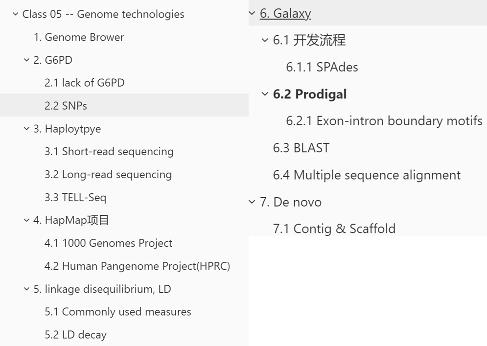
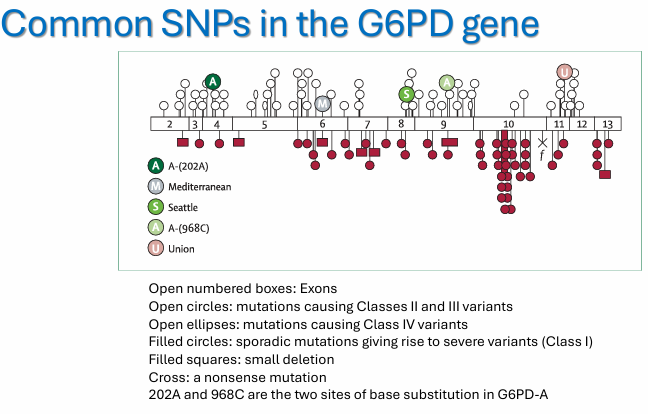

# Class 05 -- Genome technologies

Original edit：2026-03-07

Last update：2026-03-23

Markdown type：Study markdown

Resources：BEHI_5007_5.assets 

Update log： 

---

本章内容聚焦**基因组数据的分析、可视化以及常用工具**，概念多且涉及具体操作和分析逻辑。以下是我预测的可能题型：

1. **简答题/论述题**
   - **解释单倍型（haplotype）和单倍型定相（haplotype phasing）**：什么是单倍型？为什么要进行单倍型定相？不同测序技术如何实现定相？
   - **描述连锁不平衡（linkage disequilibrium）及其在遗传学中的意义**：什么是LD？它是如何产生的？在关联研究中有什么作用？
   - **比较de novo组装和参考基因组辅助组装**：两种策略的适用场景、优缺点。
   - **解释G6PD缺乏症的分子机制**：为什么特定SNP会导致酶活性降低或稳定性下降？为什么这种突变在疟疾流行区常见？
2. **技术/工具应用题**
   - **给定一个研究问题，选择合适的BLAST工具**：例如，要预测一段基因组DNA中的编码区，应该用BLASTx还是tBLASTn？（参考第15页表格）
   - **如何使用基因组浏览器（UCSC Genome Browser）回答特定问题**：例如，如何查找某个基因在不同组织的表达量？如何查看已知的致病SNP？
   - **在Galaxy平台上设计一个简单的分析流程**：例如，从原始测序读到基因预测的流程。
3. **名词解释/概念辨析题**
   - Haplotype vs. Genotype
   - Linkage disequilibrium vs. Linkage
   - De novo assembly vs. Resequencing
   - BLASTn, BLASTp, BLASTx, tBLASTn, tBLASTx
   - SPAdes, Prodigal, ClustalOmega

---

## Genome Brower

**UCSC基因组浏览器（Genome Browser）**，可以搜索基因并查看基因的不同部分，放大到单碱基级别查看序列，同时查看SNP及其相关的疾病表型（如OMIM、ClinVar） 、同一基因在其他生物中的同源序列。

> Search for a gene and view different parts of the gene. Zoom in to the base level to view the sequence. View SNPs and associated disease phenotypes (e.g., OMIM, ClinVar) and the same gene in other organisms.

可以显示DNA甲基化数据（display DNA methylation data.）可以显示组蛋白修饰的ChIP-seq信号（display ChIP-seq signals for histone modifications.）可以显示染色质可及性数据（display chromatin accessibility data)

## G6PD

**G6PD，Glucose 6 phosphate dehydrogenase**：葡萄糖-6-磷酸脱氢酶是一种管家酶，存在于所有细胞中 / G6PD is a housekeeping enzyme found in all cells. 它催化葡萄糖-6-磷酸与NADP+反应生成6-磷酸葡糖酸和NADPH / It catalyzes the reaction of glucose-6-phosphate with NADP+ to form 6-phosphogluconate and NADPH.

NADPH的产生对于避免细胞的氧化损伤是必需的 / Production of NADPH is needed to avoid oxidative damage in cells.  G6PD是红细胞中唯一能产生NADPH的酶 / G6PD is the only enzyme in red blood cells that can produce NADPH.

### lack of G6PD

**G6PD缺乏症（蚕豆病fava beans）**：患者对增加氧化应激的天然物质（如蚕豆）敏感 / Patients are sensitive to natural substances that increase oxidative stress (e.g., fava beans). 症状包括红细胞过早破坏，即溶血性贫血 / Symptoms include premature red blood cell breakdown, i.e., hemolytic anemia. 由G6PD酶的催化活性降低或稳定性下降引起 / It is caused by reduced catalytic activity or stability of the G6PD enzyme. 这是全球最常见的酶缺陷病，尤其在**疟疾流行**区常见 / It is the most common enzyme disorder worldwide, especially in **malaria-endemic regions**.

**可以选择PCR测序来检测**。

### SNPs

SNP是单核酸多态性，即DNA上单个碱基的差异（A/C/G/T的差异），而SNP图谱则是将大量SNP在染色体上的位置标志出来，形成遗传位置图/标记图。

SNP可用于进行基因定位，找到致病基因/形状基因在哪儿。查找关联分析，分析哪个SNP和疾病、性状相关。

- 开放编号的方框代表外显子 / Open numbered boxes represent exons.
- 开放圆圈代表导致II类和III类变异的突变 / Open circles represent mutations causing Class II and III variants.
- 开放椭圆代表导致IV类变异的突变 / Open ellipses represent mutations causing Class IV variants.
- 实心圆圈代表导致严重变异的散发性突变（Class I） / Filled circles represent sporadic mutations giving rise to severe variants (Class I).

---

## Haploytpye

Haplotye，是单倍型，是指从父母一方共同遗传的一组基因。**单倍型可能比单个SNP与疾病有更强的关联**。

A haplotype is a group of genes inherited together from one parent.

**haplotype phasing 单倍型定相**，是推断个体单倍型信息的问题。

Haplotype phasing is the problem of inferring an individual's haplotype information.

### Short-read sequencing

短读长测序，**代表平台**：Illumina。

**核心特点**：读长短（通常 150-300 bp）、通量极高、成本低、准确率高（Q30 以上）。

**局限**：无法直接确定单倍型（haplotype），读长太短，无法跨越多个 SNP / 结构变异，需要算法拼接定相（phasing）

**应用**：全基因组测序、RNA-seq、ChIP-seq、SNP 分型、临床快速检测

> Short-read sequencing generates reads of ~150-300 bp with high throughput and accuracy. However, it cannot directly determine haplotypes because reads are too short to span multiple SNPs, requiring computational phasing.

### Long-read sequencing

长读长测序（Long-read sequencing，三代测序），**代表平台**：PacBio（单分子实时测序 SMRT）、Nanopore（纳米孔测序）。

**核心特点**：读长极长（可达 Mb 级，数十万碱基）、能直接读取单条 DNA 分子、可直接跨越多个 SNP / 结构变异

**优势**：可直接定相（phasing）、解析单倍型、检测复杂结构变异（缺失 / 重复 / 倒位）、组装完整基因组

**局限**：单碱基准确率略低于 Illumina（但 HiFi 模式准确率已达 99.9%）、成本更高、通量相对低

> Long-read sequencing produces ultra-long reads (up to Mb-level) by directly sequencing single DNA molecules. It can directly read haplotypes with multiple SNPs, enabling accurate phasing and structural variation detection.

| 代际                 | 技术名称    | 代表平台                              | 读长          | 核心原理                                 | 优缺点                                                       |
| -------------------- | ----------- | ------------------------------------- | ------------- | ---------------------------------------- | ------------------------------------------------------------ |
| **一代测序**         | Sanger 测序 | ABI 3730xl                            | ~1000 bp      | 双脱氧核苷酸链终止法                     | 准确率极高（99.99%），读长适中；通量极低、成本高，仅用于单片段测序 |
| **二代测序（NGS）**  | 短读长测序  | Illumina NovaSeq、MiSeq               | 150-300 bp    | 边合成边测序（SBS）                      | 通量极高、成本低、准确率高；读长短，无法直接定相             |
| **三代测序（TGS）**  | 长读长测序  | PacBio Sequel II、Nanopore PromethION | 10 kb - 1 Mb+ | 单分子实时测序（SMRT）/ 纳米孔电信号测序 | 读长超长、可直接定相、解析结构变异；单碱基准确率（原始）略低、成本高 |
| **四代测序（概念）** | 单分子测序  | 部分 Nanopore 平台                    | 超长          | 无扩增、直接测序单分子                   | 无需 PCR，避免扩增偏差，实时测序                             |

> Sanger sequencing uses dideoxynucleotide chain termination, with ~1000 bp reads and 99.99% accuracy, but low throughput and high cost.

### TELL-Seq

TELL-seq是一种通过条形码标记实现单倍型定相的方法。（短读长测序的**辅助定相技术**，不是长读长测序）

TELL-seq is a method for haplotype phasing through barcoding.

它在文库制备过程中使用TELL-seq条形码标记长片段DNA。

It uses TELL-seq barcodes to label long DNA fragments during library preparation.

测序后通过TELL-Read进行解复用和读长连接。

After sequencing, TELL-Read performs demultiplexing and read linking.
TELL-Sort用于**全基因组定相**

TELL-Sort is used for **whole-genome phasing.**

---

## HapMap项目

**国际HapMap项目**目标是构建人类常见遗传变异的目录 / To construct a catalog of common genetic variants in humans.

使用了来自不同人群的DNA样本，主要关注常见SNP，构建了单倍型图谱，描述了SNP之间的连锁不平衡模式

### 1000 Genomes Project

HapMap 的**升级版**，是人类遗传变异研究的**金标准数据库**

**目标**：对全球 26 个种群的 2504 个个体进行全基因组测序，构建人类**常见 + 罕见遗传变异**的完整目录（覆盖 SNP、InDel、结构变异）。

譬如：“弥补 HapMap 仅覆盖常见 SNP 的局限，纳入罕见变异、是 GWAS、单倍型定相、种群遗传分析的核心参考数据库、、**用 1000G 数据做变异注释、种群分化分析、疾病关联研究**”

### Human Pangenome Project(HPRC)

人类泛基因组计划，HPRC，目标是替代传统线性参考基因组的新一代基因组资源，组装全球不同人群的**完整、无 gaps 的单倍型解析基因组**，消除参考偏差。

譬如“解决 HapMap/1000G 依赖线性参考的局限，更适合非欧洲人群的变异分析”、“泛基因组在 SNP 定相、结构变异检测、精准医疗中的应用”、

| 项目名称                                             | 核心目标                                               | 考试常考场景                               |
| ---------------------------------------------------- | ------------------------------------------------------ | ------------------------------------------ |
| **Human Genome Project (HGP，人类基因组计划)**       | 首次完成人类全基因组测序，奠定基因组学基础             | 测序技术发展史、基因组结构、基因定义       |
| **Human Microbiome Project (HMP，人类微生物组计划)** | 解析人体共生微生物的基因组，研究微生物与健康的关系     | 宏基因组学、微生物组测序（16S / 宏基因组） |
| **Genome Reference Consortium (GRC)**                | 维护和更新人类参考基因组（GRCh37/GRCh38）              | 测序数据比对、参考基因组的局限性           |
| **H3Africa（非洲人类遗传与健康计划）**               | 研究非洲人群的基因组多样性，解决全球基因组学的人群偏差 | 种群遗传、疾病关联分析的人群代表性         |

---

## linkage disequilibrium, LD

**连锁不平衡（linkage disequilibrium, LD）**，是指指基因组中某些SNP之间存在相关性。这种相关性不一定由物理距离近导致。

LD refers to the fact that some SNPs across the genome are correlated with each other. This correlation is not necessarily due to physical proximity.

LD的产生与减数分裂中的重组有关，重组在某些区域更频繁发生，称为**重组热点**。

LD is related to recombination during meiosis. Recombination occurs more frequently at **recombination "hotspots"**.

LD的遗传学核心意义：反映基因组的连锁关系，用于基因定位 / 疾病关联分析（GWAS）、解析种群遗传与进化历史、单倍型定相（phasing）与单倍型推断（高 LD 区域的 SNP**共分离**）、自然选择的检测。

相关性的其他原因：
自然选择（Natural Selection）：SNPs都位于**同一个致病 / 有利基因**上.

 遗传漂变（Genetic Drift）/ 奠基者效应（Founder Effect）：小种群 / 新建立的种群中，随机的遗传漂变会让某些 SNP 组合在种群中固定，形成 LD。

基因互作 / 功能约束（Functional Constraint / Epistasis）：两个 SNP 位于**功能相关的基因 / 调控元件**上，只有特定组合才能保证蛋白功能

**重组热点**

### Commonly used measures

 D'和r²是常用的LD度量指标 / D' and r² are commonly used measures of LD.

r²反映了两个位点之间的相关性 / r² reflects the correlation between two loci.

D'更受重组历史的影响，而r²更受等位基因频率的影响 / D' is more influenced by recombination history, while r² is more influenced by allele frequencies.

LD图谱通常用颜色块表示不同SNP对之间的LD强度 / LD maps often use color blocks to represent LD strength between SNP pairs.

### LD decay

随着物理距离的增加，LD通常减弱 / LD generally decreases with increasing physical distance. 不同人群的LD衰减速度不同 / LD decay rates differ among populations. LD衰减速度受重组率和人群历史影响 / LD decay rate is influenced by recombination rate and population history.

通过精细定位可以借助LD缩小候选区域 / Fine-mapping can narrow candidate regions using LD.

---

## Galaxy

Galaxy是一个用于管理数据分析工作流程的开源平台 / Galaxy is an open-source platform for managing data analysis workflows.
它无需安装即可集成许多软件工具 / It integrates many software tools without installation.
它提供用户友好的图形用户界面 / It provides user-friendly graphical user interfaces. 支持多种生物信息学数据格式，如FASTQ、SAM/BAM、VCF、GFF等

### 开发流程

创建可重复的分析流程 / Users can create reproducible analysis pipelines.

工作流程可以包含多个步骤，如质量控、比对、变异 calling / A workflow can include multiple steps such as quality control, alignment, variant calling.

#### SPAdes

SPAdes常用于细菌基因组的de novo组装，可以处理单细胞测序数据和标准数据，但只适用于有参考基因组的情况。输出包括contig和scaffold序列。

### Prodigal

**基因预测工具Prodigal**通过扫描开放阅读框（ORF）来预测基因。利用**转录本测序**，aka **Sequencing transcripts/RNA sequencing / RNA-seq**

Prodigal predicts genes by scanning for open reading frames (ORFs).

寻找起始密码子和终止密码子之间的序列，且通常要求长度大于100个密码子。

It looks for sequences between start and stop codons, typically >100 codons in length.

适用于原核生物的基因预测。

t is suitable for gene prediction in prokaryotes.
对于真核生物，还需要额外信息如**密码子偏好性**、**外显子-内含子边界**等。

For eukaryotes, additional information such as **codon bias**, **exon-intron boundaries**, etc., is needed.

#### Exon-intron boundary motifs

真核生物的内含子通常以GT开始，以AG结束（GT-AG规则），虽然GT-AG规则普遍，但存在少数例外

Introns in eukaryotes typically start with GT and end with AG (GT-AG rule). However the GT-AG rule is common but there are exceptions.
这些保守序列可以帮助识别外显子和内含子的边界 / These conserved sequences help identify exon-intron boundaries.

边界基序信息与ORF扫描结合，可以提高真核生物基因预测的准确性 / Boundary motif information combined with ORF scanning improves gene prediction accuracy in eukaryotes.

### BLAST

1. BLASTn：核酸序列比对核酸序列，用于基因组DNA注释 / BLASTn: nucleotide vs nucleotide, for genomic DNA annotation.
2. BLASTp：蛋白质序列比对蛋白质序列，用于蛋白质同源性搜索 / BLASTp: protein vs protein, for protein homology search.
3. BLASTx：核酸序列比对蛋白质数据库，用于识别基因组DNA/cDNA中的蛋白质编码基因 / BLASTx: nucleotide vs protein database, to identify protein-coding genes in gDNA/cDNA.
4. tBLASTn：蛋白质序列比对核酸数据库，用于将蛋白质映射到基因组DNA / tBLASTn: protein vs nucleotide database, to map protein to genomic DNA.
5. tBLASTx：核酸序列比对核酸数据库（会先翻译成蛋白质再进行比对），用于在RNA层面跨物种基因预测。/ Cross sepcies gene predicition at RNA level.

### Multiple sequence alignment

**多序列比对（multiple sequence alignment）**用于同时比对三个或更多个序列，可以揭示序列间的保守区域和变异区域。多序列比对可用于核酸和蛋白质序列。

Multiple sequence alignment is used to align three or more sequences simultaneously. It can reveal conserved and variable regions among sequences and be used for both nucleotide and protein sequences.

**ClustalOmega**是常用的多序列比对工具之一 ，可以高效地对大量序列进行比对，使用隐马尔可夫模型（HMM）来提高比对速，且输出可以用于构建系统发育树/ ClustalOmega is one of the commonly used multiple sequence alignment tools.

---

## De novo

关于基因组组装的两种策略，有**参考基因组组装（mapped assembly）**和**无参考基因组组装（de novo assembly）**：

Mapped assembly，是将测序读段比对到已知参考基因组上

With-reference assembly aligns sequencing reads to a known reference genome.

de novo assembly，是在没有参考基因组的情况下，通过读段重叠直接拼接出序列。

De novo assembly builds sequences from read overlaps without a reference genome.

- 对于新物种的测序，必须使用无参考组装。

  For sequencing a new species, de novo assembly must be used.

- 有参考组装通常比无参考组装更容易、计算量更小。

  With-reference assembly is usually easier and less computationally intensive than de novo assembly.

### Contig & Scaffold

Contig是连续一致的重叠群序列 / Contig is a contiguous consensus sequence.
Scaffold是由多个contig通过连接信息（如paired-end reads）构建的更长的序列框架 / Scaffold is a longer sequence framework built from multiple contigs using linking information (e.g., paired-end reads).
Scaffold中可能存在间隙（gaps） / Scaffolds may contain gaps.