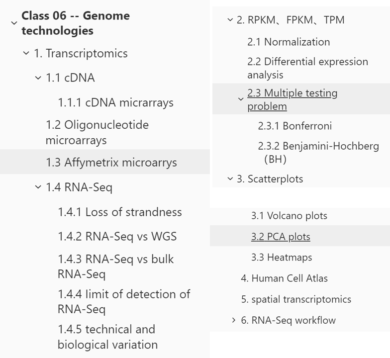
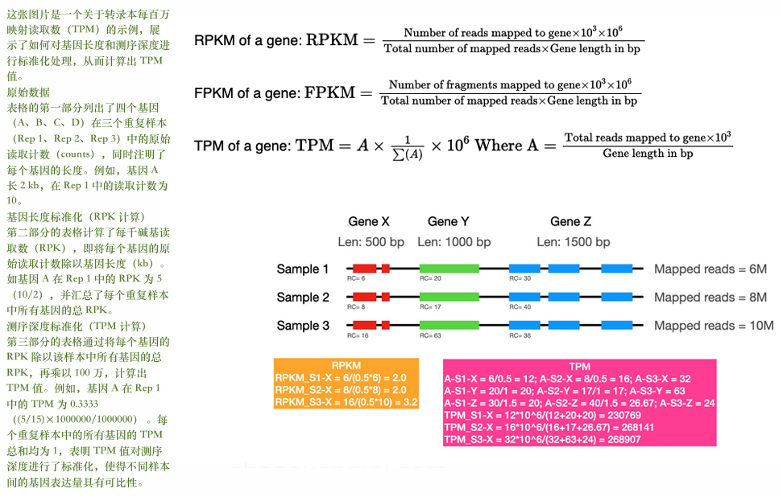

# Class 06 -- Genome technologies

Original edit：2026-03-07

Last update：2026-03-24

Markdown type：Study markdown

Resources：BEHI_5007_6.assets 

Update log： 

---

本章（Lecture 06）可能出现的其他题型预测

本章内容非常丰富，涵盖了**转录组学两大技术平台（微阵列 vs RNA-seq）、标准化指标（RPKM/FPKM/TPM）、差异表达分析的统计方法、数据可视化、以及单细胞技术**。以下是可能出现的其他题型：

1. **对比分析题/简答题**
   - **对比微阵列（Microarray）和RNA-seq**：从原理、是否需要已知序列、动态范围、灵敏度、能否发现新转录本等角度进行对比（参考第10页表格）。
   - **对比RPKM、FPKM和TPM**：解释三者的计算方式和区别，特别是FPKM如何处理双端测序，TPM与RPKM在样本间比较时的差异（参考第16-19页）。
   - **对比Bonferroni校正和Benjamini-Hochberg校正**：两者分别控制什么错误率（FWER vs FDR）？校正方法有何不同？适用场景有何区别？（参考第22页）
2. **概念解释题**
   - **解释为什么RNA-seq需要进行多重检验校正**：说明多重检验问题（multiple testing problem）及其后果。
   - **解释单细胞RNA-seq为什么比单细胞基因组测序更常用**：从技术难度、生物学意义等角度分析（参考第28页的讨论题）。
   - **解释什么是"链性丧失"（loss of strandness）及如何解决**：说明普通RNA-seq建库为何会丢失链信息，以及链特异性建库的原理（参考第11页）。
3. **计算/应用题**
   - **TPM计算**：给定几个基因的长度和read count，计算TPM值（参考第17页的示例）。
   - **多重检验校正计算**：给定一组p值，用Bonferroni或Benjamini-Hochberg方法计算校正后的p值，并判断显著性。
   - **根据火山图判断差异表达基因**：给定阈值（如log2FC > 1, p-value < 0.05），从火山图中计数上调和下调基因数量。
4. **图表解读题**
   - **解读火山图（Volcano plot）**：识别显著上调和下调基因，理解p-value和fold change的含义（参考第24页）。
   - **解读PCA图**：分析样本聚类情况，判断哪些样本相似、哪些存在差异，解释主成分的方差解释率（参考第25页）。
   - **解读热图（Heatmap）**：通过颜色判断基因表达模式，观察行和列的聚类结果，找出共表达的基因模块（参考第26页）。
   - **解读单细胞数据的t-SNE/UMAP图**：识别不同细胞群，理解细胞类型注释的依据（参考第46-47页）。
5. **实验设计题**
   - **设计一个实验来比较两种条件下的基因表达差异**：选择合适的技术（microarray或RNA-seq），说明样本数量、重复设置、数据分析步骤。
   - **如何检测新的剪接变体（splice variants）？**：为什么RNA-seq比微阵列更适合？
   - **如何研究肿瘤的异质性（heterogeneity）？**：为什么需要单细胞RNA-seq而不是bulk RNA-seq？
   - **设计一个空间转录组学实验**：如何将基因表达信息与组织空间位置结合起来？

---

## Transcriptomics

转录组学，以研究**mRNA、非编码RNA（miRNA、siRNA）和16s rRNA（用于物种鉴定）**为研究对象，主要依赖**微阵列（Microarrays）**和**RNA测序（RNA-seq）**，目标是定量基因表达（检测不同样本中基因的表达量高低）、解析基因结构（识别可变剪接、新转录本、融合基因）、研究基因调控（分析转录因子、非编码 RNA 对基因表达的调控）以及通过RNA-seq精准定位。

> mRNA、Non-coding RNA (e.g., miRNA, siRNA)、16s rRNA (for species identification)

| 组学类型                        | 研究对象      | 核心作用                                                  |
| ------------------------------- | ------------- | --------------------------------------------------------- |
| **基因组学（Genomics）**        | DNA（基因组） | 研究基因序列、突变、结构，反映**基因型**（细胞的 “蓝图”） |
| **转录组学（Transcriptomics）** | RNA（转录本） | 研究基因表达、剪接，反映**基因活性**（细胞的 “执行状态”） |
| **蛋白质组学（Proteomics）**    | 蛋白质        | 研究蛋白表达、修饰，反映**最终功能**                      |
| **代谢组学（Metabolomics）**    | 代谢物        | 研究代谢产物，反映**表型的最终结果**                      |

### cDNA

cDNA是通过逆转录酶将mRNA逆转录成DNA获得的。 逆转录酶是从RNA逆转录病毒中分离出来的。相同的逆转录反应也用于RT-PCR来检测特定序列的RNA

cDNA is obtained by reverse transcribing mRNA into DNA using reverse transcriptase. Reverse transcriptase is isolated from RNA retroviruses. The same reverse transcription reaction is used in RT-PCR to detect RNAs of given sequences.

#### cDNA micrarrays

**cDNA microarrays**，cDNA微阵列将来自两个mRNA样本的标记cDNA进行杂交 

It hybridizes two labeled cDNA samples converted from two mRNA samples.

两个样本的竞争性结合产生荧光强度比率，反映对应cDNA的相对丰度

Competitive binding of the two samples results in a ratio of fluorescence intensities, indicating relative abundance.

仅提供相对表达信息。/ only provides relative expression information.

> 红色通常代表基因上调，绿色代表下调，黑色代表组成型表达
>
> Red usually represents up-regulation, green down-regulation, and black constitutive expression.

### Oligonucleotide microarrays

寡核苷酸微阵列，也叫**基因芯片**，是把成千上万条已知序列的短 DNA 探针，固定在芯片（玻璃 / 硅片）上，用来检测样本中有没有对应 RNA/DNA、表达量高低的技术，是早期转录组学、基因检测的核心工具。

> **Oligonucleotide microarrays (also called DNA microarrays/gene chips)** are high-throughput molecular biology tools that use **synthesized short oligonucleotide probes** immobilized on a solid surface to hybridize with complementary nucleic acid sequences (DNA/RNA) in a sample, enabling simultaneous detection and quantification of thousands of genes.

核心原理是**碱基互补配对原则**：样本中的 RNA/DNA 会和芯片上互补的探针结合，**结合的量越多 → 荧光信号越强 → 对应基因的表达量越高**。

### Affymetrix microarrys

是上个技术的商业化代表，利用探针对校正非特异性杂交的背景噪声。

**Affymetrix微阵列探针**的设计：

每个基因包含一组探针对 / Each gene contains a set of probe pairs.

探针对由"完美匹配"（PM）探针和"错配"（MM）探针组成 / The probe pair consists of a "perfect match" (PM) probe and a "mismatch" (MM) probe.
PM探针设计用于靶向基因的非保守区域 / PM probes are designed to target non-conserved regions of a gene.
MM探针与PM探针完全相同，只是中间位置的核苷酸不同 / MM probes are identical to PM probes except for the nucleotide in the middle.

Affymetrix 芯片是**二代测序（NGS）普及前的主流技术**，现在逐渐被 RNA-seq 取代，但在临床快速检测、大样本筛查中仍有应用

### RNA-Seq

**<u>*标准流水线请参考最后Part*</u>**

**RNA-seq（RNA sequencing，转录组测序）** 是基于高通量测序技术（NGS），对细胞 / 组织中全部 RNA 转录本（transcripts）进行测序，从而分析基因表达、结构与调控的组学技术，是现代转录组学的**金标准**。

 单细胞RNA-seq可以测量每个细胞的表达水平 / Single-cell RNA-seq can measure expression levels of individual cells.

单细胞RNA-seq可以揭示细胞异质性 / Single-cell RNA-seq can reveal cellular heterogeneity.

其主要应用包括：

- 发现新的转录本（如剪接变体）

  Finding novel transcripts (e.g., splice variants).

- 基因表达的定量

  Quantification of gene expression.

- 非编码RNA的 profiling

  Profiling non-coding RNAs.

相比于 微阵列需要已知RNA序列才能制作探针，RNA-seq可以检测新转录本

> Microarrays need to know RNA sequence to make probes; RNA-seq can detect novel transcripts.

RNA-Seq的实验步骤：

包括RNA提取、选择、片段化 / Includes RNA extraction, selection, fragmentation.
包括cDNA文库制备（逆转录、接头连接、PCR） / Includes cDNA library preparation (reverse transcription, adapter ligation, PCR).
标准RNA-seq存在**链性丧失（loss of strandness）**问题 / Standard RNA-seq has the problem of loss of strandness.
链性丧失意味着无法判断基因来自哪条DNA链 / Loss of strandness means cannot tell which DNA strand the gene came from.

#### Loss of strandness

Strand loss，链性丧失 指在测序或扩增过程中，本来两条链（正链 + 负链）都应该保留，结果其中一条链被丢失、降解或没被扩增出来，最后只得到**单链信息**。

> Strand loss describes the loss of original strand orientation information during RNA-seq library preparation or PCR amplification. While both the sense and antisense strands should theoretically be preserved, one strand is lost, degraded, or not amplified, leaving only single-strand sequence data.

如何解决：**链特异性建库（strand‑specific library）**原理

- 常用方法是**在第二链 cDNA 合成时掺入 dUTP**：

  以 RNA 为模板合成**第一链 cDNA**（保留原始链信息）；

  合成**第二链 cDNA**时，用 **dUTP** 代替 dTTP；

  文库构建完成后，用**UDG 酶降解含 U 的第二链**；

  最终只保留**第一链 cDNA**进行测序，从而**保留原始 RNA 的链方向**。

- > Synthesize **first‑strand cDNA** from RNA;
  >
  > Synthesize **second‑strand cDNA with dUTP** instead of dTTP;
  >
  > Degrade the second strand using **UDG enzyme** before sequencing;
  >
  > Only the first strand (representing original RNA) is sequenced, **preserving strand information**.

#### RNA-Seq vs WGS

RNA-Seq vs Whole Genome Sequencing，为什么RNA-Seq比单细胞基因组测序更常用？

1. 技术难度与成本更低 Lower technical difficulty and cost

   单细胞基因组测序需要对**整个基因组进行扩增和测序**，DNA 序列长、覆盖范围大，对测序深度和扩增均一性要求极高，成本高、技术难度大。

   而单细胞 RNA‑seq 只测**转录本**，目标序列更集中，建库和测序流程更成熟，成本更低、更容易实现高通量，因此更易普及。

   > Single‑cell genome sequencing requires whole‑genome amplification and deep sequencing, which is technically challenging and expensive. In contrast, single‑cell RNA‑seq targets only expressed transcripts, with well‑established library preparation protocols, lower cost, and higher throughput, making it much more accessible.

2. 生物学意义 More direct biological and phenotypic information

   基因组 DNA 反映的是**基因型**，大部分细胞在同一生物体内基因组基本一致，差异很小，难以区分细胞类型和状态。

   而转录组反映**基因表达状态**，不同细胞类型、不同发育阶段、不同疾病状态的基因表达差异巨大，能直接区分细胞类型、识别细胞亚群、揭示细胞功能与异质性，生物学信息更丰富、更有研究价值。

   > The genome represents the genotype, which is nearly identical across most somatic cells and shows little variation. The transcriptome directly reflects **gene expression activity**, which differs drastically between cell types, developmental stages, and disease states. It provides far more informative insights into cell identity, function, and state.

3. 细胞异质性 Superior for studying cellular heterogeneity

   组织内细胞的主要差异体现在**表达模式**而非 DNA 序列，单细胞 RNA‑seq 是解析肿瘤微环境、免疫细胞、发育谱系等**细胞异质性**的核心手段。

   单细胞基因组测序主要用于检测拷贝数变异、突变等，适用场景更窄，因此远不如 scRNA‑seq 常用。

   > The main differences between cells in a tissue lie in **gene expression patterns** rather than DNA sequences. Single‑cell RNA‑seq is the primary tool for dissecting cell heterogeneity, cell subtypes, and developmental trajectories. Single‑cell genome sequencing is limited to detecting mutations and copy number variations, with much narrower applications.

4. 数据可用性与下游分析 More mature analysis workflows

   组织内细胞的主要差异体现在**表达模式**而非 DNA 序列，单细胞 RNA‑seq 是解析肿瘤微环境、免疫细胞、发育谱系等**细胞异质性**的核心手段。

   单细胞基因组测序主要用于检测拷贝数变异、突变等，适用场景更窄，因此远不如 scRNA‑seq 常用。

   > RNA‑seq has well‑developed pipelines for clustering, cell typing, and differential expression. Single‑cell genome data is more complex to analyze and often yields less interpretable information for most biological studies.

#### RNA-Seq vs bulk RNA-Seq

**单细胞RNA-seq相比bulk RNA-seq的优势是**可以揭示异质性细胞群体中的不同细胞类型 / It can reveal different cell types in a heterogeneous cell population.  可以发现稀有细胞类型（如干细胞） / It can discover rare cell types (e.g., stem cells).

bulk RNA-Seq相比RNA-Seq 数据更易于分析 / Data are easier to analyze. 成本更低 / It is cheaper.

Bulk RNA-seq测量的是细胞群体的平均表达水平 / Bulk RNA-seq measures the average expression level of a cell population.

#### Iimit of detection of RNA-Seq

单细胞RNA-seq数据分析中的检测极限：

以使用spike-in合成序列来评估检测极限 / Spike-in synthetic sequences can be used to assess the limit of detection.
Spike-in序列具有不同的长度、序列内容和浓度 / Spike-in sequences have various lengths, sequence content, and concentrations.
检测极限约为每个反应室1个分子 / The limit of detection is ~1 molecule per reaction chamber.

#### technical and biological variation

技术变异来自样本处理、文库制备和测序过程 / Technical variation comes from sample handling, library preparation, and sequencing.
生物变异来自细胞之间的真实差异 / Biological variation comes from true differences between cells.
单细胞数据分析需要区分这两种变异 / Single-cell data analysis needs to distinguish these two types of variation.

技术变异可以通过使用UMI（唯一分子标识符）来减少 / Technical variation can be reduced by using UMIs (unique molecular identifiers).

---

## RPKM、FPKM、TPM

RPKM代表每百万映射读段中每千碱基的读数 / RPKM stands for reads per kilobase million.

FPKM类似于RPKM，但不重复计算双端测序的成对读段 / FPKM is similar to RPKM but doesn't double-count paired-end reads.

TPM代表每百万转录本数 / TPM stands for transcripts per million.

三者都对测序深度和基因长度进行了标准化 / They all normalize for sequencing depth and gene length.

1. 首先需要将原始读数除以基因长度（kb），得到RPK / First, raw counts are divided by gene length (kb) to get RPK.、
2. 然后将每个基因的RPK除以该样本中所有基因的总RPK，再乘以100万 / Then each gene's RPK is divided by the total RPK of all genes in that sample and multiplied by 1 million.
3. 所有基因的TPM之和总是等于100万 / The sum of TPM for all genes is always 1 million.
4. TPM值在不同样本之间可以直接比较基因表达水平 / TPM values are directly comparable between samples for gene expression levels.

### Normalization

CPM只对测序深度进行标准化 / CPM only normalizes for sequencing depth.

 TPM对测序深度和基因长度都进行了标准化 / TPM normalizes for both sequencing depth and gene length.

RPKM/FPKM适用于样本内基因间的比较，但不适用于样本间比较 / RPKM/FPKM are suitable for within-sample comparisons between genes, but not for between-sample comparisons.

DESeq2的median of ratios方法对测序深度和RNA组成进行了标准化 / DESeq2's median of ratios method normalizes for sequencing depth and RNA composition.

| 标准化方法                    | 校正的偏差                     | 适用场景                                | 不适合的场景                          |
| ----------------------------- | ------------------------------ | --------------------------------------- | ------------------------------------- |
| **CPM**                       | 仅测序深度                     | 同组样本间的基因计数比较                | 样本内比较、差异表达（DE）分析        |
| **TPM/RPKM/FPKM**             | 测序深度 + 基因长度            | 样本内 / 同组样本间的基因表达比较       | 差异表达（DE）分析（不校正 RNA 组成） |
| **DESeq2 (median of ratios)** | 测序深度 + RNA 组成            | 样本间比较、差异表达（DE）分析          | 样本内基因间比较                      |
| **edgeR (TMM)**               | 测序深度 + RNA 组成 + 基因长度 | 样本间 / 样本内比较、差异表达（DE）分析 | 无（全场景适用）                      |

### Differential expression analysis

**差异表达分析**: 旨在识别两组样本之间表达水平存在差异的基因 / It aims to identify genes whose expression levels are different between two groups.

判断标准包括倍数变化（fold change）和p值阈值 / Criteria include fold change (effect size) and p-value cutoff (statistical significance).

倍数变化大但p值不显著的结果不可靠 / Results with large fold change but non-significant p-value are unreliable.

- 倍数变化（Fold change）：即效应量，反映基因表达水平变化的幅度。
- P 值阈值（P-value cutoff） ：用于衡量统计显著性，判断差异是否由随机因素导致。
- **小提琴图（Violin plots） 、箱线图（Boxplots） 、蜂群图（Swarm plots）** ：这三种图展示了不同类别（Alpha、Beta、Gamma、Delta）下数值变量（num_var）的分布情况，可用于直观呈现基因表达数据在不同组间的分布差异。

### Multiple testing problem

**多重检验问题**

> 当你**同时进行大量统计检验**（比如 RNA-seq 中同时对 10000 个基因做差异表达检验）时，哪怕所有基因都没有真实差异，仅靠随机概率，假阳性（Type 1 error，把无差异误判为有差异）的概率会被大幅放大
>
> - 单次检验：通常设显著性水平 **α=0.05**，即单次假阳性概率为 5%
>
> - 10000 次检验：哪怕全是真阴性，也会有 `10000 × 5% = 500` 个假阳性结果→ 这就是**多重检验问题**：检验次数越多，假阳性越不可控，得到大量虚假的「差异表达基因」。

在 RNA‑seq 差异表达分析中，我们会**同时对成千上万个基因进行统计检验**，这就产生了**多重检验问题**。

> Multiple testing correction is necessary in RNA‑seq differential expression analysis because of the **multiple testing problem**.
>
> When we test thousands of genes simultaneously for differential expression, a nominal significance level (e.g., α = 0.05) only controls the false positive rate for a single test. As the number of tests increases, the overall probability of false positives rises sharply. Even if no genes are truly differentially expressed, many will appear significant by random chance alone.
>
> Without correction, this leads to **severe inflation of false positives**, spurious results, unreproducible experiments, and incorrect biological conclusions. Multiple testing correction (such as the Benjamini‑Hochberg FDR method) controls the proportion of false discoveries among significant results, ensuring reliable identification of truly differentially expressed genes.

|                      | 原假设为真（无差异）           | 备择假设为真（有差异）         | 总计               |
| -------------------- | ------------------------------ | ------------------------------ | ------------------ |
| 判定为显著（阳性）   | **FP（假阳性，Type 1 error）** | **TP（真阳性）**               | D（发现数，TP+FP） |
| 判定为不显著（阴性） | **TN（真阴性）**               | **FN（假阴性，Type 2 error）** | n-D                |
| 总计                 | m₀（真阴性总数）               | m₁=m-m₀（真阳性总数）          | n（总检验次数）    |

| 指标                                        | 英文全称             | 公式             | 含义                                                         |
| ------------------------------------------- | -------------------- | ---------------- | ------------------------------------------------------------ |
| **假阳性率（False Positive Rate, FPR）**    | False Positive Rate  | `FP / (FP + TN)` | 单次检验中，把真阴性误判为阳性的概率，对应 p 值的定义        |
| **错误发现率（False Discovery Rate, FDR）** | False Discovery Rate | `FP / (TP + FP)` | 所有「显著结果」中，假阳性的比例，是高通量差异表达分析的核心指标 |

p 值控制的是**单次检验的 FPR**（即估计单个检验的假阳性概率（第一类错误率）），不是 FDR；当检验次数增加时，FDR 会被严重放大，这就是为什么需要多重检验校正。

#### Bonferroni

 Bonferroni 校正（控制 FWER，家族 - wise 错误率），原理是**FWER（Family-wise Error Rate）**：指在 n 次检验中，**至少出现 1 个假阳性的概率**，即 `P(FP ≥ 1)`。

校正方法：将显著性水平 α 除以检验次数 n，即新的显著性阈值为 `α' = α / n`；或直接将 p 值乘以 n，得到校正后 p 值

公式：`Adjusted p-value = p × n`（或 `p < α/n` 才显著

适用范围：不适合RNA-Seq这种高通量数据，因为过于保守，会大量丢失真实的差异基因（假阴性大幅升高）

#### Benjamini-Hochberg（BH）

Benjamini-Hochberg（BH）校正（控制 FDR，错误发现率），原理是**FDR（False Discovery Rate）**：控制「所有显著结果中，假阳性的比例」，通常设 FDR < 0.05（即显著结果中假阳性不超过 5%）

公式：`Adjusted p-value = (p × n) / rank`

p: 原始p值 / n：总检测次数/ rank：将所有 p 值从小到大排序后的秩次

适用范围：**是 RNA-seq 差异表达分析的金标准**；由于控制的是 FDR，不是 FWER，仍有少量假阳性，但在可接受范围内

---

## Scatterplots

散点图可用于展示重复样本之间的可重复性 / Scatterplots can show reproducibility across replicates.

技术重复（technical replicates）评估测量误差 / Technical replicates assess measurement error.

 生物重复（biological replicates）评估生物样本间的自然变异 / Biological replicates assess natural variation between biological samples.

相关系数越接近1，重复性越好 / The closer the correlation coefficient is to 1, the better the reproducibility.

### Volcano plots

火山图以负对数转换后的p值为纵坐标，对数倍数变化为横坐标 / Volcano plots plot the -log10(p-value) against log fold change.

它有助于突出显示差异表达的基因/蛋白质 / It is good for highlighting differentially expressed genes/proteins.

通过设定p值和倍数变化的阈值，可以区分上调和下调基因 / By setting thresholds for p-value and fold change, up- and down-regulated genes can be distinguished.

火山图中点越靠右上方，代表基因表达变化越显著 / Points further to the top-right represent more significant expression changes.

### PCA plots

 PCA是一种线性维度还原方法 / PCA is a linear dimensionality reduction method.
PCA是无监督的，计算中不使用样本标签 / PCA is unsupervised; labels of samples are not used in computation.
PCA将维度减少到最大化保留信息的"主成分" / PCA reduces dimensions to "principal components" that maximize retained information.
PCA适合检查哪些样本相似或不同（聚类） / PCA is good for checking which samples are similar or different (clustering).

### Heatmaps

热图是二维数据表，其中值由颜色表示 / Heatmaps are 2-D data tables in which values are represented by color.
在行和列上进行层次聚类 / Hierarchical clustering is performed on both rows and columns.
行聚类将具有相似表达模式的基因分组 / Row clustering groups genes with similar expression patterns.
列聚类将具有相似基因表达模式的样本分组 / Column clustering groups samples with similar gene expression patterns.

---

## Human Cell Atlas

人类细胞图谱项目旨在创建人体细胞的"谷歌地图" / It aims to create a "Google Maps" for the cells in the human body.该项目仍在进行中
它试图对所有人体细胞类型进行分类和定位 / It attempts to classify and localize all human cell types.
该项目依赖于单细胞技术 / The project relies on single-cell technologies.

## spatial transcriptomics

**空间转录组学**空间转录组学将基因表达信息与组织空间位置结合起来 / Spatial transcriptomics combines gene expression information with tissue spatial location. 它可以揭示细胞在其原生环境中的基因表达模式 / It can reveal gene expression patterns of cells in their native environment.
Stereo-seq是空间转录组学技术的一种 / Stereo-seq is one type of spatial transcriptomics technology.
空间转录组学技术已经可以研究单细胞分辨率的空间表达 / Spatial transcriptomics technologies can already study spatial expression at single-cell resolution.

---

## RNA-Seq workflow

标准流水线：原始数据（FASTQ） → 2. 质量控制（FastQC） → 3. 序列比对（TopHat/HISAT2/STAR） → 4. 比对结果（BAM/SAM） → 5. 读段计数（HTseq-count） → 6. 差异表达分析（DESeq2/EdgeR） → 7. 功能分析（STRING/DAVID/Panther）

### FASTQ & FASTA

原始数据Raw data 和参考序列：

FASTQ：RNA-seq 原始测序数据格式（核心）

**作用**：存储测序得到的**原始核酸序列**+**每个碱基的测序质量值**，是 RNA-seq 的起始数据，后缀为`.fastq/.fq`。

格式规则：每 4 行代表 1 条测序读段（read），固定结构：

1. 以`@`开头：测序读段 ID + 可选描述信息；
2. 纯核酸序列：A/T/C/G（或 N，代表未知碱基）；
3. 以`+`开头：可选重复第 1 行的 ID，也可仅写`+`；
4. 质量值字符串：**长度和第 2 行序列完全一致**，每个字符对应 1 个碱基的测序质量。

**质量值解读**：ASCII 码从`!`（最低质量，0x21）到`~`（最高质量，0x7e），字符越靠后，碱基测序准确率越高，是质量控制的核心依据。

> ### 质量控制：FastQC
>
> - **作用**：**检测原始 FASTQ 数据的测序质量**，是 RNA-seq 的**第一步操作**（质量差的数需过滤 / 剔除，否则影响后续分析）。
> - **功能**：对 FASTQ/BAM 数据进行多维度质控，生成可视化报告，包括：碱基质量分布、GC 含量、序列重复率、是否有接头污染等，快速发现测序实验中的问题（如测序仪故障、样本污染）。

FASTA：参考基因组 / 序列格式

**作用**：存储**参考基因组序列、基因序列、蛋白序列**等，是序列比对的 “模板”，后缀为`.fasta/.fa`。

格式规则：

1. 以`>`开头：序列头信息（标识符 + 描述），**`>`后第一个字符串是唯一 ID**，后续描述无统一标准；
2. 下一行开始是纯序列：可单行 / 多行，直到下一个`>`出现（代表下一个序列）；
3. 通用性强：可存储核酸（A/T/C/G）或蛋白序列（20 种氨基酸缩写）。

> ### 序列比对：TopHat/HISAT2/STAR
>
> - **作用**：将**质控后的 FASTQ 原始读段**比对到**参考基因组（FASTA）**，得到 SAM/BAM 比对结果，是后续计数和差异分析的基础。
> - 核心特点：
>   - 都是**短读段比对工具**（适配 NGS 的短读段测序），HISAT2 是 TopHat 的升级版，速度更快、准确率更高；
>   - 利用**Burrows-Wheeler Transform (BWT，伯罗斯 - 维勒变换)** 对参考基因组建索引，大幅提升比对效率，避免逐碱基比对的高耗时。

### SAM/BAM/CRAM

SAM：序列比对映射格式（文本版）

**作用**：存储**FASTQ 的原始读段比对到参考基因组（FASTA）后的结果**，记录读段的比对位置、匹配情况等，后缀`.sam`。

**格式规则**：分**头部信息**和**比对行信息**：

头部：以`@`开头，记录比对软件版本、参考基因组染色体长度等（如`@HD`= 版本，`@SQ`= 染色体信息）；

比对行：**每 1 行代表 1 条读段的比对结果**，核心字段包括：读段 ID、比对的染色体、5’端比对位置、比对情况（如`100M`=100 个碱基完全匹配，`28M1D72M`=28 个匹配 + 1 个缺失 + 72 个匹配）、测序序列 + 质量值等。

BAM/CRAM：SAM 的压缩格式（实操常用）

SAM 是纯文本，文件体积极大，实操中会用**二进制压缩格式 BAM**（`.bam`），节省存储空间；

CRAM 是比 BAM** 再压缩 40%-50%** 的格式，适合大规模数据存储，二者可通过`samtools`工具互相转换。

> ###  读段计数：HTseq-count
>
> - **作用**：根据**BAM 比对结果**和**基因组注释文件（GTF/GFF）**，**统计每个基因 / 转录本上的测序读段数**，最终生成**计数表**（Table of counts）——**差异表达分析的直接输入数据**。
> - 核心参数：3 种计数模式（解决读段跨多个基因的歧义问题），实操中最常用Union 模式：
>   - Union：读段只要比对到某个基因的任何区域，就计为该基因的读段；
>   - Intersection-strict：读段仅比对到多个基因的交集区域时，才计数；
>   - Intersection-nonempty：比 strict 宽松，读段比对到非空交集区域即计数。

### BED/GFF/GTF

BED：浏览器可扩展数据格式

- **作用**：存储基因组上的**特征位置信息**（如基因、外显子、启动子的染色体位置），后缀`.bed`，可在基因组浏览器中可视化。
- **核心规则**：**前 3 列是必选**（染色体名、特征起始位置、特征终止位置），后 9 列可选（如特征名称、得分、链方向 +/- 等），可选列需按顺序填写，不能跳列。

GFF/GTF：基因特征注释格式（比 BED 信息更丰富）

- **GFF**：通用特征格式，存储更详细的基因组特征；
- **GTF**：基因转移格式，是 GFF 的衍生版，**RNA-seq 分析中最常用**（如参考基因组的基因注释文件）；
- **核心列**：共 9 列，固定顺序：染色体、注释来源、特征类型（基因 / 外显子 / 内含子）、起始 / 终止位置、得分、链方向、密码子框架、属性（基因 ID / 父本特征 ID，分号分隔）。

### VCF

**作用**：存储基因组上的**序列变异信息**（如 SNP 单核苷酸多态性、InDel 插入缺失、微卫星重复），后缀`.vcf`，也可用于 RNA-seq 的变异分析。

**格式规则**：分**头部注释**（以`##`开头，记录文件版本、参考基因组、注释信息）和**变异行**（每一行代表 1 个变异位点，记录染色体、位置、参考碱基、变异碱基、质量值、样本基因型等）。

> ### 差异表达分析：DESeq2/EdgeR（R 语言包）
>
> - **作用**：对**计数表**进行**标准化 + 差异表达分析**，最终筛选出**差异表达基因 / 转录本（DEGs/DEPs）**，是 RNA-seq 的核心分析目标。
>
> - DESeq2 核心原理
>
>   （讲义重点讲解，EdgeR 原理类似）：
>
>   1. 标准化：采用**尺寸因子（size factor）** 校正测序深度和 RNA 组成偏差；
>   2. 建模：将读段计数拟合为**负二项分布**（适配 RNA-seq 计数数据的离散性特征）；
>   3. 检验：用**Wald 检验**做差异表达的显著性检验；
>   4. 校正：用**Benjamini-Hochberg（BH）法**进行多重检验校正，控制 FDR（错误发现率），避免假阳性。

> ### 功能分析：STRING/DAVID/Panther
>
> - **作用**：对筛选出的**差异表达基因（DEGs）\**进行\**功能注释和富集分析**，解释差异基因的**生物学意义**（避免只找到基因，不知道这些基因参与什么生理 / 病理过程）。
>
> - 各工具核心特点
>
>   ：
>
>   - **STRING**：核心是**蛋白 - 蛋白相互作用网络分析**，同时可做功能富集，展示差异基因之间的相互作用关系，挖掘核心调控基因；
>   - **DAVID/Panther**：专注于**基因功能富集分析**（如 GO 基因本体、KEGG 通路），统计差异基因显著富集的生物学过程、细胞组分、分子功能或信号通路。

> ### 无参考基因组的组装工具：Ballgown/Stringtie
>
> - **适用场景**：研究**无参考基因组的物种**（如一些非模式生物），无法进行序列比对，需先组装转录本；
> - **作用**：直接对 FASTQ 原始读段进行**转录本组装**，得到组装后的转录本注释文件（GTF），并完成转录本计数，后续再做差异表达分析。

