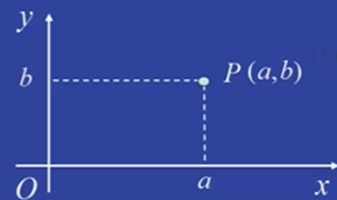
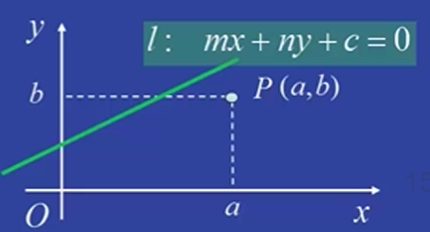
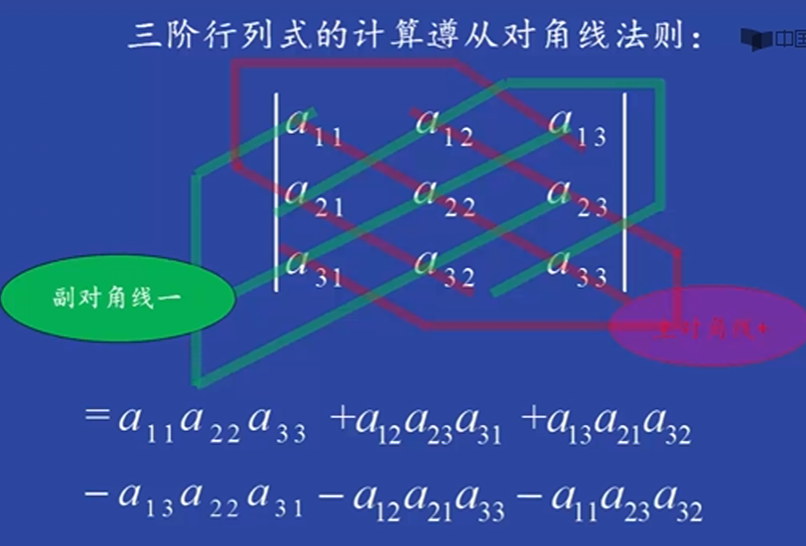

# Linear algebra Class 1

Original edit：2026-02-01

Last update：2026-02-22 

Markdown type：Study markdown

Resources：Math_linear_01.assets 

Update log： 

---

## Linear algebra basic

​        线性代数(Linear algebra)，是高维的空间解析几何，可拆解为以平面解析几何理解。

​        平面解析几何是以代数为工具，研究平面几何的课程。首先通过建立平面直角坐标系，将平面上的几何对象代数化。

- 在点$P$与有序数组$(a, b)$（即点$P$的坐标）间建立了一一对应关系。

- 给定一个直线$l$与二元一次方程$mx+ny+c=0$间建立一一对应关系。

​        平面上两条直线位置关系的几何问题，转化为两个二元一次方程构成的二元线性方程组解的问题：

   1. 两条直线平行当且仅当对应的线性方程无解；
   2. 两直线相交当且仅当对应的线性方程组有唯一解；
   3. 两直线重合当且仅当对应的线性方程组有无穷多解。

​        在空间解析几何中，通过建立空间直角坐标系，将空间的点与三元数组建立一一对应；将空间中的平面与三元一次方程建立一一对应关系；空间中平面的位置关系，就可以通过研究三元一次方程组的解来确定。

> ​       **一次方程，aka线性方程**

---

### 平面解析几何的坐标系

> 研究几何，先研究**平面**，再研究**空间**，进一步推广则研究$n$维向量空间，aka线性空间。

​        在研究$n$​维向量空间时，同样需要建立“坐标系”将几何对象代数化，此时的“坐标系”被称为**向量空间的基**。

​        “在平面和空间的情景中，建立直角坐标系，但若只要求将几何的点（向量）与代数的数组建立一一对应，则未必需要建立直角坐标系。”

​	实际上，建立**仿射坐标系**即可：

​	“平面上，存在两个**不共线**的向量$\vec{e_1},\vec{e_2}$，依向量分解定律：任何一个向量$\vec{a}$可以唯一分解为$\vec{e_1},\vec{e_2}$的线性组合，即存在唯一一组数$(x,y)$使得$\vec{a}=x\vec{e_1}+y\vec{e_2}$，$(x,y)$被称为向量a在仿射坐标系$[O;\vec{e_1},\vec{e_2}]$下的坐标。”

1. 在仿射坐标系$[O;\vec{e_1},\vec{e_2}]$中，基向量$\vec{e_1},\vec{e_2}$**不要求**相互垂直；
2. 在仿射坐标系$[O;\vec{e_1},\vec{e_2}]$中，基向量$\vec{e_1},\vec{e_2}$**不要求都**是单位向量；
3. 在仿射坐标系$[O;\vec{e_1},\vec{e_2}]$中，基向量$\vec{e_1},\vec{e_2}$**仅要求**不共线（不重合）。

​        因此，在研究$3$维向量空间时，我们建立的仿射坐标系存在平面上两个向量**不共线**、空间中三个向量**不共面**。而研究如何推广到在$n$维向量空间建立仿射坐标系是线性无关的概念。**向量的线性相关性**的目的是在$n$维向量空间成功建立仿射坐标系。

​        平面解析几何的重要内容是研究**圆锥曲线，或称为二次曲线**。非退化的圆锥曲线包括椭圆、双曲线和抛物线。

​	为更好的研究$n$维向量空间，我们采用坐标旋转、平移等方式**简化方程**，坐标旋转的目的是消去交叉项，而平移则可以通过配方消去一次项。

> 对于给定的二元二次方程，通过坐标变换（旋转和平移）将其化为标准方程来判断属于哪类二次曲线；
>
> 空间解析几何中，给定的一个三元二次方程，同样可通过坐标变化转化为便准方程来判断。

​	一次项可通过配方（即几何上的平移）消除，在$n$维向量空间中，主要研究目标为**一类二次齐次多项式**，即**二次型**理论。

> 所谓$n$元二次型就是$n$元二次齐次多项式，可看成是二次曲线（二元二次）和二次曲面（三元二次）的推广。

​	因此，在二次型理论中，我们的主要工作是：如何通过线性变换将二次型化为标准（不含交叉项而只含平方项的）二次型，作为坐标变换的推广，线性变换也是主要研究内容。

---

### 二阶与三阶行列式

用消元法解线性方程组：$\begin{cases}a_{11}x_1+a_{12}x_2=b_1,...(1)\\a_{21}x_1+a_{22}x_2=b_2,...(2)\end{cases}$，消除未知数$x_2$：$(1)×a_{22}-(2)×a_{12}$得：

$$(a_{11}a_{22}-a_{12}a_{21})x_1=b_1a_{22}-b_2a_{12}$$

同理可消除$x_1$得到：

$$(a_{11}a_{22}-a_{12}a_{21})x_2=b_2a_{11}-b_1a_{21}$$

当$a_{11}a_{22}-a_{12}a_{21}≠0$​时，得方程解为:....

​	由上述可知，在方程组解得表达式中，分子、分母都是四个数分两对乘积再作差得到，其中分母$a_{11}a_{22}-a_{12}a_{21}$由方程组中未知量系数确定，把四个系数按照它们在方程组中得相对位置，排成二行二列（横为行，竖为列）的数表：

$$\begin{array}{c}a_{11} &a_{12}\\a_{21} &a_{22}\end{array}$$

​	表达式$a_{11}a_{22}-a_{12}a_{21}$​称为该数表确定的二阶行列式，记作：

$$ \left|\begin {array}{c}a_{11} &a_{12}\\a_{21} &a_{22}\\ \end{array}\right| $$

- $a_{ij}(i=1,2; j=1,2)$：为行列式元素，其中$a_{ij}$的下标$i$为行标，$j$为列表；

- 二阶行列式遵从**对角线法则**：从$a_{11}$到$a_{22}$的实连线，称为主对角线，两个元素的乘积取正＋；从$a_{12}$到$a_{21}$​的虚连线，称为副对角线，两个元素的乘积取负－。

​	因此，利用二阶行列式的概念，方程组的解可重新表示为：
$$x_1=\frac{D_1}{D},x_2=\frac{D_2}{D},$$

​	其中$D=\left|\begin {array}{c}a_{11} &a_{12}\\a_{21} &a_{22}\\ \end{array}\right| $称为**系数行列式**：

​	$D_1= \left|\begin {array}{c}b_1 &a_{12}\\b_2 &a_{22}\\ \end{array}\right| $是用常数项$b_1,b_2$替换第一列元素$a_{11},a_{21}$所得行列式；

​	$D_2= \left|\begin {array}{c}a_{11} &b_1\\a_{21} &b_2\\ \end{array}\right| $是用常数项$b_1,b_2$替换第二列元素$a_{12},a_{22}$所得行列式。

那么如何计算三阶行列式？

---

### 全排列与对换

#### 排列

**排列**

定义：由正整数1，2，3...，n按一定次序排成一列，叫这n个元素的一个全排列（简称排列）。同时有两个特征：

- 不重：不能有重复的元素；
- 不漏：不能有漏掉的元素；

因此，从1，2...，n的排列总共有$n!$个不同的排列。

**逆序**

定义：在排列$i_1,i_2,...,i_k,...i_l,...,i_n(k<l)$中，如果$i_k>i_l$，则称$(i_k,i_l)$为该排列的一个“逆序对”，一个排列中逆序对的个数，称为该排列的“逆序数”。

- 用$\tau(i_1,i_2,...i_n)$表示排列$i_1,i_2,...i_n$的逆序数。

如何计算排列的逆序数？

> 记$\tau(i_k)$为$i_1,i_2,...,i_k,...,i_n$中位于$i_k$后面但比$i_k$小的元素的个数，则$\tau(i_1,i_2,...i_n)=\tau(i_1)+\tau(i_2)+...+\tau(i_n)$.

**奇偶排列**

定义：逆序数为偶（奇）数的排列，称为偶（奇）排列。在1, 2,..., n所有的$n!$个排列中，偶排列和奇排列均为$\frac{n!}{2}$个，各占总数$n!$的一半

#### 对换

**对换**

定义：在排列中将任意两个元素对调，其余元素保持不动，这种得到新排列的手续叫对换。将相邻两个元素对换，叫相邻对换。

定理1：一个排列中任意两个元素对调，排列改变奇偶性。

---

### n阶排列式的定义

n阶行列式是由$n^2$个数$a_{ij}(1≤i≤n,1≤j≤n)$排成的一个n行、n列的正方形数列。表达式如下，等号右边为行列式的展开式：

$$D_n=\left|\begin {array}{c}a_{11} &a_{12} &... &a_{1n}\\a_{21} &a_{22} &... &a_{2n}\\ \vdots &\vdots &\ddots &\vdots\\a_{n1} &a_{n2} &... &a_{nn}\\\end{array}\right|=\sum\limits_{i_1i_2...i_n∈P_n}(-1)^{\tau(i_1i_2...i_n)}a_{1i_1}a_{1i_2}...a_{ni_n}$$

行列式的展开式有如下三个特点：

1. 对所有的排列求和，展开式是$n!$项的代数和；
2. 每一项$a_{1i_1}a_{1i_2}...a_{ni_n}$行指标依自然顺序排列，而列指标$i_1,i_2,...,i_n$也能成一个排列，所以每一项的$n$​个元素取自不同行和不同列；
3. 当行指标成自然排列时，$a_{1i_1}a_{1i_2}...a_{ni_n}$的列指标$i_1,i_2,...,i_n$所成排列的奇偶性决定该项正负号。

#### 特殊行列式的计算

不难看出，按照定义，越是高阶的行列式计算越是繁琐，因此这里给出几个特殊行列式的计算公式以辅助后续计算通用行列式：

1. 下三角行列式

定义：只有在对角线下方的元素**才可能不是**零。表达式：

$$\left|\begin {array}{c}a_{11} &0 &... &0\\a_{21} &a_{22} &... &0\\ \vdots &\vdots &\ddots &\vdots\\a_{n1} &a_{n2} &... &a_{nn}\\\end{array}\right|$$
