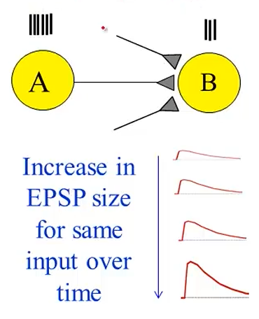
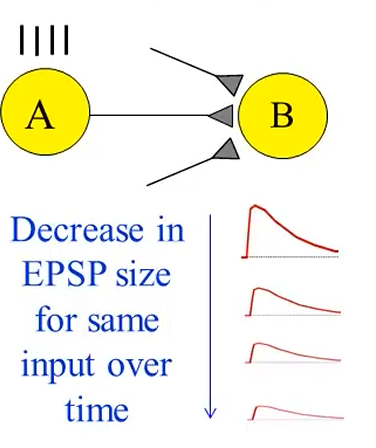
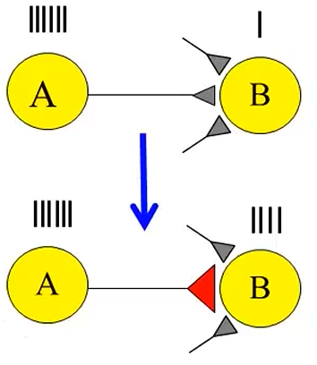
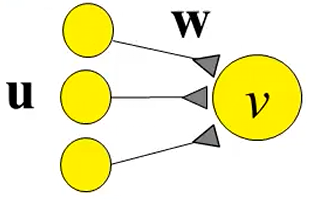

# 第7课：突触可塑性、赫布规则与统计学习

## LTP

LTP = **Long-Term Potentiation** = Experimentally observed **increase** in synaptic strength that lasts for hours or days.

LTP，即**长时程增强**，是指实验中观测到的突触强度**持久增强**现象，增强效果可维持数小时乃至数天。

- 突触强度：突触强度本质**等价于**突触电导$g_s$​. 

  

  - 当给`突触前神经元A`施加`高频强直脉冲(A上方密集竖线)`以诱导`(反复刺激)`$A\rightarrow B$的突触通路，会发生`突触可塑性变化`，即`极限突触电导`$g_{s,max}$永久变大，`同等刺激`下$g_s$ 整体提升，突触电流更强，神经元更容易被激活。
  - **相同输入刺激下，突触后兴奋性电位（EPSP）幅度随时间逐步变大**：后续即使只给 A 较弱的普通刺激，B 也会产生比之前更大的突触后电位，代表突触变强。

## LTD

LTD = Long-Term Depression = Experimentally observed decrease in synaptic strengththat lasts for hours or days.

LTD，即**长时程抑制**，是指实验中观测到的突触强度持久性下降现象，该抑制效应能够维持数小时乃至数天。

- 其作用逻辑趋同于LTP，但效果相反：通过`相同强度`的输入刺激下，随时间推移，`突触后兴奋性电位（EPSP）`幅度持续变小，即代表用**低频重复刺激突触前神经元，会触发 LTD**，使得`突触后兴奋性受体`减少、递质释放概率降低，`突触电导`$g_s$永久性下降；

### EPSP

ESPS = **Excitatory Postsynaptic Potential **

ESPS，即**兴奋性突触后电位**，是指发生在突触后神经元细胞膜产生的**正向、去极化的电位变化**，让神经元更容易产生动作电位，是一种**局部电位**。

- EPSP波形即是上图可看到的红色曲线，起点基线代表神经元静息电位。

- 波形大小代表什么：

  - 峰值高 = EPSP size 大 → 突触电导$g_s$大、突触强度高（LTP 后波形变大）

  - 峰值低 = EPSP size 小 → 突触电导$g_s$小、突触强度弱（LTD 后波形变小）

## Hebbs’ Learning Rule

> If neuron A repeatedly takes part in firing neuron B, then the synapse from A to B is strengthened.
>
> 如果神经元 A 反复参与激活神经元 B，那么 A 到 B 之间的突触连接会被增强。

赫布规则认为：**一起放电的神经元，连接会变强**。

- 由上图示可发现，放电的A与B之间从原先的`灰色`突触，由于LTP的影响下逐渐变成了`红色`突触，代表着A在释放高频脉冲的同时B所释放的脉冲频率也随之上升了。

### 数学上的Hebb

让我们考虑一个稳态输出的单层线性神经元：

我们可以考虑一个纯数学公式：

$$v=w·v = w^Tu=u^Tw$$

- $u$：输入向量，可以从上图看到左边有3个黄色神经元；
- $w$：权重向量（突出权重），每条连线代表一个突触强度；
- $v$：输入神经元的稳态输出（膜电位综合值）；
- $w·u$：向量点积，是指**每个输出×对应突触权重，全部相加**
  - 3个输入$u_1,u_2,u_3$，权重$w_1,w_2,w_3$，所以$v=w_1u_1+w_2u_2+w_3u_3$
- $w^Tu$：矩阵写法，把权重转置后做矩阵乘法，等价点积；
- $u^Tw$：向量转置交换顺序，点积结果不变，数值相等。

