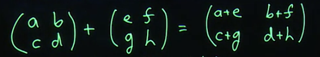
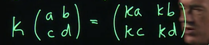
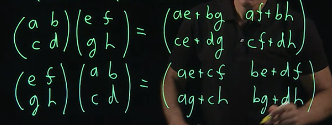

# Matrix Algebra

Class in coursera from HKUST.

## Rules of addition, subtraction, multiplication, and division

1. Addition & subtraction:

​	easy to understand with a picture.

2. multiplication:

   2.1. multiplication with single number：

   

   ​	still, easy to explain.

​	2.2. what if **matrix multiplied by matrix**?

​		let’s see....

​		Oops, weird? now you may notice that there are some number aren’t **same**.